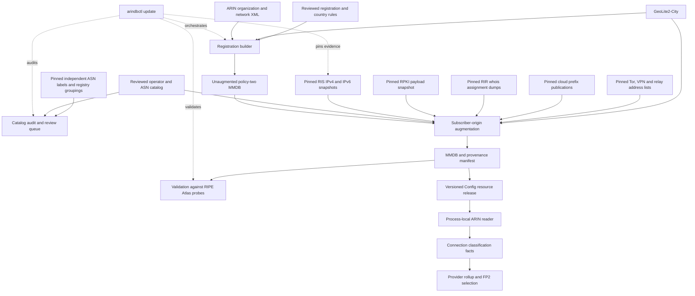

# ARIN database design

This document describes the implementation and qualified v13 research as of
2026-10-05, including the discriminator reviews recorded in
[CLASSIFICATION.md](CLASSIFICATION.md) and the release evidence below.
`arindbctl` builds an immutable IPv4/IPv6 MaxMind database that combines
registration facts, reviewed network-use evidence, and geographic risk. A
separate augmentation step joins reviewed subscriber-ISP identities to
observed routing origins across RIR regions. It withholds that inference where
routing visibility, origin authorization, associated geography or a
hosting-named registry assignment contradicts it, excludes operator-published
cloud prefixes, and applies reviewed address-level Tor and VPN findings.
`arindbctl update` refreshes every input as far as upstream sources allow,
runs both stages, audits the catalog against independent labels and validates
the finished database against RIPE Atlas; the release runner calls it. Runtime
lookups use the resulting local file; they do not query a registry, consult
BGP, or perform operator research.

The selected policy permits an **identified residential or business subscriber
ISP to default clean when no additional discriminator is available**. Explicit
contrary use, actual conflicts, and independent risk remain exclusions. Missing
catalog coverage means an identity needs review; it does not establish hosting
or proxy use. Ordinary access resellers and MVNOs are not proxy networks merely
because they do not own the last mile.

Classification supplies facts to provider selection. It does not measure URL
health, choose an FP2 fallback, set a health threshold, or prove that a provider
is online. Those responsibilities remain with their respective consumers.

## Pipeline and ownership



The command dispatcher and local publication boundary are in [main.go](main.go).
Acquisition is in [refresh.go](refresh.go) and the release orchestration in
[update.go](update.go); registration classification is in [build.go](build.go);
global augmentation is in [subscriber_origin.go](subscriber_origin.go), with
origin validation in [rpki.go](rpki.go), registry assignments in
[registry_assignments.go](registry_assignments.go), cloud prefixes in
[hosting_prefixes.go](hosting_prefixes.go) and address-level findings in
[address_risk.go](address_risk.go). Evidence pinning is in
[subscriber_evidence.go](subscriber_evidence.go); the catalog audit is in
[subscriber_audit.go](subscriber_audit.go) with independent labels in
[labels.go](labels.go) and registry groupings in [registry.go](registry.go);
database validation is in [validation.go](validation.go). Resource resolution
and runtime decoding belong to [env.go](../env.go) and [ip.go](../ip.go).

## Inputs and evidence contracts

| Input | Authority and validation |
| --- | --- |
| ARIN `orgs+nets.zip` / `arin_db.xml` | Organizations, allocations, owners, ancestry, countries, and block types. The selective archive omits points of contact. Complete XML parsing rejects malformed records, duplicate handles, missing owners, and invalid organization ancestry. |
| GeoLite2-City MMDB | Associated geographic country used for country correlation. It does not identify subscriber service. |
| Registration rule YAML | Explicit reviewed use decisions. Requires `version: 1`, nonempty rules, unique names, `reason`, `source`, selectors, and an explicitly supplied `non_quality` boolean. Unknown YAML fields and extra documents are rejected. |
| Optional country-evidence snapshots | Exact owner/allocation-bound country sets or explicit uncertainty, with HTTPS provenance, local snapshot SHA-256, and observation/expiry dates. |
| Subscriber operator catalog | `version: 1`, `policy: identified-subscriber-default`, reviewed operator identities, public ASNs, use, sources, country context, pinned origin sources, and the optional visibility floor, country policy, RPKI and address-risk sources. |
| RIS origin snapshots | Observed prefix-to-origin mappings with the number of RIS peers that see each pair. These establish routing evidence and its visibility, not subscriber use, customer location, or market rank. |
| RPKI payload snapshots | Validated ROA payloads from an rpki-client/Cloudflare JSON export or a routinator/RIPE NCC CSV export. They corroborate origin authorization; they never establish use or risk. |
| Address-level risk lists | Reviewed one-category snapshots: the official Tor exit-address export, RFC 8805 geofeeds published by relay/VPN operators, or plain address lists. Each applies only to the exact addresses it names. |
| RIR whois assignment dumps | RIPE inetnum/inet6num split files, APNIC inetnum/inet6num and the AFRINIC database. The most-specific hosting-named assignment withholds an inferred approval at its own boundary. LACNIC's dump carries no names; ARIN bulk data feeds the registration builder instead. |
| Operator-published cloud prefixes | AWS EC2 `ip-ranges.json`, Google Cloud `cloud.json`, the AzureCloud service tag, Oracle `public_ip_ranges.json`, and the DigitalOcean, Linode and Vultr geofeeds. Prefix-scope hosting evidence that excludes Quality without network risk. |
| VPN operator server lists | Mullvad, NordVPN, Private Internet Access and Windscribe publish their servers' addresses. Exact-address `vpn` findings with independent risk. |
| NRO delegated statistics and CAIDA AS2Org | Per-registry holder ids and WHOIS organizations for every ASN. The audit uses them to find sibling ASNs of a reviewed operator; the build never reads them. |
| Independent ASN labels | bgp.tools classes and tags, APNIC Labs user estimates, Stanford ASdb, ipverse and Linnaeus predictions, plus Linnaeus hand labels as ground truth. Audit-only validation of catalog entries, measured source quality and an eyeball review queue; never subscriber evidence. |
| RIPE Atlas probe archive | Connected public probes with host-set tags. A held-out reference that estimates the finished database's clean-label precision; never a classification input. |

Acquisition reads credentials from protected files. ARIN credentials contain
`api_key`; MaxMind credentials contain `account_id`, `license_key`, and
`edition_ids` including `GeoLite2-City`. The tool creates and removes an
owner-only native `geoipupdate` configuration, refuses ARIN redirects, and
suppresses secret-bearing diagnostics. Credentials are not output artifacts.
Limits include 64 KiB credential files, a 4 GiB ARIN archive, a 16 GiB extracted
XML file, and a one-hour default command deadline. See
[geoip_credentials.go](geoip_credentials.go) and [README.md](README.md).

Evidence review is separate from structural validation. A URL in a rule does
not make its claim true. Keep the reviewed source snapshots, retrieval dates,
hashes, exact identity/use claims, decisions, and caveats alongside each release.

## Subscriber state and independent risk

`classifier_version: 1` identifies the record schema. Policy two adds
`quality_policy_version: 2` and this explicit state model:

| `quality_state` | Meaning | `non_quality` |
| --- | --- | --- |
| `subscriber` | Reviewed access approval or permitted inference from an identified subscriber ISP | `false` |
| `excluded` | Reviewed contrary network use | `true` |
| `unknown` | Insufficient reviewed identity/use evidence | `true` |
| `ambiguous` | Conflicting applicable evidence | `true` |

Policy-two builds initialize both address-family defaults as unknown, so
uncovered address space cannot inherit an implicit subscriber approval. Legacy
policy zero remains readable for comparisons; absence of its negative flag is
not verified subscriber evidence.

Risk is a separate dimension:

```text
risk = geographic_risk OR network_risk
```

Reviewed `virtual_isp`, `proxy`, `vpn`, and `tor` evidence adds network risk.
Hosting and transit exclude subscriber Quality without automatically asserting
security or geographic risk. A subscriber approval cannot erase risk, so a
record may correctly contain `quality_state: subscriber` and `risk: true`.

### Registration classification

The registration builder deliberately requires direct reviewed positive
evidence. Organization rules are evaluated parent-first; a reviewed child
overrides its ancestor. An unreviewed organization child does not inherit a
positive policy-two approval. Negative evidence can inherit until a reviewed
override applies. The subsequent origin stage provides the broader identified
ISP default; these two stages must not be confused.

Rules can select organization handles, reviewed organization-name patterns, or
canonical prefixes. Prefix and organization selectors cannot be mixed in one
rule. The longest matching prefix overrides organization rules. Equal-specificity
contradictory decisions become ambiguous under policy two; legacy rules retain
their historical last-rule precedence. The reviewed-rules tests additionally
require exact, anchored name matching rather than broad company-name heuristics.

For a verified access subset of a mixed-use owner,
[allocation_scope.go](allocation_scope.go) supports positive `allocation_scopes`
containing exact `net_handle`, `org_handle`, and full source-allocation `prefix`
tuples. The build fails if the tuple disappears, changes ownership or size, or
is not authoritative ARIN space. A scope does not approve separately registered
child allocations or unrelated holdings. Contrary direct-owner or prefix
evidence remains a conflict.

Allocation precedence follows actual network ancestry and prefix specificity.
An authoritative child replaces its parent. Incomparable owners of the same
prefix are retained together; agreement can yield a common decision, while
disagreement is explicit ambiguity. The builder intersects allocation and
GeoLite boundaries and splits at reviewed rule boundaries, preventing a narrow
exception from changing an entire larger allocation.

[allocation_quality.go](allocation_quality.go) also follows a containing,
authoritative ARIN `parentNetHandle` chain for otherwise missing **negative**
Quality evidence. Missing, referral, or noncontaining links stop the walk.
Reviewed access stops that fallback without approving an unreviewed child.
This mechanism retains the direct network identity and records the inherited
classification network separately; it does not change country or risk authority.

### Geographic and network risk

ARIN block types distinguish direct registrations, external-RIR referrals,
registry allocations, reserved space, and unknown types. Referral administrative
countries are not customer-country authority. Legacy `AV` is treated as an ARIN
registration; unfamiliar types are not guessed.

Without optional country evidence, geographic risk requires both a known,
authoritative direct registration country and a known GeoLite country that
disagree. Missing countries do not imply a mismatch. Optional
`country_policy_version: 2` rules bind exact direct owners and a contained
prefix to either a credible country set or explicit uncertainty. Sources must
be fresh, hash-pinned regular files beneath the rules directory. Longest-prefix
selection applies; conflicting equally specific claims remain ambiguous.

A credible set triggers geographic risk when a known associated country is
outside that set. Explicit unknown or ambiguous country evidence records the
uncertainty without inventing a geographic mismatch. Neither case clears
independent network risk. [network_risk.go](network_risk.go) collects positive
risk evidence from the direct owner's organization ancestry and matching
prefix rules; there is no risk-clearing rule. See
[country_evidence.go](country_evidence.go) for country-source validation.

## Global subscriber-origin augmentation

The operator catalog reviews the connection between an actual subscriber
service, its legal/operator identity, and each listed ASN. Sibling ASNs of one
operator belong under one operator ID so that their aggregates and
more-specifics are evaluated as one identity. A diversified parent
company is not evidence for every affiliate or ASN. Country codes in the catalog
describe review context; they do not relocate routes or waive geographic risk.
The accepted uses are `subscriber`, `hosting`, `transit`, `virtual_isp`, `proxy`,
`vpn`, and `tor`. Duplicate operator IDs, invalid/private ASNs, malformed sources,
and unsupported uses fail validation. Multiple reviewed uses may share an ASN;
an explicit negative use wins.

Origin snapshots are regular gzip files beneath the catalog directory with
HTTPS provenance and exact hashes. Their observation/expiry interval is at
most 48 hours, and their generation header must also be no more than 48 hours
old at build time. Parsing bounds compressed input, decompressed bytes, and
line length; malformed, truncated, future, stale, or changing input fails.
Equal-prefix origins are merged independent of file order, keeping each
origin's best peer count. Longest-prefix lookup includes unidentified origins,
so a narrower unrelated network cannot inherit a broader ISP's inferred
approval. Default routes do not identify the entire Internet. IPv4 alias ranges in IPv6, including mapped/compatible, Teredo,
and 6to4 ranges, are excluded from origin inference to preserve the MMDB's IPv4
alias behavior; native IPv6 remains supported.

| Observed origin evidence | Effect |
| --- | --- |
| Every origin maps to reviewed subscriber ISPs | Promote an unknown base record to inferred subscriber |
| No origin has a reviewed identity | Preserve the base record; leave missing identity for review |
| A reviewed subscriber and an unidentified competing origin | Ambiguous; veto an otherwise positive/unknown base |
| Any reviewed negative use | Excluded; veto an otherwise positive/unknown base |
| Existing base exclusion or ambiguity | Preserve it; an inferred subscriber cannot clear it |
| Proxy, virtual-ISP, VPN, or Tor origin evidence | Also add independent network risk |
| Subscriber-only route seen by fewer RIS peers than `minimum_origin_peers` | Withheld: identity recorded, base state preserved |
| Subscriber-only route whose origin is RPKI-invalid | Withheld: identity recorded, base state preserved |
| Inferred approval whose GeoLite country is outside every identified operator's reviewed countries | Withheld at that geography's boundary, under `origin_country_policy` |
| Inferred approval inside a most-specific RIR assignment named for hosting | Withheld at the assignment's boundary as `registry-hosting-assignment` |
| Prefix in an operator-published cloud list | Excluded at that prefix; a direct reviewed subscriber approval there becomes ambiguous |
| Address named by a reviewed Tor, proxy, VPN or virtual-ISP list | Excluded at that exact address and independent network risk added |

Missing child-registration or service-purpose detail alone does not veto an
identified subscriber ISP. A narrower unknown origin blocks broader *inference*,
but does not erase an independent direct registration approval. Existing
geographic and network risk always survives augmentation.

### Withheld inference

A withheld decision is a third outcome between inference and veto. The route's
identity, ASNs, peer count, validity and source are recorded with
`origin_use_state: withheld` and `origin_withheld_reason`, but the base
`quality_state` is unchanged: unknown stays unknown for review, and a direct
registration approval survives. Negative and conflicting evidence is never
withheld; it applies at any visibility or validity.

Visibility is the number of RIS peers that see a prefix/origin pair. The
2026-10-04 IPv4 table has 453 peers at most; 68,342 of 1,270,431 pairs are seen
by exactly one peer, and those include leaked aggregates and benchmarking
space. The floor defaults to 10 peers and the manifest records the effective
value. An operator's own more-specific inherits the visibility of its
identically originated aggregate, or of an aggregate originated by sibling ASNs
of the same reviewed operator, because the aggregate establishes the identity
and carries the Internet's traffic. A different origin set inherits nothing.

RPKI validity follows RFC 6811 over the pinned payloads, including AS0
payloads, and is evaluated per origin: any invalid origin makes the route
invalid. An invalid more-specific under a valid identically originated
aggregate is recorded as `valid-aggregate`: the same operator exceeded its own
maximum length, which is not an identity problem. Not-found and valid routes
are unchanged. RPKI never creates risk or an approval.

The reviewed-country discriminator requires `--geolite2` and
`origin_country_policy: withhold-outside-reviewed-countries` together. It
compares the GeoLite country of each cell inside a newly inferred prefix with
the union of the identified operators' reviewed countries, withholds the
inference for outside cells, and records the observed `associated_country`
there. Unknown GeoLite countries never withhold. On a sample of 127 correctly
identified eyeball ASNs this withholds under one percent of their routed IPv4
space; the withheld cells are dominated by on-net CDN caches, leased blocks and
anycast announced from an access ASN, and an operator whose space is mostly
outside its reviewed countries is a misidentified catalog entry.

RIR assignment objects are the only free evidence below the ASN, and they
matter most for incumbents that sell both access and hosting under one ASN.
An object is hosting-named when its netname or descr carries DATACENTER,
VPS, HOSTING or CLOUD, or DEDICATED/DEDI together with SERVER/SERVERS
(also with trailing digits, as in VPS2)
and no access-technology token such as ADSL, FTTH, DOCSIS, PPPOE, BNG or CGNAT.
DEDICATED or DEDI alone is neutral: official assignments also use those words
for dedicated Internet access, leased lines, Wi-Fi, VSAT and customer IPs.
Missing server evidence does not establish access; the subscriber inference
still requires the reviewed ISP identity and preserves every other veto.
The parser inspects every description, includes space/tab/plus continuation
lines of these attributes, and strips end-of-line comments according to the
[RPSL attribute-value syntax](https://docs.db.ripe.net/RIPE-Database-Structure/Attribute-Values/).
Comments and other attributes do not supply network-use tokens.
The initial six-token screen included standalone DEDICATED and DEDI. Across
the 2026-10-04 RIPE, APNIC
and AFRINIC dumps (6.7 million objects), objects naming them sat under
hosting-labelled origins 86 to 96 percent of the time, while every
access-technology token sat under hosting origins at most 6 percent of the
time. A reviewed sample of hosting-named objects inside eyeball origins was
hosting in 42 of 45 cases (TDC, Belgacom, Versatel and Bezeqint hosting
ranges, dedicated servers, VPS blocks), and independent research found RIPE
registry keywords agree with RIPE Atlas probe tags at Cohen's kappa 0.90 where
they are decisive. The most-specific object decides, so a DSL pool registered
inside a block named for hosting is not withheld; the builder keeps every
object nested inside a hosting-named one so that its children override it. A
keyword is evidence, not proof, so the rule withholds rather than excludes,
records `registry_assignment_netname` and `registry_assignment_source`, and
leaves direct approvals, exclusions and risk unchanged.

Operator-published cloud prefixes are applied after the origin stage. Unknown
records and inferred approvals inside them become excluded with
`hosting_prefix_source_ids`; a direct reviewed subscriber approval meets
contrary published use and becomes ambiguous; exclusions, ambiguity and risk
are preserved; no network risk is added. This matters where a cloud prefix is
originated by an access network: on 2026-10-04, 52 AWS EC2 Wavelength
prefixes were originated by Verizon Wireless AS6167 and an Oracle block by Cox
AS22773, so identity alone would have approved rented compute. AWS and Azure
publications mix tenant compute with provider services, so their sources must
select services explicitly (`EC2`, `AzureCloud`). Published lists contain
non-global space (Vultr's feed lists 6to4 and Teredo), which is skipped and
counted rather than failing the source.

Address-level findings are applied last, on top of whatever record covers the
address. They add independent network risk with the list's reviewed category,
exclude subscriber use at that address, and leave the surrounding prefix
unchanged. Lists never expand to a prefix, operator or ASN. The VPN operators'
own server lists named 10,861 addresses on 2026-10-04, and 26 of them sat in
space the identified-ISP inference approved: NordVPN servers inside Versatel
and BT, Windscribe servers inside LG U+ and SK Broadband.

The input must be a complete, unaugmented policy-two database. Previously
augmented records are rejected: refreshing from yesterday's inferred result
could retain approvals whose origin evidence has disappeared. Always rebuild
augmentation from the registration base.

Country/state/province research prioritizes up to 30 evidenced subscriber
operators per region, with fewer where the sources establish fewer. That is a
research queue, not an eligibility cutoff. Reviewed smaller ISPs use the same
classification path. Preserve deduplicated entities, source-backed regional
footprints, metric and period, rank confidence, missing coverage, and unverified
ranks. National rankings cannot be copied into every state. Traffic-estimate
ASN queues and administrative-region indexes are discovery inputs, not reviewed
subscriber proof. See [SUBSCRIBER-ORIGINS.md](SUBSCRIBER-ORIGINS.md) for the catalog
schema and research contract.

### Qualified catalog scope (v13)

The frozen v13 catalog contains **5,190 reviewed subscriber operator groups,
5,432 subscriber ASNs and 160 country contexts**, alongside six explicit
negative operator groups. The full update preserves these reviewed identities
while refreshing their routing and other evidence. This is a global catalog,
with incomplete coverage; these counts are neither a census of every ISP nor
counts of live providers. Coverage is uneven: 4,694 subscriber groups include
Brazil in their review context, where the regulator/NIR identity join supplied
much of the catalog's breadth. Corporate affiliation, an ASN label, a traffic
estimate or a regulator ranking alone cannot approve another ASN. Research
must join the exact ASN and operator identity to actual subscriber service,
retain contrary evidence, and keep regional service presence separate from
prefix location and market rank.

The retained country/admin1 inventory spans 242 country contexts and 3,865
first-level administrative regions. It has reviewed subscriber identities in
160 contexts and reviewed service-presence evidence in 131 regions; 82 contexts
and 3,734 regions still lack those respective reviews. No region is marked
complete for a combined subscriber-services top 30. Missing regional research
does not negate an otherwise reviewed subscriber identity, and a national
operator's presence does not establish service in every state or province.

Brazil's 27 regions have derived, metric-specific top-30 tables from Anatel's
August 2026 **fixed Internet** subscriptions, covering both individual and
business subscribers. These are derived ranks within the reporting universe,
with economic-group/legal-entity deduplication, not a regulator-published
ordinal ranking or a combined fixed/mobile ranking. The 601 entities in the
union of those top-30 queues still require their own ASN review; the frozen
coverage report has only 13–29 reviewed top-30 entities per region. Therefore
neither complete classification coverage nor complete all-service rankings
follow from the existence of those 27 tables. Colombia, Chile and other
regional reporting queues retain their source, metric, period and unresolved
identity joins without being promoted to complete operator coverage.

A separately retained draft adds 12 sibling ASNs to five already reviewed
subscriber operators. It adds no operator groups, country contexts or regional
service-presence pairs, and has not passed a new full-artifact/native gate.
Those draft identities are not part of the selected v13 counts above. Broader
expansion must continue exact ASN-to-subscriber-service review alongside the
missing regional ranking work; neither a sibling relationship nor a top-30
position substitutes for that review. Keep smaller reviewed access providers
eligible under the same clean-default rule and preserve explicit contrary use.

## Output and provenance

Each build produces `arin.mmdb` and `manifest.json`. The MMDB contains direct
registration identity and scope, countries, classification state, matching rule
and source, reason, ambiguity/owner evidence, and independent risk evidence.
Observed origins add `origin_use_state` and `origin_asns`, including unidentified
origins whose use remains unknown. Known origin decisions additionally add
`origin_operator_ids`, `origin_evidence_source`, `origin_peers` and, when RPKI
payloads were supplied, `origin_rpki_validity`. Withheld decisions add
`origin_withheld_reason`. New inferred approvals also carry
`subscriber_evidence_kind: isp_inferred` and
`classification_rule: identified-subscriber-isp-default`; direct approvals keep
their existing classification provenance. Address-level findings add
`address_risk_source_ids` and their `network_risk_evidence` entries, cloud
prefixes add `hosting_prefix_source_ids`, and registry withholding adds
`registry_assignment_netname` and `registry_assignment_source`. A record
carrying any origin, hosting-prefix or address-level field is rejected as
augmentation input.

Unknown origin attribution preserves the base classification, including direct
subscriber approval and all independent risk evidence. It supplies the bounded
current-owner research aggregate in [CAPTURE.md](../arinshadowctl/CAPTURE.md)
without exporting provider addresses. Withheld origin identities remain distinct
from unknown origins in that aggregate; neither adds an approval.

Keep allocation ownership, classification authority and routing origin as
separate evidence. The MMDB's `org_handle` and `net_handle` identify the direct
allocation owner; `classification_org_handle` and
`classification_network_handle` identify where the rule came from. Exact
positive allocation scopes bind the complete owner/network/prefix tuple and
cannot approve a separately registered child. An observed origin ASN does not
replace any of those registration identities.

The bounded capture reports both `Registration` and `Origin` aggregates.
Registration carries public organization/network handles, the classification
organization and a hash of the rule name; Origin carries the complete sorted
ASN set and its use state. Multiple origins remain a set rather than being
assigned to one arbitrary operator. Sets larger than eight ASNs become
unattributed, and each aggregation dimension has a 4,096-group limit with
explicit overflow counts. These reports support exact owner/origin research
without exporting provider addresses or customer identities; attribution alone
never changes subscriber state or clears risk.

The full augmentation walk reuses successful immutable decoded records by
reader-local MMDB offset. Each reader has a 65,536-record FIFO cache; evicted
records are decoded again. This bounds the optimization without dropping
routes, base partitions, classification fields or evidence. The manifest records
hits and misses for both base and origin readers.

The registration manifest binds the builder version, XML, GeoLite database,
rules, optional evidence files, output hash, build time, and classification and
allocation counts. The augmentation manifest binds the exact base MMDB, catalog,
origin, RPKI, registry-assignment, hosting-prefix, address-risk, registry and
label snapshots and their generations, the GeoLite database when the country
policy is active, the effective visibility floor, output hash, and
augmentation counts including withheld partitions by reason, RPKI route
validity, registry objects with their hosting and nested-override counts,
applied hosting prefixes with skipped non-global entries, and applied address
entries. `quality_state_partitions` counts the origin stage before the hosting
and address overlays, which are counted separately. An update adds
`registration-manifest.json` and `update-manifest.json` beside them.
Retain both manifests and source receipts to preserve the full chain. The
builder rehashes inputs before publishing and verifies the written database.

Source rows, emitted partitions, compressed MMDB leaves, covered address area,
and live providers are different quantities. In a full comparison, count
candidate populations from the candidate's own leaf partition; weighting a
base leaf by a lookup at its first address is not an exact candidate population.
No offline count establishes provider coverage or recovered Quality supply.

## Updating and building

Commands use explicit paths and publish into a new directory. Work is staged
beneath the destination's parent and renamed only after successful completion;
existing output directories are never replaced. Cancellation or failure leaves
the previous published artifact intact. Local publication does not upload or
select a Config release.

### `arindbctl update`

`update` is the release command. It refreshes every data set the resource
depends on, as far as the upstream sources allow, and publishes one bundle:

| Path | Contents | Config resource |
| --- | --- | --- |
| `mmdb/` | GeoLite2-City, places and manifest, as `geolite2 refresh` | yes |
| `arindb/` | Final `arin.mmdb`, its `manifest.json`, `registration-manifest.json` and `update-manifest.json` | yes |
| `subscriber-evidence/catalog/` | The refreshed `catalog.yml` with every pinned snapshot under `sources/` and the pinning manifest | no |
| `subscriber-evidence/registration/` | The registration base database and its manifest | no |
| `subscriber-evidence/audit/` | `catalog-audit.json` and manifest | no |
| `subscriber-evidence/validation/` | The pinned Atlas archive, `validation.json` and manifest | no |
| `update-summary.txt` | One line for release notifications | no |

The steps are: refresh GeoLite2; download and validate ARIN; build the
registration database; and, when a reviewed operator catalog is supplied with
`--subscriber-catalog`, pin fresh evidence from that catalog, audit it, run the
augmentation on the registration base and validate the finished database
against RIPE Atlas. Pinning always includes the routing, RPKI, Tor, NRO and
CAIDA snapshots and, under update, the registry assignment dumps, cloud prefix
publications, VPN server lists and label sources; `--relay-geofeeds` adds the
Apple and Cloudflare egress geofeeds after their `vpn` category is reviewed.
The catalog's operators, visibility floor and country policy are carried
forward; its old source stanzas are replaced by the fresh ones.

GeoLite2, ARIN and the two RIS routing snapshots are required: if any fails,
nothing is published. Every other evidence source is best effort. A source that
cannot be downloaded, or fails the same validation the build applies, is left
out of the refreshed catalog and listed in `update-manifest.json` under
`unavailable_evidence` with its URL and error; the build never substitutes a
stale or unvalidated snapshot. A local write failure is always fatal. The audit
and the Atlas validation are review aids: their failure is recorded in the
manifest and does not block the release. Leaving out a negative source makes
that release less conservative, so the release message names every
unavailable source.

Without `--subscriber-catalog`, update builds the registration database alone
and its manifest says so: publishing that resource replaces an augmented one,
and under subscriber policy two it removes the inferred subscriber coverage.

```sh
go build -ldflags "-X main.Version=$WARP_VERSION" -o /tmp/arindbctl ./arindbctl
/tmp/arindbctl update \
  --geoip-config "$WARP_HOME/vault/mm-geoip.yml" \
  --credentials "$WARP_HOME/vault/arin.yml" \
  --rules "$WARP_HOME/config/main/arindb.yml" \
  --subscriber-catalog "$WARP_HOME/config/main/arindb-subscribers/catalog.yml" \
  --output /path/to/new-ip-database-bundle \
  --timeout 2h
```

The all-release runner's `refresh_ip_databases` in `build/all/run.sh` runs
exactly this before the config-updater image is built. Its inputs are
`GEOIP_CONF_FILE`, `ARIN_CREDENTIALS_FILE`, `ARIN_RULES_FILE` and the optional
`ARIN_SUBSCRIBER_CATALOG_FILE`, which defaults to
`$WARP_HOME/config/$BUILD_ENV/arindb-subscribers/catalog.yml`. A catalog at the
default path is used when present; an explicitly configured catalog that
cannot be read stops the release rather than silently publishing a
registration-only resource. `ARIN_RELAY_GEOFEEDS=1` adds the relay geofeeds.
The runner moves `mmdb/` and `arindb/` into the versioned config resources,
leaves `subscriber-evidence/` in `$BUILD_OUT/ip-databases`, and puts the update
summary, including unavailable sources and the Atlas estimate, in the release
message. An update downloads roughly 350 MB of evidence beside the ARIN
archive. On 2026-10-04, pinning took two minutes, the audit one minute and the
augmentation with every family 223 seconds at a 20 GB peak resident set,
sequentially after the registration build; a routing-only augmentation of the
same base already peaks at 19.5 GB, because the writer holds all 7.3 million
output partitions, so the release host needs that memory free.

### Individual commands

| Command | Output |
| --- | --- |
| `update --geoip-config … --credentials … --rules … [--subscriber-catalog …] [--relay-geofeeds] --output …` | The release bundle described above |
| `refresh --geoip-config … --credentials … --rules … --output …` | One atomic bundle containing refreshed `mmdb/` and registration `arindb/`; no subscriber stage |
| `geolite2 refresh --geoip-config … --output …` | Validated GeoLite resources and manifest |
| `arin refresh --credentials … --output …` | Acquired and validated ARIN XML |
| `build --source … --geolite2 … --rules … --output …` | Registration MMDB and manifest, using local inputs |
| `refresh-subscriber-evidence [--rules existing-catalog.yml] [--registry-assignments] [--hosting-prefixes] [--vpn-servers] [--label-sources] [--relay-geofeeds] --output …` | Strict evidence pinning: every requested source must succeed. Writes `sources/` and a complete `catalog.yml`, or an `evidence.yml` fragment without `--rules` |
| `audit-subscriber-catalog --rules … --geolite2 … --output …` | `catalog-audit.json` and manifest, described below |
| `augment-subscribers --source … --rules … [--geolite2 …] --output …` | Globally augmented MMDB and manifest, using a registration MMDB, operator catalog and pinned evidence; `--geolite2` is required by, and only by, the reviewed-country policy |
| `validate-database --source arin.mmdb --atlas-probes … --output …` | `validation.json` and manifest, described below |

`refresh` remains for registration-only work and compatibility; it does not
run the subscriber stage. The individual commands reproduce an update step by
step from pinned inputs, for review or investigation.

### Catalog audit

Run the audit before every catalog revision; update runs it on every release.
It measures the catalog against the same pinned routing, validity and
geography the build uses and flags identities whose routed space lies mostly
outside their reviewed countries, ASNs that originate nothing, and the
unreviewed origins carrying the most address space per associated country.
Each operator also gets its share of routed IPv4 space under hosting-named
registry assignments. With registry sources it lists each operator's NRO
holder ids and CAIDA organizations, sibling ASNs that are unreviewed or listed
under another operator, and merge candidates: operator pairs sharing a holder,
and pairs where one originates more-specifics inside the other's aggregates.
The latter is how one operator's sibling ASNs look when cataloged separately,
and until they are merged those more-specifics stand on their own visibility
and validity.

With label sources it gives each operator the independent sources' signals and
a verdict against its reviewed use (agrees, disagrees, mixed, unlabeled), with
`corroborated` set when two or more sources agree and none disagrees. When the
Linnaeus hand labels are present it scores every source and the two- and
three-source consensus rules against them in `label_source_quality`, scoring
Linnaeus's own predictions on its held-out validation and test splits only,
and tallies the
catalog's operators against the hand labels in `catalog_ground_truth`, flagging
`ground-truth-contradicts`. The per-country `unreviewed_eyeball_queue_by_country`
ranks unreviewed ASNs with an independent eyeball signal by APNIC users;
APNIC users alone never qualify an ASN, contrary signals are flagged rather
than filtered, and `corroborated` marks the two-source rule.

On the 2026-10-04 sample, 106 of 127 subscriber operators agreed with
independent sources and 20 were mixed: incumbents that bgp.tools also tags as
VPS or CDN hosts, which is genuine mixed use inside one ASN and the reason
prefix-level evidence matters. The registry sources surfaced Comcast's 55
regional ASNs, Airtel's four unlisted siblings and the Orange ES/Jazztel
nesting, with 311 of 325 nested routes below the visibility floor. Address
weights are not subscribers, and a queued ASN or suggested merge is a research
input, never reviewed evidence. Use the same GeoLite release for the
registration build and the augmentation so cell boundaries agree.

### Validation against RIPE Atlas

Classification inputs never include RIPE Atlas, so its probes are a held-out
reference for the finished database. Connected public probes tagged home, DSL,
cable, fibre, FTTH, GPON, PPPoE, VDSL, LTE or mobile are residential; probes
tagged datacentre or VPS, and every anchor, are datacentre; a network tagged
both ways is dropped. Units are distinct /24 (IPv4) or /48 (IPv6) networks so
that one site counts once, and a unit is clean when any of its probe addresses
is: generous to recall and strict about datacentre false approvals. The report
gives, each with a Wilson 95% interval, the clean label's precision against
Atlas, residential recall and the clean rate among datacentre networks; clean
units by evidence kind; which decision kept each residential network out of
the clean label (no identified operator, withheld by reason, hosting prefix,
address-level risk or exclusion); and every datacentre false approval with its
network, ASN and operators. Atlas tags are self-reported and the population
leans towards Europe and technical users, so the estimate informs review and
never gates a release. Residential recall measures catalog coverage as much as
rule cost.

The full v13 update's 2026-10-05 validation uses 6,865 residential and 3,045
datacentre networks, after dropping 30 networks with conflicting tags:

| Measure against Atlas tags | Count | Estimate | Wilson 95% interval |
| --- | --- | --- | --- |
| Clean-label precision | 3,618 / 3,689 clean networks | 98.08% | 97.58–98.47% |
| Residential recall | 3,618 / 6,865 residential networks | 52.70% | 51.52–53.88% |
| Datacentre clean rate | 71 / 3,045 datacentre networks | 2.33% | 1.85–2.93% |

Of the 3,247 residential networks not labelled clean, 3,216 have no identified
operator. This makes exact operator/ASN review the largest measured recall
opportunity in this sample. The 71 clean datacentre-labelled networks remain
review targets for mixed-use, hosting, leased-space or proxy evidence; a label
conflict is not itself a new exclusion rule. Self-reported tags, European and
technical-user bias, /24-or-/48 aggregation and the any-clean-probe rule limit
these estimates. They are not live-provider recall, worldwide accuracy or
proof that all hosting and residential proxies have been excluded.

## Research and evidence sources

Two research passes on 2026-10-04 surveyed public data for distinguishing
subscriber access from hosting, transit, proxy, VPN and Tor use, for finding
subscriber operators worldwide, and for validating the result. Formats and URLs
were fetched and verified that day, and every adopted source was measured on
real data before it was adopted; the details are in
[CLASSIFICATION.md](CLASSIFICATION.md).

| Source | Role in this design |
| --- | --- |
| RIPE RIS `riswhoisdump` IPv4/IPv6, with `<seen by #rispeers>` | Routing origin and visibility; required by update. The visibility floor and aggregate inheritance come from its peer counts. Attribution to RIPE NCC. |
| RPKI payloads from rpki-client/Cloudflare JSON, routinator CSV, or the RIPE NCC daily archive with publisher hashes | Origin authorization, withholding only. The archive is preferred for reproducibility; update pins the Cloudflare export. |
| RIPE, APNIC and AFRINIC whois dumps | Adopted as `registry_assignment_sources`: hosting-named most-specific assignments withhold inferred approvals. Tokens measured over 6.7 million objects; registry keywords agree with Atlas tags at kappa 0.90 where decisive. |
| Cloud prefix publications: AWS EC2, Google Cloud, AzureCloud, Oracle, DigitalOcean/Linode/Vultr geofeeds | Adopted as `hosting_prefix_sources` after measurement showed cloud compute originated by access networks (AWS Wavelength under Verizon Wireless). Cloudflare and Fastly edge lists are CDN, not tenant compute, and are not used. |
| Tor Project `exit-addresses`; CollecTor archives (CC0) | Address-level `tor` findings at measured egress addresses. The export itself spans about 47 hours. |
| Mullvad, NordVPN, PIA and Windscribe server lists | Adopted as exact-address `vpn` lists; 26 of their 10,861 addresses sat in inferred subscriber space. Proton requires authentication and ExpressVPN publishes no list. |
| Apple iCloud Private Relay and Cloudflare egress geofeeds (RFC 8805) | Operator-published relay egress, opt-in `vpn` lists. |
| NRO extended delegated statistics; CAIDA AS2Org (attribution) | Audit-only sibling grouping. AS2Org organization ids are global and group Comcast's 56 ASNs under one id. |
| bgp.tools classes and tags; APNIC Labs user estimates; Stanford ASdb (no stated license); ipverse (CC0); Linnaeus predictions and hand labels (MIT) | Adopted as audit-only `label_sources`. Measured eyeball precision against the hand labels: bgp.tools 0.961, ipverse 0.942, Linnaeus 0.927 held out, ASdb 0.823, APNIC 0.802; two agreeing sources with none contrary 0.969, three 0.988. Krippendorff's alpha across seven sources is 0.34, so sources are never pooled unweighted, and no per-ASN source can judge a mixed ASN. |
| RIPE Atlas probe archive | Adopted as the held-out validation reference for the finished database. The only free per-network reference: about 4,100 residential and 1,700 datacentre /24s in a day's archive. |
| Consolidated operator geofeeds (`geolocatemuch.com` validated-all, built by geofeed-finder) | Measured, not adopted: in identified space they agree with GeoLite on 99.5% of cells and would change 54 of 117,903 country decisions; no stated license. A candidate override for the country policy if that changes. |
| PeeringDB `info_types` | Measured kappa 0.87 against the hand labels, but its AUP forbids bulk redistribution; usable by reviewers, not pinned. |
| Spamhaus DROP and ASN-DROP (credit required) | Small high-precision negative list, deferred pending a reviewed category policy. |
| Regulator and NIR publications: NIC.br ASN/CNPJ (done for Brazil), LACNIC RDAP registrant legal ids, JPNIC ASN list, Colombia Postdata, CNMC, AGCOM, MIC, ACCC, TRAI, FCC BDC | Subscriber counts and footprints; only NIC.br carries ASNs, LACNIC registrant handles can bridge by legal id, the rest need name bridges. |
| MaxMind Enterprise, Anonymous IP and Residential Proxy; IPinfo; ipapi | Licensed address-level user-type and proxy sightings, deferred; the signal matrix in CLASSIFICATION.md records their handling. |
| CAIDA AS classification; Rapid7 and OpenINTEL reverse DNS; Spamhaus PBL | Unavailable: retired, access-gated, or DNS-query only with terms limited to mail filtering. |

Techniques adopted: visibility weighting of origins, aggregate and sibling
inheritance, RFC 6811 origin validation as a withholding discriminator,
reviewed-country withholding at GeoLite cell boundaries, hosting-named
registry assignments with most-specific override, operator-published cloud
prefixes, exact-address negative evidence, registry and organization sibling
detection, ground-truth scoring of independent labels, and held-out validation
against RIPE Atlas with Wilson intervals.

Techniques measured and deferred, in order of expected value:

- **Lease inference.** "Sublet Your Subnet" (IMC 2024, code released) infers
  leased space at 98% precision and 82% recall from the WHOIS allocation tree,
  origin ASNs, CAIDA relationships and organizations; leased space grew to
  about 6% of routed IPv4 prefixes, and its top lessees are hosting providers.
  It is the main remaining path for ISP-branded proxy and leased hosting space
  inside eyeball-registered blocks. Broker maintainers on the leaf inetnum and
  AS0 ROAs between leases are cheaper partial signals.
- **Sampled reverse DNS.** A PTR lexicon reached 95-99% residential precision at
  23-33% recall against Atlas, and covers ARIN space where registry text is
  unavailable, but it needs active collection with scanner hygiene; CAIDA's
  routed-/24 DNS names dataset can prototype it.
- **Prefix structure.** Addresses per routed prefix separate eyeball from
  hosting ASNs with AUC 0.86, and inside mixed ASNs datacentre probes sit in
  /20s while home probes sit in /12s. Useful as a review trigger; MOAS share is
  useless (AUC 0.50).
- **Global registration-country risk** from the delegated files: the delegated
  country disagrees with GeoLite for roughly six percent of ARIN, RIPE and
  AFRINIC assigned IPv4 space, so that is a supply policy decision rather than
  a classifier correction.

Not adopted: IRR `descr` text (negligible signal, and 276,661 RADB objects say
"Proxy-registered route object", which is unrelated to proxies), MOAS, Steam,
Netflix and Ookla rankings (names or tiles, not addresses), and Cloudflare
Radar (no AS type). No public residential-proxy egress list exists; rotating
residential proxies on genuine home lines cannot be detected offline, while
static ISP-proxy space is reachable through the registry, cloud, VPN, lease
and routing signals above.

Address churn bounds what a release can know. Atlas residential probes keep
their IPv4 address 92% of the time over two days but 76% over 31 days and 49%
over a year, with Germany at 39% over 31 days; residential proxy addresses
stay visible about eight days on average. Prefix-scope evidence ages slowly,
while exact-address Tor and VPN findings describe the update's own day, so the
release cadence, not the 48-hour pinning window, sets their effective age.

Release builds should stamp the reviewed builder version rather than leaving
the default `development`. Preserve immutable inputs for reproduction; build
time is part of the output and freshness checks, so later builds need not be
byte-identical. Updating routing data does not automatically re-review an
operator's business or ASN ownership.

## Runtime loading and connection facts

The runtime resolves `Config.ResourcePath("arindb/arin.mmdb")`. The resolver
checks direct resources and then versioned directory candidates across Config
homes; its version comparison includes build metadata. Use that resolver to
verify the selected path, rather than guessing from directory modification time
or numeric suffixes. Missing resources and unavailable/corrupt higher-priority
resources are distinct failures.

The MMDB reader is held by `sync.OnceValues`: replacing a file does not hot-reload
an already initialized process. Selection, resource availability, and process
reload must all occur through the owning deployment lifecycle. The decoder
ignores additive metadata it does not consume, but rejects unsupported schema
versions and inconsistent policy-two state/flag combinations.

`ArinInfo.QualityVerified()` requires a positive database build epoch,
classifier version one, policy two, subscriber state, `non_quality: false`, and
`risk: false`. Manual IP overrides do not provide a database epoch and therefore
cannot manufacture this proof. The epoch identifies the database actually
queried, including a successful lookup without a matching record.

[network_client_location_controller.go](../controller/network_client_location_controller.go)
classifies the actual connection address and stores risk, subscriber verification,
non-Quality state, database build epoch, and lookup time. A probed egress location
does not replace the classification of that connection address. Existing stored
facts are not rewritten merely because a new MMDB is selected. Fresh connection
observations and provider rollups must converge afterward. The database's masked
address representation is insufficient to reconstruct exact historical IPs for
an offline reclassification; owner-side capture can compare candidates where
the actual address is available.

## Boundary with FP2 and fallback behavior

The uniform FP2 fallback requirement belongs to provider selection across
provider behaviors. ARIN records must have the same meaning regardless of how
a candidate was obtained. Expanding the catalog changes those facts; it does
not silently change fallback semantics, health thresholds, timeouts, or common
risk exclusions.

In the implementation documented here,
[provider_subscriber_eligibility.go](../model/provider_subscriber_eligibility.go)
enables the subscriber predicate through
`subscriber_quality_policy_version: 2` in `provider.yml`. Missing or zero policy
retains legacy behavior; invalid policy fails. Native Quality membership
requires live connection evidence and all live connections to be verified,
non-risky subscribers. Named-provider and forced-minimum checks retain the
requested bucket's policy. Discovery, borrowing and refills evaluate the
selected bucket: a Quality request can use independently eligible Speed or
Online supply without turning an unknown subscriber classification into
Quality. Common risk and other hard exclusions still apply across every tier,
including risk newly observed while rechecking stale Quality evidence. See
[provider_selection_bucket_policy_test.go](../model/provider_selection_bucket_policy_test.go)
for the selected-bucket fallback and risk-preservation controls. These are
consumer semantics; catalog expansion does not change their thresholds or
fallback ordering.

[egress_index.go](../model/egress_index.go) combines classification with accepted
health and common exclusions. Passing health can enter Speed; Quality also
requires the non-Quality flag to be clear. Missing or failing health can remain
in Online subject to common exclusions. None of these paths turns an unknown
classification into reviewed subscriber evidence.

The geographic picker is another distinct consumer. Its legacy Quality-named
location filter is populated from public native-or-Online supply by
`exportClientScores` in
[network_client_location_model.go](../model/network_client_location_model.go).
Zero native Quality therefore does not, by itself, prove an empty picker or
identify the cause of a request failure. Evaluate selection results, publication
freshness, health, classification, and request latency as separate observations.

## Release, activation, and measurement

Package the final MMDB and manifest under a new versioned `arindb` resource in
the existing Config workflow, preserving unrelated inventory and the intended
provider policy. Building and verifying an immutable config-updater image,
selecting that image, completing its resource update, and loading the new MMDB
in consumers are separate events. A successful build alone proves none of the
later events. The Config release version, resource-directory version, MMDB build
epoch, classifier schema, and subscriber policy version are distinct identifiers.

An optional shadow comparison can measure candidate decisions against the
current database without changing serving policy. Whether comparison occurs
before or after activation, actual resource and process observations establish
which classifier was used. Operational receipts retain those release-specific
claims. Main execution follows [RUN-MAIN.md](../monitor/RUN-MAIN.md).

### Qualified v13 artifact and Config selection (2026-10-05)

The full normal update completed with every requested evidence source
available. Its final artifact is:

| Identity | Value |
| --- | --- |
| Builder revision | `0bb38ed62d5daeb61d3f911f4fb9c72e5ae33ed1` |
| ARIN resource version / build epoch | `2026.10.5+1791162091` / `1791162091` |
| ARIN file size | 592,226,645 bytes |
| ARIN SHA-256 | `2095612c250649c0e316651599e1c84db74d393ee7ae569e5f97f658c5609da3` |
| Config release | `2026.10.5-arin-active-v13+1063773520` |
| Published Config OCI index | `sha256:4ef7398b4bd4f0436e21da46fde31b6e382d7ad79b3924db0937452f21578ae4` |

Independent qualification traversed 6,956,913 registration-base, 7,884,021
final-database and 1,226,535 independent routing-reference boundaries. It
checked the origin sets against independent longest-prefix lookup and preserved
registration, base risk and non-Quality invariants. Native serving and mapped
capture each passed 2,048 public readback samples. A further 305 sampled policy
checks covered all 14 hosting/relay/VPN/Tor feeds, including 72 hosting cases
inside identified subscriber-carrier networks. Those samples qualify the
specified controls; they do not claim every published prefix or live provider
was measured.

The 592 MB file exceeds the legacy 512 MiB shadow snapshot limit. The qualified c343
consumer graph keeps the legacy snapshot refusal and uses a bounded 1 GiB
mapped capture reader. Its focused tests also qualify typed Origin replies and
maximum wire size. Select the compatible standalone coordinator before using
new Connect capture replies: the new decoder accepts omitted legacy Origin
fields, while the old strict decoder refuses the new field. The host bridge
forwards bounded opaque replies; the typed interpretation belongs to the
coordinator. These file limits belong to shadow instrumentation. The active
serving reader is byte-identical in the preceding 536c and qualified c343
graphs: it opens the selected MMDB directly without that 512 MiB limit. The
capture cap therefore does not impose a full-fleet consumer upgrade before
the new resource can load; actual loaded-resource identity still needs proof.

Physical staging preserved the complete selected active-v7 Config baseline,
including policy two and the native reader setting, and added exactly seven
matched ARIN/GeoLite/places files in two version directories (667,548,482 added
bytes). The resulting 96-path, 4,417,597,032-byte tree passed complete inventory
comparison. The actual c343 native resolver selected all three new resource
paths, and its serving ARIN reader loaded epoch `1791162091`. Both published
image architectures were extracted and checked against that tree.

**Root's Main Config deployment completed successfully at
`2026-10-05T06:07:50.840855Z`, selecting the version and OCI index above.
Fleet-wide loaded-consumer convergence and recovered provider supply remain
unverified.**
The separate deployment receipt has exit status zero and SHA-256
`ccea1d2e8235eda5ef47209a70a5708c59329a1abb6d488915c968a8ff286551`;
it retains `runtime_resource_identity_proven: false` and
`provider_supply_proven: false`. The immutable publication manifest's
`selection_executed: false` describes its earlier publication checkpoint,
not this later selection. The typed coordinator was selected locally before
the Connect rollout, but neither that selection nor the service deployment
receipts establish fleet-wide adoption. The qualified c343 runtime graph uses
schema 763; a newer canonical source revision or migration inventory is not
evidence that a running process uses that graph.

Freshness is also bounded. The pinned RIS IPv4 snapshot was observed at
`2026-10-04T18:03:14Z` and expires at `2026-10-06T18:03:14Z`; IPv6 was observed
three minutes later and expires at `2026-10-06T18:06:14Z`. These are the earliest
recorded evidence expiries in this bundle. Recheck freshness before selecting
or reproducing it, and refresh through the normal update path as evidence ages.
The process-local reader does not automatically unload or reclassify records
when an evidence timestamp expires.

### One mapped-process observation (2026-10-05)

At `13:54:46.879280Z`–`13:54:47.100884Z`, one selected Main Connect process
(amd64, source `1a46ab5f`) had a stable read-only file mapping whose ARIN
metadata reported build epoch `1791162091`. Native container, PID, process
start, executable and mapped device/inode identity stayed unchanged through
the read. The file length was 592,226,645 bytes; its final 131,072 bytes and
decoded metadata matched the qualified v13 fingerprints. The native read took
0.221604 seconds under an eight-second deadline. The retained Main receipt has
SHA-256 `d14c692da126d5fb7ff6c0183a28ed7e703c010079def63528f946c9f077ad33`.

This is evidence for one process mapping and a bounded fingerprint. It does
not hash the complete file or prove which application reader used it, request
routing, fleet convergence, refreshed connection classifications, or recovered
Quality supply. Those remain separate measurements. The deployed Connect and
Taskworker ARIN source comparison preserves the same classification rules;
this observation does not expand the catalog or change health/security gates.

### Measurements to complete after selection

After activation, establish the selected resource hash and resolver path, the
loaded epoch in actual consumers, fresh connection classifications, provider
rollup convergence, and complete native publication. The aggregate coverage
query in [provider_arin_coverage_model.go](../model/provider_arin_coverage_model.go)
distinguishes current, outdated, and missing classification against an expected
epoch and lookup cutoff. It does not independently establish Quality eligibility.
Measure coverage additions and explicit exclusions as well as actual FP2
results. Keep incomplete observations explicit and use them to prioritize the
next identity or discriminator review.

The first post-selection Main coverage attempt hit its three-second statement
deadline (`SQLSTATE 57014`); no classification counts were returned. A separate
one-key native census attempt reached its connection timeout before issuing
any Redis GET. Those failed reads provided no counts. The unchanged coverage
query passed a local PostgreSQL fixture with 75,000 live connections under the
same statement deadline, but that fixture cannot establish Main's plan, data
layout or current load. Do not infer a production cause or relax the deadline
from that local result. Durable current, outdated and missing classification
coverage remains **unknown**.

A second current-cohort Main read at `2026-10-05T15:42:30.468457Z` also
ended with `SQLSTATE 57014`. This version capped enumeration at 200,000
connected rows and grouped each provider once; it retained the three-second
statement deadline. Its 75,000-live-row local fixture completed the query in
1.221 seconds, but Main returned neither counts nor a surviving plan. The
retained receipt is
`0efc3e3dc82b3456468ef2a765f913c96715e487a91d006ff5be3dba1081d57f`.
Neither timeout confirms stale stored facts or justifies a classification
write. Any smaller diagnostic must identify its subset explicitly; it cannot
stand in for complete fleet coverage.

A smaller Main read succeeded at `2026-10-05T16:26:47.184608Z`, with the
query taking 0.031563 seconds. It enumerated the first 257 connected rows in
client order and withheld the entire final provider at the boundary (one row).
The remaining 256 rows yielded 119 live eligible connections across 118
providers after the active/public/handler filters. Of those connections, 116
had epoch `1791162091` and lookup times within the selected cutover and
observation bounds; three had missing or mismatched location ownership. No
older epoch, newer epoch, pre-cutover or future lookup was observed.

Within that subset, 115 providers were current on all included live
connections, and 20 had verified nonrisk subscriber classifications on all of
them (21 connections). Live location flags marked 95 providers non-Quality and
six risky; those counts can overlap. A non-Quality flag does not distinguish
excluded, unknown and ambiguous states and is not a proxy count. Receipt
`0eb8161c707094575a03a16689a5ba6bf96460d4cfdf3d672c7eeca614ab2557`
contains aggregate counts only. This sorted prefix is not representative of
the fleet and does not establish native Quality supply, source-process
ownership or the persistence/cause of the three missing or mismatched rows.
It supplies no evidence for refreshing an older epoch in those observed rows;
the classification-only CAS cannot insert or repair their location identity.

A later bounded native-host census read succeeded at
`2026-10-05T08:51:36.381701Z`. It returned one complete cached publication from
source evaluation `08:40:09.693091Z`–`08:40:57.573495Z`, published at
`08:44:05.457343Z` on the same date. The source was 638.808 seconds old when
read, and its whole evaluation occurred after the Config selection cutoff.

| Native bucket | Deduplicated public providers |
| --- | ---: |
| Quality | 4 |
| Speed | 82 |
| Online | 80,593 |

These counts overlap across buckets. Under selected URL-probe evidence policy
1, the Online cohort contained 82 URL-ratio passes, 80,243 failures and 268 providers
with no accepted evidence. The ratio uses the inclusive 4/5 threshold over
`(2026-10-05T00:40:13.425409Z, 2026-10-05T08:40:13.425409Z]`; it is separate
from native bucket admission. All four Quality providers had at least ten
accepted outcomes; Speed had 62 with at least ten and 20 with one. These are
outcome counts, not success counts or four-hour quota completion.

The retained Main receipt has SHA-256
`e1e8062bb589d58013d1d0c20f80108540d96e8e5b5a4520ff94c8edc46cb373`.
It contains no risk-exclusion counts, ARIN lookup epochs, loaded file identity
or provider-level joins. Thus the native supply is measured for that source
publication, while fleet-wide v13 adoption, classification coverage and its
causal effect on the Quality count remain unverified. A new publication after
selection does not establish that its stored classification inputs came from
the new resource.

The later read at `2026-10-05T15:11:40.231020Z` reached Redis and decoded a
present publication, but refused it because its source was 1,213.599842 seconds
old against a 900-second limit. Source evaluation completed at
`14:51:26.631178Z`; publication followed at `15:01:04.938704Z`. The
578.307526 seconds between those events and the further 635.292316 seconds
until observation are distinct delays, with no established cause or producing
process identity. Receipt
`f8e539aae1c51787fe1bf6f93d2db86cf5263aaf577b676e77c44f846f12fbd3`
therefore supplies no qualified newer bucket counts. The historical 4/82/80,593
counts above are not a current result, and a later publication timestamp does
not renew its source evaluation.

A subsequent read at `2026-10-05T17:44:57.444113Z` reached the same key, but
failed publication validation during decoding. Its native child exited zero
and completed the bounded read in 25.482 milliseconds. Receipt
`8b9c64ef61b46efca14becc12d33e63c98b39bd5c7b820aa8746dce41cd8330c`
retains no qualified source clocks or bucket counts. This is a different
failure from the earlier stale-source refusal: neither current freshness nor
a publisher stall is established. The invalid value was not retained; a
bounded diagnostic of the failed validation location is needed before changing
reader or producer behavior. A fresh URL-quota census cannot substitute for
this independent native publication.

The diagnostic read at `2026-10-05T18:41:34.320881Z` refused a present
publication as `source_stale`: source evaluation ran from
`18:12:13.641328Z` to `18:13:49.203099Z`, and publication was stamped at
`18:25:05.820968Z`. The source was 1,665.117782 seconds old against the
unchanged 900-second limit: 676.617869 seconds from source completion to
publication, then 988.499913 seconds until the read. Source evaluation itself
took 95.561771 seconds; only 223.382131 seconds of source freshness remained
at publication. Receipt
`966c5cec60db28db61132c4ec6869d206b2e1b65555a11faf8f15fd4d92e81de`
and independent gate
`b5ec59d69d34402a5758358c1dc77954d72dddcda321a6685f484cbe330e84aa`
retain this clock partition, but no current Quality/Speed counts. The reader
checks freshness before bucket and ratio validation, so those checks were not
reached and the earlier `publication_invalid` remains unresolved. No retained
publication identifier joins the two observations or identifies their writers.

In the reviewed `9577fddd` producer, source evaluation completes before target
export; the native census is written only after the export and readiness
markers succeed. Failed exports preserve the prior key and its clocks. The
key's 300-minute TTL and the task's 120-minute execution limit do not promise
fresh data. The successful task schedules its next run after 30 seconds. Task
ownership separately uses a direct PostgreSQL advisory-lock session and a
five-minute timestamp lease for crash recovery. These source limits identify
possible diagnostic boundaries, not the actual owner or cause of this refusal.

The source-completion timestamp precedes exclusion-network queries, target
assembly and export; the 676.6-second interval is therefore not a measured
Redis-only duration. Export fans out four passes per location/group through
up to 48 workers. Native snapshot GET/Lua operations and individual alias SETs
are synchronous alongside the bounded legacy pipeline. The existing
`cache_write` metric measures legacy SET attempts, including retries; it omits
those native operations, retry sleeps, connection acquisition and the final
census SET. Phase durations overlap across parent/child spans and workers,
and exits include error cleanup, so neither subtraction nor an exit count
establishes successful publication. The task has no durable target cursor.

The unique-key task observation at `2026-10-05T19:59:14.360996Z` found the
expected scheduled function with empty arguments and a 7,200-second execution
limit. It was due by 41.720312 seconds, its stored claim timestamp was
9.586317 seconds old, and its timestamp lease had 290.413683 seconds remaining.
The row retained one retry and an error classified as `canceled`; this neither
dates that error nor establishes that the current attempt was canceled.
Receipt `6cb36928c4b1b44760f3f80e85d09a7be7158db6bdca8e296592005d2406c80d`
records a 1.222-millisecond point query. The row was present at that snapshot,
but claim/release timestamps do not identify the worker, advisory owner,
execution start or progress. Exact-process phase evidence is still needed;
no cause of the publication delay or newer native supply is established.

Connection facts advance only after a successful actual ARIN lookup during a
connection location write. The c343 connection path retries a failed initial
lookup; selecting Config does not stamp existing facts with the new epoch.
Its active ARIN reader is process-local and opens once, so resolver selection
and loaded process identity must be measured separately. The native census,
when available, describes a completed cached score publication: retain its
source start, completion and publication timestamps, and distinguish its
bucket membership from durable current-generation classification coverage.

The observed Taskworker source `74810db4` preserves that loader and
connection-fact contract. Twenty-five reviewed ARIN loader, classifier, capture
and native-score files match the selected Connect `1a46ab5f` source exactly.
The eight-slot observation at `2026-10-05T12:10Z` established ready workers on
that revision, not their loaded ARIN epoch. Taskworker startup does not eagerly
warm the IP database; its score publisher consumes stored connection facts.
The legacy missing-connection location task is a no-op. Restarting the
publisher therefore does not reclassify the fleet.

Keep these separate measurements and gates when interpreting recovery:

| Boundary | What it establishes |
| --- | --- |
| Four-hour URL quota | Ten accepted measured successes or failures; not ten successes or a passing health ratio. |
| Eight-hour URL health | A nonzero selected-policy denominator and success ratio at least 4/5 for native Quality and Speed. |
| Probe security | Persistent security failures exclude serving buckets until the required authenticated recovery; quota progress alone does not clear them. |
| Subscriber identity | Verified policy-two subscriber evidence is additionally required for native Quality; eligible Speed/Online fallback retains its own rules. |
| Risk and reliability | Common serving exclusions remain, while an operator-side probe setup failure without a provider measurement supplies no negative provider verdict. |
| Resource adoption | Actual loaded generation and subsequent connection lookups; Config selection, worker readiness and score-publication clocks cannot substitute. |

The earlier `11:23:51Z` quota source reported zero completion among 79,664
eligible providers. The later `2026-10-05T12:14:55.902994Z` source reported
79,775 of 80,053 quota-complete (99.652730%), 79,751 security-complete, and
524 remaining measured runs across 278 deficient providers. The cohort changed,
so this is not a fixed-provider comparison. These figures are not a newer
Quality/Speed census, a passing URL ratio, or proof of ARIN classification.
The 24-provider security gap cannot be cleared merely by filling quota.
Six native local controls on exact `5f613cbe` verified the ten-total-outcome
boundary, including accepted failures and progression through eight, nine and
ten runs; they do not establish Main's outcome distribution or probe delivery.

Existing `urnetwork_stats_provider_excluded{reason}` and
`urnetwork_stats_provider_egress_index{bucket,index}` gauges provide
replica-backed rule diagnostics. Exclusion reasons report the first failing
rule, so an early reliability, risk or TLS failure can hide later failures.
The earlier graph had no producer observation timestamp for these gauges.
Taskworker source `47952095` adds
`urnetwork_stats_provider_egress_refresh_available` and the
`urnetwork_stats_provider_egress_source_started_seconds` and
`urnetwork_stats_provider_egress_source_completed_seconds` clocks. A failed
refresh leaves availability zero; successful cache hits preserve the original
source clocks. Retained counts and a recent scrape alone still cannot establish
a fresh exclusion census. These are `CountProviderEgress` dashboard snapshots,
separate from both the native score-target census key and URL quota publication.
No qualified current read of these timestamped gauges is retained here.
The individual count vectors and clocks are updated sequentially; availability
one and a shared scrape timestamp do not by themselves prove an atomic
counts-and-clock snapshot if collection overlaps a refresh.

The native publication has source clocks but lacks ARIN epochs and exclusion
reasons. These reviewed sources export no loaded-ARIN epoch gauge. The bounded
process observation above supplies a mapped epoch for one process; its
partial-file fingerprint does not establish a whole-file hash, application-reader
use, fleet convergence or provider-level effect.

An isolated classification-only refresh prototype passed nine local controls,
including concurrent single-winner and mixed-writer checks. It compares the
exact previous ARIN fields and write token before replacing six classification
fields after an actual lookup; it does not rewrite location, URL/TLS evidence
or reliability. It remains inactive: Main stale facts are unconfirmed, and
bounded live-owner integration is unfinished. Owner changes during a write
and uncertain commit outcomes require explicit handling; the local tests do
not establish production activation or recovered Quality supply.

The retained Connect `12c5c0ac` and API `a357c978` source trees each preserve
25 reviewed ARIN loader, owner-capture, classification and native-score files
from the earlier `1a46ab5f` graph byte for byte. This source comparison is not a
live-owner join or proof of loaded resources in those newer processes. The
aggregate database read retains no provider identifiers or addresses. Any
future owner-side correction must first join a current live owner and address,
its actual lookup generation, and the exact durable row/token; the earlier
one-process mapping and a cached score-publication clock cannot supply that
join.

For this release, retain the following evidence as rollout proceeds:

1. The selected Config index and actual process resource path/hash/epoch after
   the owning restart; desired selectors and successful image publication are
   insufficient by themselves.
2. Aggregate current, outdated and missing lookups at epoch `1791162091`, using
   the actual cutover time, followed by native score-generation and provider
   rollup convergence. Do not treat old stored facts as freshly reclassified.
3. Actual Quality, Speed and Online results under their existing health,
   reliability and common-risk gates, including fallback and publication age.
4. Complete owner-side capture aggregates where available, preserving unknown,
   withheld, conflicting and overflow populations. Prioritize exact
   allocation-owner and origin-set research from those gaps, review the Atlas
   disagreements with narrow evidence, and keep unfinished country/admin1
   rankings explicit. New catalog or discriminator changes need their own
   review and artifact qualification.

## Verification and known limits

Builder controls cover ancestry, allocation authority and precedence, exact
scopes, narrow boundaries, conflicting owners, unknown evidence, country
uncertainty, independent risk, multi-origin conflicts, IPv4 aliases, immutable
base preservation, malformed/stale inputs, rejection of repeated augmentation,
visibility and validity withholding with aggregate inheritance, reviewed-country
withholding at cell boundaries, registry-assignment withholding with
most-specific override, cloud hosting prefixes, exact-address risk lists in
every supported format including the VPN operators' JSON, both RPKI export
formats, every label format with ground-truth scoring, the audit's flags and
queues, Atlas validation with Wilson intervals, and update's required and
best-effort sources, registration-only mode and bundle layout. The build
repository's `ip_database_refresh_test.go` covers the runner's update call,
catalog selection and summary message.
Run package tests, race tests, and vet for builder changes. Release-catalog
tests take explicit reviewed inputs, including `ARIN_REVIEWED_RULES_PATH`;
synthetic test success is not review of a production catalog. Qualify each
large artifact with full readback and the intended runtime decoder as well.

Coverage remains bounded by reviewed identities and routing visibility. An
identified ISP inference cannot detect every leased subnet, proxy, hosting use,
or subsequent reassignment; the visibility, validity, geography, registry,
cloud and address-level discriminators narrow that gap without closing it.
Address lists expire with their snapshots and Tor exits churn within hours, so
a pinned list is evidence about the update's day, not the present. Registry
keywords cover RIPE, APNIC and AFRINIC assignments only, and ARIN reassignment
names are not yet read. The Atlas estimate inherits Atlas's biases and its
self-reported tags, and a best-effort update that lost a negative source is
less conservative than one that did not; its manifest says which. Narrow contrary evidence must be added when found.
Country/admin1 research and ranks may be incomplete even when an operator is
already eligible. Snapshot expiry is enforced during building, not as a runtime
per-record expiry; keeping a selected resource fresh requires an update process.
Health, live connections, publication, and request behavior can independently
limit provider supply after classification coverage improves.
