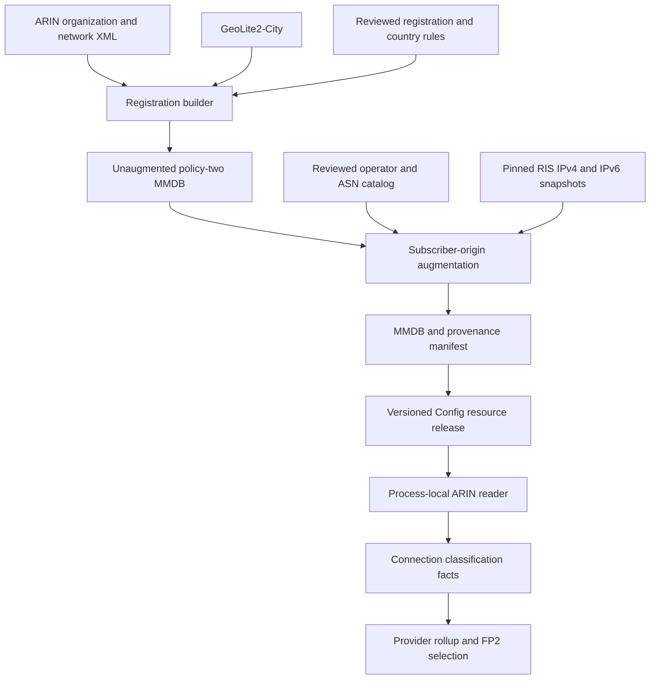

# ARIN database design

This document describes the implementation as of 2026-10-04, including the
discriminators added by the same-day classifier review recorded in
[CLASSIFICATION.md](CLASSIFICATION.md). `arindbctl` builds an immutable
IPv4/IPv6 MaxMind database that combines registration facts, reviewed
network-use evidence, and geographic risk. A separate augmentation step joins
reviewed subscriber-ISP identities to observed routing origins across RIR
regions, withholds that inference where routing visibility, origin
authorization or associated geography contradicts it, and applies reviewed
address-level findings. Runtime lookups use the resulting local file; they do
not query a registry, consult BGP, or perform operator research.

The selected policy permits an **identified residential or business subscriber
ISP to default clean when no additional discriminator is available**. Explicit
contrary use, actual conflicts, and independent risk remain exclusions. Missing
catalog coverage means an identity needs review; it does not establish hosting
or proxy use. Ordinary access resellers and MVNOs are not proxy networks merely
because they do not own the last mile.

Classification supplies facts to provider selection. It does not measure URL
health, choose an FP2 fallback, set a health threshold, or prove that a provider
is online. Those responsibilities remain with their respective consumers.

## Pipeline and ownership



The command dispatcher and local publication boundary are in [main.go](main.go).
Acquisition is in [refresh.go](refresh.go); registration classification is in
[build.go](build.go); global augmentation is in
[subscriber_origin.go](subscriber_origin.go), with origin validation in
[rpki.go](rpki.go), address-level findings in [address_risk.go](address_risk.go)
and the catalog audit in [subscriber_audit.go](subscriber_audit.go). Resource
resolution and runtime decoding belong to [env.go](../env.go) and
[ip.go](../ip.go).

## Inputs and evidence contracts

| Input | Authority and validation |
| --- | --- |
| ARIN `orgs+nets.zip` / `arin_db.xml` | Organizations, allocations, owners, ancestry, countries, and block types. The selective archive omits points of contact. Complete XML parsing rejects malformed records, duplicate handles, missing owners, and invalid organization ancestry. |
| GeoLite2-City MMDB | Associated geographic country used for country correlation. It does not identify subscriber service. |
| Registration rule YAML | Explicit reviewed use decisions. Requires `version: 1`, nonempty rules, unique names, `reason`, `source`, selectors, and an explicitly supplied `non_quality` boolean. Unknown YAML fields and extra documents are rejected. |
| Optional country-evidence snapshots | Exact owner/allocation-bound country sets or explicit uncertainty, with HTTPS provenance, local snapshot SHA-256, and observation/expiry dates. |
| Subscriber operator catalog | `version: 1`, `policy: identified-subscriber-default`, reviewed operator identities, public ASNs, use, sources, country context, pinned origin sources, and the optional visibility floor, country policy, RPKI and address-risk sources. |
| RIS origin snapshots | Observed prefix-to-origin mappings with the number of RIS peers that see each pair. These establish routing evidence and its visibility, not subscriber use, customer location, or market rank. |
| RPKI payload snapshots | Validated ROA payloads from an rpki-client/Cloudflare JSON export or a routinator/RIPE NCC CSV export. They corroborate origin authorization; they never establish use or risk. |
| Address-level risk lists | Reviewed one-category snapshots: the official Tor exit-address export, RFC 8805 geofeeds published by relay/VPN operators, or plain address lists. Each applies only to the exact addresses it names. |
| NRO delegated statistics | Per-registry resource-holder ids for every ASN. The audit uses them to find sibling ASNs of a reviewed operator; the build never reads them. |
| Operator-published cloud prefixes | AWS EC2 `ip-ranges.json`, Google Cloud `cloud.json`, the AzureCloud service tag, Oracle `public_ip_ranges.json`, and the DigitalOcean, Linode and Vultr geofeeds. Prefix-scope hosting evidence that excludes Quality without network risk. |
| Independent ASN labels | bgp.tools ASN classes and tag lists and APNIC Labs per-ASN user estimates. Audit-only validation of catalog entries and an eyeball review queue; never subscriber evidence. |

Acquisition reads credentials from protected files. ARIN credentials contain
`api_key`; MaxMind credentials contain `account_id`, `license_key`, and
`edition_ids` including `GeoLite2-City`. The tool creates and removes an
owner-only native `geoipupdate` configuration, refuses ARIN redirects, and
suppresses secret-bearing diagnostics. Credentials are not output artifacts.
Limits include 64 KiB credential files, a 4 GiB ARIN archive, a 16 GiB extracted
XML file, and a one-hour default command deadline. See
[geoip_credentials.go](geoip_credentials.go) and [README.md](README.md).

Evidence review is separate from structural validation. A URL in a rule does
not make its claim true. Keep the reviewed source snapshots, retrieval dates,
hashes, exact identity/use claims, decisions, and caveats alongside each release.

## Subscriber state and independent risk

`classifier_version: 1` identifies the record schema. Policy two adds
`quality_policy_version: 2` and this explicit state model:

| `quality_state` | Meaning | `non_quality` |
| --- | --- | --- |
| `subscriber` | Reviewed access approval or permitted inference from an identified subscriber ISP | `false` |
| `excluded` | Reviewed contrary network use | `true` |
| `unknown` | Insufficient reviewed identity/use evidence | `true` |
| `ambiguous` | Conflicting applicable evidence | `true` |

Policy-two builds initialize both address-family defaults as unknown, so
uncovered address space cannot inherit an implicit subscriber approval. Legacy
policy zero remains readable for comparisons; absence of its negative flag is
not verified subscriber evidence.

Risk is a separate dimension:

```text
risk = geographic_risk OR network_risk
```

Reviewed `virtual_isp`, `proxy`, `vpn`, and `tor` evidence adds network risk.
Hosting and transit exclude subscriber Quality without automatically asserting
security or geographic risk. A subscriber approval cannot erase risk, so a
record may correctly contain `quality_state: subscriber` and `risk: true`.

### Registration classification

The registration builder deliberately requires direct reviewed positive
evidence. Organization rules are evaluated parent-first; a reviewed child
overrides its ancestor. An unreviewed organization child does not inherit a
positive policy-two approval. Negative evidence can inherit until a reviewed
override applies. The subsequent origin stage provides the broader identified
ISP default; these two stages must not be confused.

Rules can select organization handles, reviewed organization-name patterns, or
canonical prefixes. Prefix and organization selectors cannot be mixed in one
rule. The longest matching prefix overrides organization rules. Equal-specificity
contradictory decisions become ambiguous under policy two; legacy rules retain
their historical last-rule precedence. The reviewed-rules tests additionally
require exact, anchored name matching rather than broad company-name heuristics.

For a verified access subset of a mixed-use owner,
[allocation_scope.go](allocation_scope.go) supports positive `allocation_scopes`
containing exact `net_handle`, `org_handle`, and full source-allocation `prefix`
tuples. The build fails if the tuple disappears, changes ownership or size, or
is not authoritative ARIN space. A scope does not approve separately registered
child allocations or unrelated holdings. Contrary direct-owner or prefix
evidence remains a conflict.

Allocation precedence follows actual network ancestry and prefix specificity.
An authoritative child replaces its parent. Incomparable owners of the same
prefix are retained together; agreement can yield a common decision, while
disagreement is explicit ambiguity. The builder intersects allocation and
GeoLite boundaries and splits at reviewed rule boundaries, preventing a narrow
exception from changing an entire larger allocation.

[allocation_quality.go](allocation_quality.go) also follows a containing,
authoritative ARIN `parentNetHandle` chain for otherwise missing **negative**
Quality evidence. Missing, referral, or noncontaining links stop the walk.
Reviewed access stops that fallback without approving an unreviewed child.
This mechanism retains the direct network identity and records the inherited
classification network separately; it does not change country or risk authority.

### Geographic and network risk

ARIN block types distinguish direct registrations, external-RIR referrals,
registry allocations, reserved space, and unknown types. Referral administrative
countries are not customer-country authority. Legacy `AV` is treated as an ARIN
registration; unfamiliar types are not guessed.

Without optional country evidence, geographic risk requires both a known,
authoritative direct registration country and a known GeoLite country that
disagree. Missing countries do not imply a mismatch. Optional
`country_policy_version: 2` rules bind exact direct owners and a contained
prefix to either a credible country set or explicit uncertainty. Sources must
be fresh, hash-pinned regular files beneath the rules directory. Longest-prefix
selection applies; conflicting equally specific claims remain ambiguous.

A credible set triggers geographic risk when a known associated country is
outside that set. Explicit unknown or ambiguous country evidence records the
uncertainty without inventing a geographic mismatch. Neither case clears
independent network risk. [network_risk.go](network_risk.go) collects positive
risk evidence from the direct owner's organization ancestry and matching
prefix rules; there is no risk-clearing rule. See
[country_evidence.go](country_evidence.go) for country-source validation.

## Global subscriber-origin augmentation

The operator catalog reviews the connection between an actual subscriber
service, its legal/operator identity, and each listed ASN. Sibling ASNs of one
operator belong under one operator ID so that their aggregates and
more-specifics are evaluated as one identity. A diversified parent
company is not evidence for every affiliate or ASN. Country codes in the catalog
describe review context; they do not relocate routes or waive geographic risk.
The accepted uses are `subscriber`, `hosting`, `transit`, `virtual_isp`, `proxy`,
`vpn`, and `tor`. Duplicate operator IDs, invalid/private ASNs, malformed sources,
and unsupported uses fail validation. Multiple reviewed uses may share an ASN;
an explicit negative use wins.

Origin snapshots are regular gzip files beneath the catalog directory with
HTTPS provenance and exact hashes. Their observation/expiry interval is at
most 48 hours, and their generation header must also be no more than 48 hours
old at build time. Parsing bounds compressed input, decompressed bytes, and
line length; malformed, truncated, future, stale, or changing input fails.
Equal-prefix origins are merged independent of file order, keeping each
origin's best peer count. Longest-prefix lookup includes unidentified origins,
so a narrower unrelated network cannot inherit a broader ISP's inferred
approval. Default routes do not identify the entire Internet. IPv4 alias ranges in IPv6, including mapped/compatible, Teredo,
and 6to4 ranges, are excluded from origin inference to preserve the MMDB's IPv4
alias behavior; native IPv6 remains supported.

| Observed origin evidence | Effect |
| --- | --- |
| Every origin maps to reviewed subscriber ISPs | Promote an unknown base record to inferred subscriber |
| No origin has a reviewed identity | Preserve the base record; leave missing identity for review |
| A reviewed subscriber and an unidentified competing origin | Ambiguous; veto an otherwise positive/unknown base |
| Any reviewed negative use | Excluded; veto an otherwise positive/unknown base |
| Existing base exclusion or ambiguity | Preserve it; an inferred subscriber cannot clear it |
| Proxy, virtual-ISP, VPN, or Tor origin evidence | Also add independent network risk |
| Subscriber-only route seen by fewer RIS peers than `minimum_origin_peers` | Withheld: identity recorded, base state preserved |
| Subscriber-only route whose origin is RPKI-invalid | Withheld: identity recorded, base state preserved |
| Inferred approval whose GeoLite country is outside every identified operator's reviewed countries | Withheld at that geography's boundary, under `origin_country_policy` |
| Prefix in an operator-published cloud list | Excluded at that prefix; a direct reviewed subscriber approval there becomes ambiguous |
| Address named by a reviewed Tor, proxy, VPN or virtual-ISP list | Excluded at that exact address and independent network risk added |

Missing child-registration or service-purpose detail alone does not veto an
identified subscriber ISP. A narrower unknown origin blocks broader *inference*,
but does not erase an independent direct registration approval. Existing
geographic and network risk always survives augmentation.

### Withheld inference

A withheld decision is a third outcome between inference and veto. The route's
identity, ASNs, peer count, validity and source are recorded with
`origin_use_state: withheld` and `origin_withheld_reason`, but the base
`quality_state` is unchanged: unknown stays unknown for review, and a direct
registration approval survives. Negative and conflicting evidence is never
withheld; it applies at any visibility or validity.

Visibility is the number of RIS peers that see a prefix/origin pair. The
2026-10-04 IPv4 table has 453 peers at most; 68,342 of 1,270,431 pairs are seen
by exactly one peer, and those include leaked aggregates and benchmarking
space. The floor defaults to 10 peers and the manifest records the effective
value. An operator's own more-specific inherits the visibility of its
identically originated aggregate, or of an aggregate originated by sibling ASNs
of the same reviewed operator, because the aggregate establishes the identity
and carries the Internet's traffic. A different origin set inherits nothing.

RPKI validity follows RFC 6811 over the pinned payloads, including AS0
payloads, and is evaluated per origin: any invalid origin makes the route
invalid. An invalid more-specific under a valid identically originated
aggregate is recorded as `valid-aggregate`: the same operator exceeded its own
maximum length, which is not an identity problem. Not-found and valid routes
are unchanged. RPKI never creates risk or an approval.

The reviewed-country discriminator requires `--geolite2` and
`origin_country_policy: withhold-outside-reviewed-countries` together. It
compares the GeoLite country of each cell inside a newly inferred prefix with
the union of the identified operators' reviewed countries, withholds the
inference for outside cells, and records the observed `associated_country`
there. Unknown GeoLite countries never withhold. On a sample of 127 correctly
identified eyeball ASNs this withholds under one percent of their routed IPv4
space; the withheld cells are dominated by on-net CDN caches, leased blocks and
anycast announced from an access ASN, and an operator whose space is mostly
outside its reviewed countries is a misidentified catalog entry.

Operator-published cloud prefixes are applied after the origin stage. Unknown
records and inferred approvals inside them become excluded with
`hosting_prefix_source_ids`; a direct reviewed subscriber approval meets
contrary published use and becomes ambiguous; exclusions, ambiguity and risk
are preserved; no network risk is added. This matters where a cloud prefix is
originated by an access network: on 2026-10-04, 52 AWS EC2 Wavelength
prefixes were originated by Verizon Wireless AS6167 and an Oracle block by Cox
AS22773, so identity alone would have approved rented compute. AWS and Azure
publications mix tenant compute with provider services, so their sources must
select services explicitly (`EC2`, `AzureCloud`). Published lists contain
non-global space (Vultr's feed lists 6to4 and Teredo), which is skipped and
counted rather than failing the source.

Address-level findings are applied last, on top of whatever record covers the
address. They add independent network risk with the list's reviewed category,
exclude subscriber use at that address, and leave the surrounding prefix
unchanged. Lists never expand to a prefix, operator or ASN.

The input must be a complete, unaugmented policy-two database. Previously
augmented records are rejected: refreshing from yesterday's inferred result
could retain approvals whose origin evidence has disappeared. Always rebuild
augmentation from the registration base.

Country/state/province research prioritizes up to 30 evidenced subscriber
operators per region, with fewer where the sources establish fewer. That is a
research queue, not an eligibility cutoff. Reviewed smaller ISPs use the same
classification path. Preserve deduplicated entities, source-backed regional
footprints, metric and period, rank confidence, missing coverage, and unverified
ranks. National rankings cannot be copied into every state. Traffic-estimate
ASN queues and administrative-region indexes are discovery inputs, not reviewed
subscriber proof. See [SUBSCRIBER-ORIGINS.md](SUBSCRIBER-ORIGINS.md) for the catalog
schema and research contract.

## Output and provenance

Each build produces `arin.mmdb` and `manifest.json`. The MMDB contains direct
registration identity and scope, countries, classification state, matching rule
and source, reason, ambiguity/owner evidence, and independent risk evidence.
Known origin decisions add `origin_use_state`, `origin_asns`,
`origin_operator_ids`, `origin_evidence_source`, `origin_peers` and, when RPKI
payloads were supplied, `origin_rpki_validity`. Withheld decisions add
`origin_withheld_reason`. New inferred approvals also carry
`subscriber_evidence_kind: isp_inferred` and
`classification_rule: identified-subscriber-isp-default`; direct approvals keep
their existing classification provenance. Address-level findings add
`address_risk_source_ids` and their `network_risk_evidence` entries. A record
carrying any origin or address-level field is rejected as augmentation input.

The registration manifest binds the builder version, XML, GeoLite database,
rules, optional evidence files, output hash, build time, and classification and
allocation counts. The augmentation manifest binds the exact base MMDB, catalog,
origin, RPKI and address-risk snapshots and their generations, the GeoLite
database when the country policy is active, the effective visibility floor,
output hash, and augmentation counts including withheld partitions by reason,
RPKI route validity, applied hosting prefixes with skipped non-global entries,
and applied address entries. `quality_state_partitions` counts the origin
stage before the hosting and address overlays, which are counted separately.
Retain both manifests and source receipts to preserve the full chain. The
builder rehashes inputs before publishing and verifies the written database.

Source rows, emitted partitions, compressed MMDB leaves, covered address area,
and live providers are different quantities. In a full comparison, count
candidate populations from the candidate's own leaf partition; weighting a
base leaf by a lookup at its first address is not an exact candidate population.
No offline count establishes provider coverage or recovered Quality supply.

## Updating and building

Commands use explicit paths and publish into a new directory. Work is staged
beneath the destination's parent and renamed only after successful completion;
existing output directories are never replaced. Cancellation or failure leaves
the previous published artifact intact. Local publication does not upload or
select a Config release.

| Command | Output |
| --- | --- |
| `geolite2 refresh --geoip-config … --output …` | Validated GeoLite resources and manifest |
| `arin refresh --credentials … --output …` | Acquired and validated ARIN XML |
| `build --source … --geolite2 … --rules … --output …` | Registration MMDB and manifest, using local inputs |
| `augment-subscribers --source … --rules … [--geolite2 …] --output …` | Globally augmented MMDB and manifest, using a registration MMDB, operator catalog and pinned evidence; `--geolite2` is required by, and only by, the reviewed-country policy |
| `audit-subscriber-catalog --rules … --geolite2 … --output …` | `catalog-audit.json` and manifest: per-operator routed geography against reviewed countries, unobserved ASNs, registry siblings, operator merge candidates, withheld routes, and a per-country queue of unreviewed origins |
| `refresh-subscriber-evidence [--rules existing-catalog.yml] [--hosting-prefixes] [--label-sources] [--relay-geofeeds] --output …` | Pinned, validated and hashed RIS, RPKI, Tor and NRO snapshots under `sources/`, optionally the seven cloud prefix lists, the bgp.tools and APNIC label sources and the relay geofeeds, plus a complete `catalog.yml` carrying the existing operators and policy, or an `evidence.yml` fragment without `--rules` |
| `refresh --geoip-config … --credentials … --rules … --output …` | One atomic bundle containing refreshed `mmdb/` and registration `arindb/` |

`refresh` does **not** invoke `augment-subscribers`. A release that needs global
subscriber coverage must explicitly run augmentation and package its final
MMDB. Replacing that resource with a plain registration refresh would discard
the augmented coverage even though the refresh itself succeeded.

Example offline build, after acquiring and reviewing the inputs:

```sh
go build -o /tmp/arindbctl ./arindbctl
/tmp/arindbctl build \
  --source /path/to/arin_db.xml \
  --geolite2 /path/to/GeoLite2-City.mmdb \
  --rules /path/to/reviewed-registration.yml \
  --output /path/to/new-registration
/tmp/arindbctl audit-subscriber-catalog \
  --rules /path/to/reviewed-operators/catalog.yml \
  --geolite2 /path/to/GeoLite2-City.mmdb \
  --output /path/to/catalog-audit
/tmp/arindbctl augment-subscribers \
  --source /path/to/new-registration/arin.mmdb \
  --rules /path/to/reviewed-operators/catalog.yml \
  --geolite2 /path/to/GeoLite2-City.mmdb \
  --output /path/to/new-final-arindb
```

A catalog revision is therefore three commands: refresh the evidence from the
previous catalog, audit the result, and augment. The refresh downloads over
HTTPS without following redirects, bounds every body, parses each snapshot
with the reader the build uses, stores large JSON and text snapshots gzipped,
and refuses to publish if the written catalog does not validate and hash. It
pins evidence; it does not review operators, and the relay geofeeds it can
pin are opt-in because their `vpn` category is a reviewer decision.

Run the audit before every catalog revision. It measures the catalog against
the same pinned routing, validity and geography the build uses and flags
identities whose routed space lies mostly outside their reviewed countries,
ASNs that originate nothing, and the unreviewed origins carrying the most
address space per associated country. With a registry source it also lists
each operator's registry holder ids, sibling ASNs that are unreviewed or
listed under another operator, and merge candidates: operator pairs sharing a
holder, and pairs where one originates more-specifics inside the other's
aggregates. The latter is how one operator's sibling ASNs look when cataloged
separately, and until they are merged those more-specifics stand on their own
visibility and validity. With label sources it adds, per operator, the
bgp.tools classes and tags and APNIC users of its ASNs and a verdict against
the reviewed use (agrees, disagrees, mixed, unlabeled), and a per-country
`unreviewed_eyeball_queue_by_country`: unreviewed ASNs that bgp.tools calls
eyeball, ranked by APNIC users, with contrary tags flagged rather than
filtered. On the 2026-10-04 sample 106 of 127 subscriber operators agreed,
20 were mixed (incumbents bgp.tools also tags as VPS or CDN hosts, which is
genuine mixed use inside one ASN and the reason prefix-scope hosting evidence
matters), and the queue led with TIM and Claro in Brazil, Charter AS11426 in
the US and Airtel in Nigeria, where the address-weighted queue led with AWS.
On the same sample the registry source surfaced Comcast's 55
regional ASNs, Airtel's four unlisted siblings, and the Orange ES/Jazztel
nesting with 311 of 325 nested routes below the visibility floor. Address
weights are not subscribers, and a queued ASN or suggested merge is a research
input, never reviewed evidence. Use the same GeoLite release for the
registration build and the augmentation so cell boundaries agree.

## Research and evidence sources

The 2026-10-04 review surveyed public data for distinguishing subscriber
access from hosting, transit, proxy, VPN and Tor use, and for finding
subscriber operators worldwide. Formats and URLs were fetched and verified
that day; the details and verdicts are in
[CLASSIFICATION.md](CLASSIFICATION.md).

| Source | Role in this design |
| --- | --- |
| RIPE RIS `riswhoisdump` IPv4/IPv6, with `<seen by #rispeers>` | Routing origin and visibility. Pinned by the refresh; the visibility floor and aggregate inheritance come from its peer counts. Attribution to RIPE NCC. |
| RPKI payloads from rpki-client/Cloudflare JSON, routinator CSV, or the RIPE NCC daily archive with publisher hashes | Origin authorization, withholding only. The archive is preferred for reproducibility; the Cloudflare export is what the refresh pins today. |
| Tor Project `exit-addresses` and bulk exit list; CollecTor archives (CC0) | Address-level `tor` findings at measured egress addresses. |
| Apple iCloud Private Relay and Cloudflare egress geofeeds (RFC 8805) | Operator-published relay egress, opt-in `vpn` lists; Mullvad and NordVPN publish relay JSON that could join them after review. |
| NRO extended delegated statistics; RIR whois dumps; CAIDA AS2Org (attribution) | Registry holder grouping for sibling ASNs and the delegated country used in the global geographic-risk measurement. |
| Cloud prefix publications: AWS EC2, Google Cloud, AzureCloud, Oracle, DigitalOcean/Linode/Vultr geofeeds | Adopted as `hosting_prefix_sources` after measurement showed cloud compute originated by access networks (AWS Wavelength under Verizon Wireless). Cloudflare and Fastly edge lists are CDN, not tenant compute, and are not used. |
| Spamhaus DROP and ASN-DROP (credit required) | Small high-precision negative list, deferred pending a reviewed category policy. |
| APNIC Labs per-ASN user estimates; bgp.tools class and tags | Adopted as audit-only `label_sources` for validation and the eyeball queue. APNIC credits VPN egress ASNs with users, so users never contradict an anonymizer entry. |
| PeeringDB `info_types`, Stanford ASdb, Cloudflare Radar, Steam per-country rankings | Discovery only. PeeringDB data may not be redistributed in bulk; ASdb bulk download is login-gated; Radar needs a token; Steam lists names without ASNs. |
| Regulator and NIR publications: NIC.br ASN/CNPJ (done for Brazil), LACNIC RDAP registrant legal ids, JPNIC ASN list, Colombia Postdata, CNMC, AGCOM, MIC, ACCC, TRAI, FCC BDC | Subscriber counts and footprints; only NIC.br carries ASNs, LACNIC registrant handles can bridge by legal id, the rest need name bridges. |
| MaxMind Enterprise, Anonymous IP and Residential Proxy; IPinfo; ipapi | Licensed address-level user-type and proxy sightings, deferred; the signal matrix in CLASSIFICATION.md records their handling. |
| CAIDA AS classification; Rapid7 and OpenINTEL reverse DNS; Spamhaus PBL bulk | Unavailable: retired, access-gated, or DNS-query only. |

Techniques evaluated and adopted: visibility weighting of origins, aggregate
and sibling inheritance, RFC 6811 origin validation as a withholding
discriminator, reviewed-country withholding at GeoLite cell boundaries,
exact-address negative evidence, and registry-holder sibling detection.
Evaluated and not adopted: reverse-DNS naming heuristics (static business
subscribers and CGNAT make them unreliable without our own measurement),
prefix-length heuristics (no authoritative dataset), and extending
registration-country geographic risk worldwide from the delegated files
(the delegated country disagrees with GeoLite for roughly six percent of
ARIN, RIPE and AFRINIC assigned IPv4 space, so that is a supply policy
decision rather than a classifier correction).

Release builds should stamp the reviewed builder version rather than leaving
the default `development`. Preserve immutable inputs for reproduction; build
time is part of the output and freshness checks, so later builds need not be
byte-identical. Updating routing data does not automatically re-review an
operator's business or ASN ownership.

## Runtime loading and connection facts

The runtime resolves `Config.ResourcePath("arindb/arin.mmdb")`. The resolver
checks direct resources and then versioned directory candidates across Config
homes; its version comparison includes build metadata. Use that resolver to
verify the selected path, rather than guessing from directory modification time
or numeric suffixes. Missing resources and unavailable/corrupt higher-priority
resources are distinct failures.

The MMDB reader is held by `sync.OnceValues`: replacing a file does not hot-reload
an already initialized process. Selection, resource availability, and process
reload must all occur through the owning deployment lifecycle. The decoder
ignores additive metadata it does not consume, but rejects unsupported schema
versions and inconsistent policy-two state/flag combinations.

`ArinInfo.QualityVerified()` requires a positive database build epoch,
classifier version one, policy two, subscriber state, `non_quality: false`, and
`risk: false`. Manual IP overrides do not provide a database epoch and therefore
cannot manufacture this proof. The epoch identifies the database actually
queried, including a successful lookup without a matching record.

[network_client_location_controller.go](../controller/network_client_location_controller.go)
classifies the actual connection address and stores risk, subscriber verification,
non-Quality state, database build epoch, and lookup time. A probed egress location
does not replace the classification of that connection address. Existing stored
facts are not rewritten merely because a new MMDB is selected. Fresh connection
observations and provider rollups must converge afterward. The database's masked
address representation is insufficient to reconstruct exact historical IPs for
an offline reclassification; owner-side capture can compare candidates where
the actual address is available.

## Boundary with FP2 and fallback behavior

The uniform FP2 fallback requirement belongs to provider selection across
provider behaviors. ARIN records must have the same meaning regardless of how
a candidate was obtained. Expanding the catalog changes those facts; it does
not silently change fallback semantics, health thresholds, timeouts, or common
risk exclusions.

In the implementation documented here,
[provider_subscriber_eligibility.go](../model/provider_subscriber_eligibility.go)
enables the subscriber predicate through
`subscriber_quality_policy_version: 2` in `provider.yml`. Missing or zero policy
retains legacy behavior; invalid policy fails. For an original Quality request,
the predicate requires live connection evidence and all live connections to be
verified, non-risky subscribers. It applies to named providers, forced minimums,
Speed borrowing, Online fallback, and refills. Speed requests do not acquire
that Quality-only predicate. This describes the current consumer boundary;
implementing or changing uniform fallback is a separate FP2 change with its own
behavior tests.

[egress_index.go](../model/egress_index.go) combines classification with accepted
health and common exclusions. Passing health can enter Speed; Quality also
requires the non-Quality flag to be clear. Missing or failing health can remain
in Online subject to common exclusions. None of these paths turns an unknown
classification into reviewed subscriber evidence.

The geographic picker is another distinct consumer. Its legacy Quality-named
location filter is populated from public native-or-Online supply by
`exportClientScores` in
[network_client_location_model.go](../model/network_client_location_model.go).
Zero native Quality therefore does not, by itself, prove an empty picker or
identify the cause of a request failure. Evaluate selection results, publication
freshness, health, classification, and request latency as separate observations.

## Release, activation, and measurement

Package the final MMDB and manifest under a new versioned `arindb` resource in
the existing Config workflow, preserving unrelated inventory and the intended
provider policy. Building and verifying an immutable config-updater image,
selecting that image, completing its resource update, and loading the new MMDB
in consumers are separate events. A successful build alone proves none of the
later events. The Config release version, resource-directory version, MMDB build
epoch, classifier schema, and subscriber policy version are distinct identifiers.

An optional shadow comparison can measure candidate decisions against the
current database without changing serving policy. Whether comparison occurs
before or after activation, actual resource and process observations establish
which classifier was used. Operational receipts retain those release-specific
claims. Main execution follows [RUN-MAIN.md](../monitor/RUN-MAIN.md).

After activation, establish the selected resource hash and resolver path, the
loaded epoch in actual consumers, fresh connection classifications, provider
rollup convergence, and complete native publication. The aggregate coverage
query in [provider_arin_coverage_model.go](../model/provider_arin_coverage_model.go)
distinguishes current, outdated, and missing classification against an expected
epoch and lookup cutoff. It does not independently establish Quality eligibility.
Measure coverage additions and explicit exclusions as well as actual FP2
results. Keep incomplete observations explicit and use them to prioritize the
next identity or discriminator review.

## Verification and known limits

Builder controls cover ancestry, allocation authority and precedence, exact
scopes, narrow boundaries, conflicting owners, unknown evidence, country
uncertainty, independent risk, multi-origin conflicts, IPv4 aliases, immutable
base preservation, malformed/stale inputs, rejection of repeated augmentation,
visibility and validity withholding with aggregate inheritance, reviewed-country
withholding at cell boundaries, exact-address risk lists in every supported
format, both RPKI export formats, and the audit's flags and queue.
Run package tests, race tests, and vet for builder changes. Release-catalog
tests take explicit reviewed inputs, including `ARIN_REVIEWED_RULES_PATH`;
synthetic test success is not review of a production catalog. Qualify each
large artifact with full readback and the intended runtime decoder as well.

Coverage remains bounded by reviewed identities and routing visibility. An
identified ISP inference cannot detect every leased subnet, proxy, hosting use,
or subsequent reassignment; the visibility, validity, geography and
address-level discriminators narrow that gap without closing it. Address lists
expire with their snapshots and Tor exits churn within hours, so a pinned list
is evidence about the build interval, not the present. Narrow contrary evidence must be added when found.
Country/admin1 research and ranks may be incomplete even when an operator is
already eligible. Snapshot expiry is enforced during building, not as a runtime
per-record expiry; keeping a selected resource fresh requires an update process.
Health, live connections, publication, and request behavior can independently
limit provider supply after classification coverage improves.
