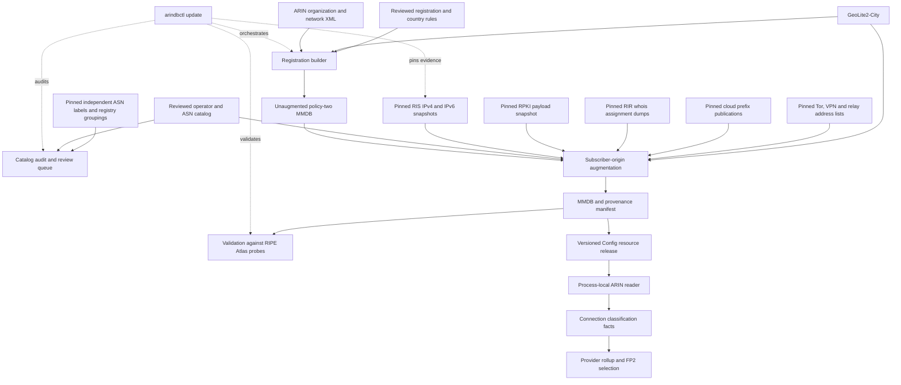

# ARIN database design

This document describes the implementation and retained research and measurements
through 2026-10-07, including the discriminator reviews recorded in
[CLASSIFICATION.md](CLASSIFICATION.md) and the release evidence below.
`arindbctl` builds an immutable IPv4/IPv6 MaxMind database that combines
registration facts, reviewed network-use evidence, and geographic risk. A
separate augmentation step joins reviewed subscriber-ISP identities to
observed routing origins across RIR regions. It withholds that inference where
routing visibility, origin authorization, associated geography or a
hosting-named registry assignment contradicts it, excludes operator-published
cloud prefixes, and applies reviewed address-level Tor and VPN findings.
`arindbctl update` refreshes every input as far as upstream sources allow,
runs both stages, audits the catalog against independent labels and validates
the finished database against RIPE Atlas; the release runner calls it. Runtime
lookups use the resulting local file; they do not query a registry, consult
BGP, or perform operator research.

The selected policy permits an **identified residential or business subscriber
ISP to default clean when no additional discriminator is available**. Explicit
contrary use, actual conflicts, and independent risk remain exclusions. Missing
catalog coverage means an identity needs review; it does not establish hosting
or proxy use. Ordinary access resellers and MVNOs are not proxy networks merely
because they do not own the last mile.

Classification supplies facts to provider selection. It does not measure URL
health, choose an FP2 fallback, set a health threshold, or prove that a provider
is online. Those responsibilities remain with their respective consumers.

## Pipeline and ownership



The command dispatcher and local publication boundary are in [main.go](main.go).
Acquisition is in [refresh.go](refresh.go) and the release orchestration in
[update.go](update.go); registration classification is in [build.go](build.go);
global augmentation is in [subscriber_origin.go](subscriber_origin.go), with
origin validation in [rpki.go](rpki.go), registry assignments in
[registry_assignments.go](registry_assignments.go), cloud prefixes in
[hosting_prefixes.go](hosting_prefixes.go) and address-level findings in
[address_risk.go](address_risk.go). Evidence pinning is in
[subscriber_evidence.go](subscriber_evidence.go); the catalog audit is in
[subscriber_audit.go](subscriber_audit.go) with independent labels in
[labels.go](labels.go) and registry groupings in [registry.go](registry.go);
database validation is in [validation.go](validation.go). Resource resolution
and runtime decoding belong to [env.go](../env.go) and [ip.go](../ip.go).

## Inputs and evidence contracts

| Input | Authority and validation |
| --- | --- |
| ARIN `orgs+nets.zip` / `arin_db.xml` | Organizations, allocations, owners, ancestry, countries, and block types. The selective archive omits points of contact. Complete XML parsing rejects malformed records, duplicate handles, missing owners, and invalid organization ancestry. |
| GeoLite2-City MMDB | Associated geographic country used for country correlation. It does not identify subscriber service. |
| Registration rule YAML | Explicit reviewed use decisions. Requires `version: 1`, nonempty rules, unique names, `reason`, `source`, selectors, and an explicitly supplied `non_quality` boolean. Unknown YAML fields and extra documents are rejected. |
| Optional country-evidence snapshots | Exact owner/allocation-bound country sets or explicit uncertainty, with HTTPS provenance, local snapshot SHA-256, and observation/expiry dates. |
| Subscriber operator catalog | `version: 1`, `policy: identified-subscriber-default`, reviewed operator identities, public ASNs, use, sources, country context, pinned origin sources, and the optional visibility floor, country policy, RPKI and address-risk sources. |
| RIS origin snapshots | Observed prefix-to-origin mappings with the number of RIS peers that see each pair. These establish routing evidence and its visibility, not subscriber use, customer location, or market rank. |
| RPKI payload snapshots | Validated ROA payloads from an rpki-client/Cloudflare JSON export or a routinator/RIPE NCC CSV export. They corroborate origin authorization; they never establish use or risk. |
| Address-level risk lists | Reviewed one-category snapshots: the official Tor exit-address export, RFC 8805 geofeeds published by relay/VPN operators, or plain address lists. Each applies only to the exact addresses it names. |
| RIR whois assignment dumps | RIPE inetnum/inet6num split files, APNIC inetnum/inet6num and the AFRINIC database. The most-specific hosting-named assignment withholds an inferred approval at its own boundary. LACNIC's dump carries no names; ARIN bulk data feeds the registration builder instead. |
| Operator-published cloud prefixes | AWS EC2 `ip-ranges.json`, Google Cloud `cloud.json`, the AzureCloud service tag, Oracle `public_ip_ranges.json`, and the DigitalOcean, Linode and Vultr geofeeds. Prefix-scope hosting evidence that excludes Quality without network risk. |
| VPN operator server lists | Mullvad, NordVPN, Private Internet Access and Windscribe publish their servers' addresses. Exact-address `vpn` findings with independent risk. |
| NRO delegated statistics and CAIDA AS2Org | Per-registry holder ids and WHOIS organizations for every ASN. The audit uses them to find sibling ASNs of a reviewed operator; the build never reads them. |
| Independent ASN labels | bgp.tools classes and tags, APNIC Labs user estimates, Stanford ASdb, ipverse and Linnaeus predictions, plus Linnaeus hand labels as ground truth. Audit-only validation of catalog entries, measured source quality and an eyeball review queue; never subscriber evidence. |
| RIPE Atlas probe archive | Connected public probes with host-set tags. A held-out reference that estimates the finished database's clean-label precision; never a classification input. |

Acquisition reads credentials from protected files. ARIN credentials contain
`api_key`; MaxMind credentials contain `account_id`, `license_key`, and
`edition_ids` including `GeoLite2-City`. The tool creates and removes an
owner-only native `geoipupdate` configuration, refuses ARIN redirects, and
suppresses secret-bearing diagnostics. Credentials are not output artifacts.
Limits include 64 KiB credential files, a 4 GiB ARIN archive, a 16 GiB extracted
XML file, and a one-hour default command deadline. See
[geoip_credentials.go](geoip_credentials.go) and [README.md](README.md).

Evidence review is separate from structural validation. A URL in a rule does
not make its claim true. Keep the reviewed source snapshots, retrieval dates,
hashes, exact identity/use claims, decisions, and caveats alongside each release.

## Subscriber state and independent risk

`classifier_version: 1` identifies the record schema. Policy two adds
`quality_policy_version: 2` and this explicit state model:

| `quality_state` | Meaning | `non_quality` |
| --- | --- | --- |
| `subscriber` | Reviewed access approval or permitted inference from an identified subscriber ISP | `false` |
| `excluded` | Reviewed contrary network use | `true` |
| `unknown` | Insufficient reviewed identity/use evidence | `true` |
| `ambiguous` | Conflicting applicable evidence | `true` |

Policy-two builds initialize both address-family defaults as unknown, so
uncovered address space cannot inherit an implicit subscriber approval. Legacy
policy zero remains readable for comparisons; absence of its negative flag is
not verified subscriber evidence.

Risk is a separate dimension:

```text
risk = geographic_risk OR network_risk
```

Reviewed `virtual_isp`, `proxy`, `vpn`, and `tor` evidence adds network risk.
Hosting and transit exclude subscriber Quality without automatically asserting
security or geographic risk. A subscriber approval cannot erase risk, so a
record may correctly contain `quality_state: subscriber` and `risk: true`.

### Registration classification

The registration builder deliberately requires direct reviewed positive
evidence. Organization rules are evaluated parent-first; a reviewed child
overrides its ancestor. An unreviewed organization child does not inherit a
positive policy-two approval. Negative evidence can inherit until a reviewed
override applies. The subsequent origin stage provides the broader identified
ISP default; these two stages must not be confused.

Rules can select organization handles, reviewed organization-name patterns, or
canonical prefixes. Prefix and organization selectors cannot be mixed in one
rule. The longest matching prefix overrides organization rules. Equal-specificity
contradictory decisions become ambiguous under policy two; legacy rules retain
their historical last-rule precedence. The reviewed-rules tests additionally
require exact, anchored name matching rather than broad company-name heuristics.

For a verified access subset of a mixed-use owner,
[allocation_scope.go](allocation_scope.go) supports positive `allocation_scopes`
containing exact `net_handle`, `org_handle`, and full source-allocation `prefix`
tuples. The build fails if the tuple disappears, changes ownership or size, or
is not authoritative ARIN space. A scope does not approve separately registered
child allocations or unrelated holdings. Contrary direct-owner or prefix
evidence remains a conflict.

Allocation precedence follows actual network ancestry and prefix specificity.
An authoritative child replaces its parent. Incomparable owners of the same
prefix are retained together; agreement can yield a common decision, while
disagreement is explicit ambiguity. The builder intersects allocation and
GeoLite boundaries and splits at reviewed rule boundaries, preventing a narrow
exception from changing an entire larger allocation.

[allocation_quality.go](allocation_quality.go) also follows a containing,
authoritative ARIN `parentNetHandle` chain for otherwise missing **negative**
Quality evidence. Missing, referral, or noncontaining links stop the walk.
Reviewed access stops that fallback without approving an unreviewed child.
This mechanism retains the direct network identity and records the inherited
classification network separately; it does not change country or risk authority.

### Geographic and network risk

ARIN block types distinguish direct registrations, external-RIR referrals,
registry allocations, reserved space, and unknown types. Referral administrative
countries are not customer-country authority. Legacy `AV` is treated as an ARIN
registration; unfamiliar types are not guessed.

Without optional country evidence, geographic risk requires both a known,
authoritative direct registration country and a known GeoLite country that
disagree. Missing countries do not imply a mismatch. Optional
`country_policy_version: 2` rules bind exact direct owners and a contained
prefix to either a credible country set or explicit uncertainty. Sources must
be fresh, hash-pinned regular files beneath the rules directory. Longest-prefix
selection applies; conflicting equally specific claims remain ambiguous.

A credible set triggers geographic risk when a known associated country is
outside that set. Explicit unknown or ambiguous country evidence records the
uncertainty without inventing a geographic mismatch. Neither case clears
independent network risk. [network_risk.go](network_risk.go) collects positive
risk evidence from the direct owner's organization ancestry and matching
prefix rules; there is no risk-clearing rule. See
[country_evidence.go](country_evidence.go) for country-source validation.

## Global subscriber-origin augmentation

The operator catalog reviews the connection between an actual subscriber
service, its legal/operator identity, and each listed ASN. Sibling ASNs of one
operator belong under one operator ID so that their aggregates and
more-specifics are evaluated as one identity. A diversified parent
company is not evidence for every affiliate or ASN. Country codes in the catalog
describe review context; they do not relocate routes or waive geographic risk.
The accepted uses are `subscriber`, `hosting`, `transit`, `virtual_isp`, `proxy`,
`vpn`, and `tor`. Duplicate operator IDs, invalid/private ASNs, malformed sources,
and unsupported uses fail validation. Multiple reviewed uses may share an ASN;
an explicit negative use wins.

Origin snapshots are regular gzip files beneath the catalog directory with
HTTPS provenance and exact hashes. Their observation/expiry interval is at
most 48 hours, and their generation header must also be no more than 48 hours
old at build time. Parsing bounds compressed input, decompressed bytes, and
line length; malformed, truncated, future, stale, or changing input fails.
Equal-prefix origins are merged independent of file order, keeping each
origin's best peer count. Longest-prefix lookup includes unidentified origins,
so a narrower unrelated network cannot inherit a broader ISP's inferred
approval. Default routes do not identify the entire Internet. IPv4 alias ranges in IPv6, including mapped/compatible, Teredo,
and 6to4 ranges, are excluded from origin inference to preserve the MMDB's IPv4
alias behavior; native IPv6 remains supported.

| Observed origin evidence | Effect |
| --- | --- |
| Every origin maps to reviewed subscriber ISPs | Promote an unknown base record to inferred subscriber |
| No origin has a reviewed identity | Preserve the base record; leave missing identity for review |
| A reviewed subscriber and an unidentified competing origin | Ambiguous; veto an otherwise positive/unknown base |
| Any reviewed negative use | Excluded; veto an otherwise positive/unknown base |
| Existing base exclusion or ambiguity | Preserve it; an inferred subscriber cannot clear it |
| Proxy, virtual-ISP, VPN, or Tor origin evidence | Also add independent network risk |
| Subscriber-only route seen by fewer RIS peers than `minimum_origin_peers` | Withheld: identity recorded, base state preserved |
| Subscriber-only route whose origin is RPKI-invalid | Withheld: identity recorded, base state preserved |
| Inferred approval whose GeoLite country is outside every identified operator's reviewed countries | Withheld at that geography's boundary, under `origin_country_policy` |
| Inferred approval inside a most-specific RIR assignment named for hosting | Withheld at the assignment's boundary as `registry-hosting-assignment` |
| Prefix in an operator-published cloud list | Excluded at that prefix; a direct reviewed subscriber approval there becomes ambiguous |
| Address named by a reviewed Tor, proxy, VPN or virtual-ISP list | Excluded at that exact address and independent network risk added |

Missing child-registration or service-purpose detail alone does not veto an
identified subscriber ISP. A narrower unknown origin blocks broader *inference*,
but does not erase an independent direct registration approval. Existing
geographic and network risk always survives augmentation.

### Withheld inference

A withheld decision is a third outcome between inference and veto. The route's
identity, ASNs, peer count, validity and source are recorded with
`origin_use_state: withheld` and `origin_withheld_reason`, but the base
`quality_state` is unchanged: unknown stays unknown for review, and a direct
registration approval survives. Negative and conflicting evidence is never
withheld; it applies at any visibility or validity.

Visibility is the number of RIS peers that see a prefix/origin pair. The
2026-10-04 IPv4 table has 453 peers at most; 68,342 of 1,270,431 pairs are seen
by exactly one peer, and those include leaked aggregates and benchmarking
space. The floor defaults to 10 peers and the manifest records the effective
value. An operator's own more-specific inherits the visibility of its
identically originated aggregate, or of an aggregate originated by sibling ASNs
of the same reviewed operator, because the aggregate establishes the identity
and carries the Internet's traffic. A different origin set inherits nothing.

RPKI validity follows RFC 6811 over the pinned payloads, including AS0
payloads, and is evaluated per origin: any invalid origin makes the route
invalid. An invalid more-specific under a valid identically originated
aggregate is recorded as `valid-aggregate`: the same operator exceeded its own
maximum length, which is not an identity problem. Not-found and valid routes
are unchanged. RPKI never creates risk or an approval.

The reviewed-country discriminator requires `--geolite2` and
`origin_country_policy: withhold-outside-reviewed-countries` together. It
compares the GeoLite country of each cell inside a newly inferred prefix with
the union of the identified operators' reviewed countries, withholds the
inference for outside cells, and records the observed `associated_country`
there. Unknown GeoLite countries never withhold. On a sample of 127 correctly
identified eyeball ASNs this withholds under one percent of their routed IPv4
space; the withheld cells are dominated by on-net CDN caches, leased blocks and
anycast announced from an access ASN, and an operator whose space is mostly
outside its reviewed countries is a misidentified catalog entry.

RIR assignment objects are the only free evidence below the ASN, and they
matter most for incumbents that sell both access and hosting under one ASN.
An object is hosting-named when its netname or descr carries DATACENTER,
VPS, HOSTING or CLOUD, or DEDICATED/DEDI together with SERVER/SERVERS
(also with trailing digits, as in VPS2)
and no access-technology token such as ADSL, FTTH, DOCSIS, PPPOE, BNG or CGNAT.
DEDICATED or DEDI alone is neutral: official assignments also use those words
for dedicated Internet access, leased lines, Wi-Fi, VSAT and customer IPs.
Missing server evidence does not establish access; the subscriber inference
still requires the reviewed ISP identity and preserves every other veto.
The parser inspects every description, includes space/tab/plus continuation
lines of these attributes, and strips end-of-line comments according to the
[RPSL attribute-value syntax](https://docs.db.ripe.net/RIPE-Database-Structure/Attribute-Values/).
Comments and other attributes do not supply network-use tokens.
The initial six-token screen included standalone DEDICATED and DEDI. Across
the 2026-10-04 RIPE, APNIC
and AFRINIC dumps (6.7 million objects), objects naming them sat under
hosting-labelled origins 86 to 96 percent of the time, while every
access-technology token sat under hosting origins at most 6 percent of the
time. A reviewed sample of hosting-named objects inside eyeball origins was
hosting in 42 of 45 cases (TDC, Belgacom, Versatel and Bezeqint hosting
ranges, dedicated servers, VPS blocks), and independent research found RIPE
registry keywords agree with RIPE Atlas probe tags at Cohen's kappa 0.90 where
they are decisive. The most-specific object decides, so a DSL pool registered
inside a block named for hosting is not withheld; the builder keeps every
object nested inside a hosting-named one so that its children override it. A
keyword is evidence, not proof, so the rule withholds rather than excludes,
records `registry_assignment_netname` and `registry_assignment_source`, and
leaves direct approvals, exclusions and risk unchanged.

Operator-published cloud prefixes are applied after the origin stage. Unknown
records and inferred approvals inside them become excluded with
`hosting_prefix_source_ids`; a direct reviewed subscriber approval meets
contrary published use and becomes ambiguous; exclusions, ambiguity and risk
are preserved; no network risk is added. This matters where a cloud prefix is
originated by an access network: on 2026-10-04, 52 AWS EC2 Wavelength
prefixes were originated by Verizon Wireless AS6167 and an Oracle block by Cox
AS22773, so identity alone would have approved rented compute. AWS and Azure
publications mix tenant compute with provider services, so their sources must
select services explicitly (`EC2`, `AzureCloud`). Published lists contain
non-global space (Vultr's feed lists 6to4 and Teredo), which is skipped and
counted rather than failing the source.

Address-level findings are applied last, on top of whatever record covers the
address. They add independent network risk with the list's reviewed category,
exclude subscriber use at that address, and leave the surrounding prefix
unchanged. Lists never expand to a prefix, operator or ASN. The VPN operators'
own server lists named 10,861 addresses on 2026-10-04, and 26 of them sat in
space the identified-ISP inference approved: NordVPN servers inside Versatel
and BT, Windscribe servers inside LG U+ and SK Broadband.

The input must be a complete, unaugmented policy-two database. Previously
augmented records are rejected: refreshing from yesterday's inferred result
could retain approvals whose origin evidence has disappeared. Always rebuild
augmentation from the registration base.

Country/state/province research prioritizes up to 30 evidenced subscriber
operators per region, with fewer where the sources establish fewer. That is a
research queue, not an eligibility cutoff. Reviewed smaller ISPs use the same
classification path. Preserve deduplicated entities, source-backed regional
footprints, metric and period, rank confidence, missing coverage, and unverified
ranks. National rankings cannot be copied into every state. Traffic-estimate
ASN queues and administrative-region indexes are discovery inputs, not reviewed
subscriber proof. See [SUBSCRIBER-ORIGINS.md](SUBSCRIBER-ORIGINS.md) for the catalog
schema and research contract.

### Qualified catalog scope (v13)

The frozen v13 catalog contains **5,190 reviewed subscriber operator groups,
5,432 subscriber ASNs and 160 country contexts**, alongside six explicit
negative operator groups. The full update preserves these reviewed identities
while refreshing their routing and other evidence. This is a global catalog,
with incomplete coverage; these counts are neither a census of every ISP nor
counts of live providers. Coverage is uneven: 4,694 subscriber groups include
Brazil in their review context, where the regulator/NIR identity join supplied
much of the catalog's breadth. Corporate affiliation, an ASN label, a traffic
estimate or a regulator ranking alone cannot approve another ASN. Research
must join the exact ASN and operator identity to actual subscriber service,
retain contrary evidence, and keep regional service presence separate from
prefix location and market rank.

The retained country/admin1 inventory spans 242 country contexts and 3,865
first-level administrative regions. It has reviewed subscriber identities in
160 contexts and reviewed service-presence evidence in 131 regions; 82 contexts
and 3,734 regions still lack those respective reviews. No region is marked
complete for a combined subscriber-services top 30. Missing regional research
does not negate an otherwise reviewed subscriber identity, and a national
operator's presence does not establish service in every state or province.

Brazil's 27 regions have derived, metric-specific top-30 tables from Anatel's
August 2026 **fixed Internet** subscriptions, covering both individual and
business subscribers. These are derived ranks within the reporting universe,
with economic-group/legal-entity deduplication, not a regulator-published
ordinal ranking or a combined fixed/mobile ranking. The 601 entities in the
union of those top-30 queues still require their own ASN review; the frozen
coverage report has only 13–29 reviewed top-30 entities per region. Therefore
neither complete classification coverage nor complete all-service rankings
follow from the existence of those 27 tables. Colombia, Chile and other
regional reporting queues retain their source, metric, period and unresolved
identity joins without being promoted to complete operator coverage.

The completed October 6 successor contains **5,191 subscriber groups, 5,445
ASNs and the same 160 country contexts**. It adds 12 reviewed sibling ASNs to
five existing operators and one new Thailand operator, `nt-th` with AS23969.
Previous reviewed identities and all six negative groups are retained. These
additions have passed native catalog parsing and the complete new artifact's
readback gates. Config selected this successor on October 6; the bounded
one-process mapping proof is recorded below. The v13 counts remain the
historical comparison. No fleet-use, regional ranking or service-presence
completion follows from these additions.

For NT, APNIC's exact ASN record, the official TOT/CAT-to-NT merger history,
and NT's [current residential fiber terms](https://ntplc.co.th/promotions/detail/nt-fiber-care-plus)
support subscriber access. No generic National Telecom name rule was added.
Sify AS9583 remains a precise mixed-scope research item: business Internet
access is eligible subscriber evidence, while its official wholesale-transit
material does not identify the serving ASN. Neither household-service absence
nor unresolved corporate evidence justifies a blanket ASN decision. These
findings do not attribute the native Speed-minus-Quality population to either
operator. Continue exact identity review for smaller access providers and the
unfinished country/state/province ranking work under the same clean-default
rule, preserving explicit contrary use.

### US origin-identity gaps under review

The retained October 6 count of the selected successor's catalog (`ec316ffc`) finds
**nine subscriber groups with 13 ASNs in the US review context**, compared with
**4,694 groups in Brazil**: 90.43% of its 5,191 subscriber groups. The global
160-country count therefore does not establish balanced country coverage.
These are origin-catalog counts, not all classifier approvals; direct
registration rules already recognize, for example, Google Fiber and Webpass.
Neither catalog concentration nor the sampled stored US country identifies
any sampled provider's operator or explains its exclusion.

Primary RIR identity and operator service records support this next,
source-reviewed candidate:

| Existing or new operator group | Additional exact ASNs |
| --- | --- |
| Charter / Spectrum | 10796, 20001, 11427, 11351, 11426, 12271, 33363 |
| AT&T | 7132 |
| Verizon US | 701 |
| Optimum / former Suddenlink | 19108 |
| Astound / RCN / Wave / Grande | 6079, 11404, 7459 |
| GFiber | 16591 |

The review joins exact RIR assignments to the operator's subscriber service,
with operator-maintained ASN records where obtained. The three Charter ASNs
11351/11426/12271 have the exact regional RIR assignments and Spectrum access
service evidence, without a retained PeeringDB record. Verizon's
[Internet Dedicated instructions](https://www.verizon.com/business/welcome-kits/internet-dedicated-services/)
explicitly identify AS701; business subscribers qualify, and an NSP label
alone does not establish hosting or proxy use. AT&T reports AS7132's peering
consolidated into AS7018, so its addition does not establish current routes.
Astound's [brand history](https://www.astound.com/industry-trends/newsroom/rcn-grande-wave-entouch-and-digital-west-now-astound-broadband/)
and [residential service](https://www.astound.com/internet/) support its three
exact reviewed siblings. GFiber's origin addition supplements existing direct
registration approvals; it does not approve Google's cloud networks.

AS22773 remains registered to Cox. [Cox's transaction history](https://www.coxenterprises.com/what-we-do/broadband)
and [Charter's completion announcement](https://corporate.charter.com/newsroom/charter-and-cox-communications-complete-transaction)
confirm the August 2026 acquisition, so the existing Charter-family placement
is preserved rather than treated as a proven ownership error. Registration
identity, corporate ownership and actual network use remain distinct facts.

Candidate `4bc85427`, source-review gate `653c6a4e`, adds 14 ASNs and two groups:
prospectively 5,193 subscriber groups, 5,459 ASNs and the same 160 country
contexts, including 11 US groups and 27 ASNs. It preserves every previous
identity, all six negative groups, policy and pinned evidence feeds. This is a
catalog candidate, not a newly built or activated resource. Its three focused
native parser/augmentation control families passed under independent gate
`97a904b8`. It adds no regional rank completion and supplies no attribution of
the retained Speed-only sample.

The first full update with this catalog started at `2026-10-06T07:38:30Z`.
The kernel records a global OOM kill of its exact `arindbctl` PID 4081336 at
`08:21:31Z`; local reinspection at `12:52Z` found no surviving builder or
supervisor. The retained stage has a registration-base file and manifest but only
2,940,928 bytes of the final MMDB, no final manifest, no published bundle and
no terminal executor receipt. It is not adoptable. The kernel proves the
native termination; the missing supervisor receipt remains unexplained.

The run started with 6,159,581,184 bytes of host `MemAvailable`. Its final
sample had 10,497,654,784 bytes of group RSS and 904,335,360 available bytes;
the original one-GiB memory floor allowed a 20-second grace. A prior successful
same-builder update started with 12,261,048,320 available bytes and peaked at
11,650,019,328 sampled RSS bytes. These observations establish inadequate
joint resource admission in the failed run, not a catalog-specific memory
regression or a bound on future peak usage. Terminal evidence is pinned by
`6f37a760`; all old inputs and partial outputs remain intact.

A fresh v2 executor preserves the exact builder and `4bc85427` catalog,
requires 12 GiB available host memory at startup and stops at the first
sample below the unchanged one-GiB live floor. Its 3,660-second wall limit,
12-GiB RSS cap, 20-GiB work budget and eight-GiB filesystem floors are unchanged.
Six local controls and independent predecessor-RED/candidate-GREEN admission
and first-low-floor controls passed (`aa7972da`). Root still owns the exclusive
heavy-work window, binding, launch, artifact readback and any later activation;
the prepared wrapper supplies no completed artifact or Quality recovery claim.
The corrected v2 Root binder and disabled composition passed independent
review (`ffd1fdf0`). Full, native and mapped readback preparation also passed
source review (`ff3b5ac2`, launcher `6ebb2c6a`), with actual native success and
fresh output-bound contracts required before execution. These are preparation
gates, not artifact or production observations.

Two later source-reviewed candidates remain separate from that frozen build.
The US follow-up (`8ef7afb4`, review `5513b5d6`) adds 14 more ASNs, yielding
23 US-context groups and 41 ASNs. Its new groups cover PenTeleData, TDS,
altafiber, Windstream, Midco, Breezeline, WOW, Fidium, Brightspeed, Ziply,
Armstrong and Metronet, with reviewed additions to AT&T and Charter. The
cumulative global follow-up (`924e1aff`, review `60d42484`) adds Indosat AS4761,
BT/Plusnet AS6871, OneBroadband AS17665, XL Axiata AS24203 and YouFibre
AS212655. It would contain 5,209 subscriber groups and 5,478 ASNs across the
same 160 country contexts. Both preserve every negative object, policy and
feed. Their cumulative native parser/augmentation controls later passed with
the five-ASN successor below; its completed artifact passed the four readbacks
recorded below.
No retained Main provider sample is joined to these additions.

A further cumulative candidate (`320b4c10`) appends five exact US ASNs to
`924e1aff`. Independent source review `97259b87` accepted the registry,
operator and first-party service joins under `identified-subscriber-default`:

| Subscriber operator | Exact ASN | First-party service evidence and scope |
| --- | --- | --- |
| Lumen / CenturyLink Communications LLC | 209 | The [business Internet schedule](https://assets.lumen.com/is/content/Lumen/internet-services-service-schedule) names the matching legal provider and AS209 as a Lumen-network destination. It also covers transit; this is not proof that every AS209 prefix serves subscribers. |
| Shentel / Glo Fiber | 4922 | [Glo Fiber terms](https://www.glofiber.com/en/terms) identify the exact registrant, Shenandoah Cable Television LLC, and its residential fiber-to-the-home service. |
| Hughesnet | 6621 | The [current subscriber agreement](https://legal.hughesnet.com/ServiceTermsAndConditions-current.cfm) identifies Hughes Network Systems LLC and its residential satellite/Fusion service. |
| Viasat | 7155 | The [currently linked residential agreement](https://www.viasat.com/content/dam/us-site/legal/documents/Customer_Agreement_Residential_v9_21.pdf) identifies Viasat Inc and residential Internet service. The registry's backbone label does not alone establish transit-only use. |
| ALLO Communications | 15108 | The [residential subscriber agreement](https://www.allocommunications.com/terms-and-conditions/subscriber-agreement-for-residential-services/) identifies the exact legal registrant. Its general AUP also names web hosting; address-level exclusions remain necessary. |

This successor contains **5,214 subscriber groups and 5,483 ASNs** across the
same 160 country contexts, including **28 US groups and 46 US ASNs**. All
prior catalog bytes, identities, six negative groups, policy and evidence feeds
are preserved; the five entries are appended. Seven deterministic Python
source controls passed, including rejection of an unchanged predecessor,
unreviewed AS3356 expansion, negative removal, weaker visibility policy,
changed existing provenance and country expansion. Independent composition
review `5dd1d47d` verified all 26 source pins, the exact predecessor byte prefix
and five appended entries, and repeated all seven controls. Six cumulative
native parser/augmentation tests then passed under independent gate `ddd88d32`
in 9.0 seconds with 297,844,736 bytes of sampled group RSS. They exercise the
19 prior additions and five new identities with the existing vetoes. The complete
generated artifact subsequently passed its separate readbacks. No AS3356,
AS3549, affiliate, parent or
customer ASN gains approval by association. Neither the frozen `4bc85427`
update nor the separate earlier candidates were changed in place.

The completed augmentation for `320b4c10` reuses the completed October 6
registration base `257ca5e6` and runs `augment-subscribers` once.
That 445,051,096-byte base already passed the complete registration traversal.
Streamed hashing on October 6 at 17:37 UTC verified the retained base, its
rules and GeoLite lineage, the builder and all 38 evidence snapshots. The new
catalog's policy and every source stanza exactly match the completed bundle;
the changed operator inventory still requires a new final MMDB. Exact regular
copies of the catalog and snapshots are staged in a separate archive directory.
Their earliest expiry remains `2026-10-08T02:03:14Z`; reuse does not refresh
their observation times. The failed update's registration file has a different
hash (`543c26d0`), despite matching input hashes and counts, and is not selected.

The retained successful run spent approximately 691 seconds in augmentation
out of 2,054 seconds overall, using adjacent manifest timestamps to delimit
the phase. Its augmentation RSS rose from below one GiB to 11,937,247,232
bytes. Reusing the base therefore avoids roughly 22.6 minutes of preceding
work but does not establish a four-GiB build budget. The reuse
executor retains 12-GiB host admission and RSS caps, the immediate one-GiB
host floor and existing disk floors; only its native and wall deadlines shrink
to 30 and 31 minutes. All 40 builder Go files, including tests, match between
qualified source `0bb38ed6` and canonical `cf7ced9e`. This file parity does not
establish equivalence of their surrounding module graphs. The prepared
executor requires the qualified binary and original frozen graph. Independent
gate `d9de0c9a` binds the six actual catalog controls, 14 synthetic controls,
executor/Root-binder review and readback source review. Root bound the reviewed
manifest in an exclusive resource window before launching the augmentation.

The October 6 native run completed in 730.125 seconds with exit zero and no
resource limit triggered. Its qualified executor reports a valid output of
595,184,171 bytes, epoch `1791310718`, SHA-256
`bfe386270592c8b30a9da6cce762d4bbf1661359e4cbcc34769ed89f8d0f5cbe`.
Peak sampled group RSS was 11,847,909,376 bytes; the lowest sampled host
available memory was 1,911,414,784 bytes. Status `1a34f240` and retained local
observation `341bc4fc` bind that result. The new and preceding manifests have
the same 40 input-hash roles; only the subscriber catalog hash differs.
The explicit `reuse-manifest.json` records that registration and evidence were
not refreshed, and their original observation and expiry times remain intact.

The new manifest reports 4,706,008 inferred subscriber partitions versus
3,198,507 in its predecessor. These are origin-stage counters before the
hosting and address overlays, with changed partition boundaries; they are not
independently traversed final populations, address totals or live-provider
gains. All four exact-hash readbacks completed successfully on October 6 at
21:31 UTC. Combined independent receipt `f72964a9` binds their contracts,
output summaries, lineage and resource telemetry:

| Readback | Actual receipt | Evidence checked | Elapsed seconds | Peak sampled group RSS bytes |
| --- | --- | --- | ---: | ---: |
| Full structure and origins | `a66f5ede` | 6,956,934 registration boundaries, 7,888,720 final boundaries and 1,227,465 independent-origin boundaries; exact origin LPM, preserved registration fields, monotonic base risk and no promotion of explicit base exclusions | 286.049 | 1,461,133,312 |
| Native serving and capture | `1471cf7b` | 2,048 public samples matched typed state, risk, verified status, origin attribution and the actual database epoch | 40.056 | 1,036,943,360 |
| Mapped capture | `65a88d99` | The same 2,048 samples passed against the exact new/new file pair and measured mapping bounds; two hash streams read 1,190,368,454 bytes | 11.048 | 1,071,816,704 |
| Targeted hosting and address policy | `17a7ea7c` | 305 public samples across 14 feeds, including 72 subscriber-carrier hosting conflicts, retained the required hosting and VPN/Tor exclusions | 35.029 | 1,112,809,472 |

Full contract `82d7f3b0` and native contract `3639f30f` bind the same final
artifact, retained registration base and catalog. Full summary `b939c3a8`,
public samples `440569b0` and policy summary `0ec02811` identify the actual
outputs. The policy gate checks selected published samples, not every feed
prefix. These results qualify the offline artifact for publication review;
they establish neither Main adoption nor recovered provider Quality.

Readiness receipt `67742a21` rechecked the unchanged artifact-status and handoff
pins and the complete frozen readback source: 5,622 source files and 20,921
dependency files matched. This source-only check used 36,429,824 bytes of peak
RSS and did not traverse the database. The four readbacks then ran sequentially,
with a two-GiB RSS and work limit and a 30-minute wall limit per phase. Each
launch requires three GiB of available memory, ten GiB free on both filesystems
and an idle Go/build lane; the existing live floors remained intact. Their
completed native results above supersede the earlier preparation-only status.

The additive Config payload contains `arin.mmdb`, `manifest.json`,
`registration-manifest.json` and `reuse-manifest.json` under resource version
`2026.10.6+1791310718`, totaling 595,202,871 bytes. A release must preserve the
then-selected physical Config inventory, GeoLite/places resources, private
profile and policy-two setting. The earlier 97-path packaging baseline is
historical; it cannot replace a fresh owning inventory. The reuse manifest
must remain explicit rather than be labelled as a new full update.

The cumulative Config successor was physically staged with 111 paths and
5,659,323,181 bytes, preserving all 106 paths in the freshly read selected
baseline. Stage receipt `4cb423b9` binds the four added files and their version
directory. Actual native precedence receipt `f08d56e9` confirms that generic
and explicit ARIN resource resolution select the new exact database and epoch;
GeoLite and places continue to resolve to epoch `1791253792`. This native
control passed in 39.029 seconds with a sampled peak RSS of 1,027,596,288 bytes.

The standard Config packager published version
`2026.10.6-arin-cumulative-catalog+1065252460` from genuine Warp source
`544e8234`, with build receipt `bb059589`. Its immutable registry index is
`sha256:2f6bf9cd251e8097cb205ea7a72f3d49ba8cc01c732151809965941cd7b024c3`.
Full image verification completed at October 6 23:21:53 UTC in manifest
`eb21f8aa`: both amd64 and arm64 images match all 111 staged path types, modes
and file hashes, both updater binaries match their local clean VCS builds,
and the amd64 help/version smoke checks pass with networking disabled.
Independent image gate `7fd1e946` binds that manifest and Root's successful
verifier terminal `3030cd5c`. The image retains policy two and the native
reader. Root's fresh baseline receipt `3d64d9a3` matched the prior selection.
The normal Config selector then completed with exit zero at October 6
23:26:14 UTC, selecting the cumulative version and requesting its supported
restart. Receipt `c959ed7d` records the actual start at 23:26:04.646404 UTC and
completion at 23:26:14.011087 UTC. This establishes selection; actual reader
identity and provider-coverage observations remain separate evidence.

Root's bounded fixed-key observation at October 6 23:41:46 UTC retained a
fresh native census with **287 Quality, 4,974 Speed and 80,592 Online**
providers. Its source interval was 23:30:34.980192 to 23:31:31.997039 UTC,
and publication occurred at 23:36:57.588604 UTC. All three readiness markers
were one in both passes. Actual receipt `0f5b92a7` and its independent
reduction establish that global publication was available after selection.
They do not identify the publisher's loaded ARIN reader, attribute the counts
to the new catalog, prove affected-group availability, or repair historical
classification rows. The catalog length and readiness markers also do not
prove provider membership or usable selection.

The October 7 04:24:05 UTC bounded native observation now supplies later
post-release evidence. Actual receipt `7393f20e` passed the closed public
contract replay and independent interpretation `8c9afb3e`. The publication
contains **707 native Quality, 6,488 Speed and 77,317 Online** providers,
including 5,781 Speed-without-Quality providers. Its source evaluation ran
04:17:49.212198 to 04:18:36.970133 UTC and publication occurred at
04:23:47.221464 UTC. The source is later than the actual V17 eight-Taskworker
runtime observation completed at 04:12:48.888979 UTC. That runtime evidence is
metric self-report; it does not identify the native publisher or every process
holding an ARIN mapping. The earlier 287-Quality count is a different
observation, not a control proving a catalog-caused increase.

Two equal fixed Redis publication/sample pairs bracketed one indexed,
read-only query. The query took 0.836 seconds and the native body took 1.077
seconds. It classified 256 publication-salted-hash-selected Speed-only
providers into these first-failing **current** facts:

| Current fact | Sample providers | US | France |
| --- | ---: | ---: | ---: |
| Live nonquality classification and nonquality rollup | 248 | 211 | 10 |
| Egress ratio now below the source threshold | 8 | 6 | 2 |

All 256 observed live connection rows have selected epoch `1791310718` and a
lookup within the selected-resource interval; the retained sample has no
observed live-row lookup deficit. The aggregate does not establish one live
row per provider. The eight ratio failures occur before live-classification
checks in the ordered discriminator, while all sampled members passed the
ratio at the earlier publication evaluation. These are different observation
times, not a reconstruction of why the publisher originally excluded them.
The 248 late-branch providers passed the earlier current guards and retained
nonquality classifications plus nonquality rollups. Their stored booleans
cannot distinguish an unknown subscriber identity, ambiguous ownership,
explicit hosting/proxy/virtual-ISP exclusion, or an origin withholding reason.
The sample proportions cannot be extrapolated to the 5,781-member Speed-only
population, a country, or a state/province; missing first-failure categories
also do not establish that their underlying conditions are absent elsewhere.

The next cause discriminator is an isolated source candidate, not deployed
diagnostic evidence. It caps requests at 64 exact connection keys and reuses
the authenticated Connect owner registry, a fresh primary-key fact read, and
the serving ARIN reader. It checks the same owner before and after decoding
typed classification state, allocation/rule identity, complete bounded origin
ASN sets and the four closed withholding reasons. It does not hash or open a
second database, refresh stored lookup clocks, export addresses, or change
Quality policy. The existing capture protocol is kept separate. Independent
source reviews accepted the core (`5dbd1062`) and its bounded Connect-only
caller (`482037ee`). Go formatting/compilation, native controls, the new SQL
selector and final publication-pair composition remain unqualified. A selected
compatible service and explicit current diagnostic endpoint authority are
also required before Root can execute it. The caller selects at most 32 exact
Connect processes, retains missing or duplicate handler ownership as unknown,
and does not require a native publisher endpoint or all-fleet retirement proof.
Its public projection explicitly leaves publication binding unproved until the
parent validates the unchanged source pair after capture.
Unavailable owners, changed owners, stale facts and unsupported records must
remain explicit unknowns. The policy remains: an identified residential or
business subscriber ISP defaults clean unless additional contrary evidence
applies; explicit proxy, hosting, virtual-ISP, origin and independent risk
exclusions remain in force.

The separate October 7 US/France research packet proposes twelve exact
subscriber ASNs on the unchanged `320b4c10` catalog baseline:

| Reviewed operator group | Exact ASN additions | Country and limited regional evidence |
| --- | --- | --- |
| GCI | 8047 | Alaska communities, subject to address availability |
| Alaska Communications | 7782 | Alaska home access; Lower-48 transport is not retail presence |
| altafiber / Hawaiian Telcom | 36149 | Hawaii; extends the existing group while retaining 6181 |
| Sonic | 7065, 46375 | California and limited Dallas activations, not statewide Texas coverage |
| EPB | 26827 | Current Chattanooga/Tennessee; North Georgia remains dated historical evidence |
| C Spire Fiber | 11272 | Listed fiber towns in Alabama, Florida, Mississippi and Tennessee |
| SFR | 21502 | French household THD; extends the existing group while retaining 15557 |
| K-Net | 24904 | Conditional named networks; 15 departments are a conservative subset |
| Nordnet | 8362 | Conditional communes in 66 departments across 13 metropolitan regions |
| Vialis | 12727, 42487 | Bas-Rhin and Haut-Rhin; the ASN name does not establish Moselle service |

Each exact ASN has retained primary registry and subscriber-service evidence,
with independent cross-review. AS36149 qualifies through Hawaiian Telcom's own
residential terms before the documented altafiber relationship supplies group
deduplication. Both Sonic legal entities have separate service evidence. GCI's
retained ARIN contacts establish the current operating-network/brand link;
the unavailable DBA certificate is not evidence of a formal legal name change.
The Nordnet contract closes Manche to new customers, so its territorial listing
does not establish new-order availability. K-Net's 15-department list is not
exhaustive. FDN-to-AS20766 was rejected because the registry identity is Gitoyen;
Ozone-to-AS39886 remains deferred. No affiliate ASN or prefix is approved by
association.

The source-only cumulative candidate `5bbba6ad` contains 5,222 subscriber
groups and 5,495 unique subscriber ASNs across the same 160 countries. US
coverage becomes 33 groups/53 ASNs and France 8 groups/10 ASNs. These are
catalog counts, not subscription counts, market ranks or Main Quality gains.
Eight groups are new and two existing groups are extended; all unowned stanza
bytes, six negative groups, evidence-feed pins and policy controls are retained.
All six US operators have mixed hosting/cloud/colocation evidence, and French
mixed-service caveats remain explicit. The identified-ISP default does not
override an applicable hosting, proxy, virtual-ISP, address, origin or risk
finding, and a mixed product portfolio alone does not exclude an entire ASN.

Research and composition receipts are retained under
`artifacts/arin-us-state-research-20261007-v1`,
`artifacts/arin-fr-regional-research-20261007-v1`,
`artifacts/arin-fr-independent-review-20261007-us-v1` and
`artifacts/arin-us-fr-subscriber-candidate-20261007-v1`. US cross-review
`8c20dd95`, France cross-review `986b3aa0` and composition source review
`e16ae2f3` passed. Seven deterministic composition controls passed; native
catalog parsing, fresh evidence/artifact construction, readbacks, publication
and actual adoption have not run for this candidate. The already selected
MMDB and its retained V17 measurement are unchanged. The later V19 Taskworker
runtime observation at 05:21:14.641977 UTC is a separate eight-slot metric
witness and does not relabel that earlier ARIN observation or prove a loaded
reader's identity. State/province/country top-30 completeness remains open:
availability and service-presence sources do not supply comparable subscriber
rankings or attribute the sampled Main providers to these operators.

Source inspection distinguishes the adoption owners. Connect announces call
the controller's actual-address lookup and persist its database epoch and
lookup time. API also opens the ARIN reader on IP-info and extender location
paths, and its Quality guard consumes current connection facts. Taskworker
rollup and native index publication consume those stored facts; they do not
reclassify old addresses from the connection table. `ip.go` opens ARIN through
`sync.OnceValues`, so an already initialized process retains its reader across
a Config selection. Root must attest the actual mapped resource in every
current or draining lookup owner and observe fresh post-cutover connection
facts, completed rollup/index generations and native Quality supply. Desired
Config, a fresh metric push, or a file visible inside one container cannot
substitute for that adoption evidence. Missing and older-epoch connections
remain explicit in aggregate coverage; raw provider addresses cannot be
reconstructed from their stored hashes.

The retained Atlas reference archive `458d5421` also remains available. Its
existing validation report binds predecessor `2952a345`, so its precision and
recall measurements do not describe this successor. A disabled, bounded
source plan can apply the qualified validator to the new artifact after its
readbacks. That host-labelled reference remains a review aid with geographic
and population bias; it does not establish live-provider coverage or supply.

Retained RIS routing measurements must also distinguish direct observations
from inherited visibility. On the October 6 `02:03:14Z` IPv4 snapshot,
PenTeleData AS3737 has 27 of 1,229 observed prefixes directly meeting the
ten-peer floor. A bounded Python calculation of the classifier's nearest
matching-parent rule brings all 1,229 to that floor or higher; TDS AS4181 similarly
goes from 83 to 535 of 535. The calculation uses complete origin sets and
reviewed operator identities and never sums peer counts (`7b353111`). It does
not join RPKI, registration, risk/cloud, address lists, assignment, country
policy or longest-prefix classification partitions. These are route visibility
counts, not eligible addresses, customers, current Main providers or measured
Quality gains. APNIC user estimates remain audit-priority inputs only.

A source-only pass through all 1,589,823 rows of the same IPv4 and IPv6
snapshots also measured direct visibility for the 38 subscriber ASNs added
between catalogs `ec316ffc` and `320b4c10`. Repeated measurements agree
(`ff93366d`); for the five latest US identities the IPv4 counts are:

| Exact ASN | Observed distinct prefixes | Direct peer count at least ten |
| --- | ---: | ---: |
| AS209 | 1,590 | 1,588 |
| AS4922 | 101 | 93 |
| AS6621 | 371 | 371 |
| AS7155 | 4,366 | 4,346 |
| AS15108 | 57 | 57 |

AS7132, another newly reviewed ASN, has no observed route in either retained
snapshot. These per-ASN counts use the maximum direct count on repeated
observations, never a sum. They omit parent and sibling-identity visibility
and all classification discriminators; multi-origin prefixes can appear in
more than one ASN's count. They add routing context to the catalog inventory,
without establishing final classifier coverage or a provider gain.

Source review also found a diagnostic loss in the inspected `db9f90a` shadow
projection: the MMDB retains `origin_withheld_reason`, but the projection
retains only origin ASNs and use state. The change prepared as `4ec4f8ab4`
preserves the four closed withholding reasons for visibility, RPKI,
reviewed-country policy and registry hosting assignment. Its exact production
and test postimages passed ten local decoder, aggregation, authenticated-wire
and compatibility controls; later module composition and runtime adoption
remain separate checks. The selected catalog does not enable the optional
reviewed-country policy, and the projection changes no classification or
eligibility rule. An older strict coordinator rejects the added field, requiring
coordinator compatibility before using an updated capture producer.

The next bounded attribution needs a fresh generation-bound private sample,
complete connection groups and an authenticated current owner to join typed
classification, exact origin ASN sets and registration-rule provenance. The
retained aggregate has no recoverable provider IDs or addresses. Existing
capture enablement/expiry authority remains unproved, and a cold recorder
hashes both database streams before mapping; the short RPC deadline does not
turn that initialization into a bounded tail read. Those prerequisites remain
separate from the catalog research and from any proposal to change serving
classification.

## Output and provenance

Each build produces `arin.mmdb` and `manifest.json`. The MMDB contains direct
registration identity and scope, countries, classification state, matching rule
and source, reason, ambiguity/owner evidence, and independent risk evidence.
Observed origins add `origin_use_state` and `origin_asns`, including unidentified
origins whose use remains unknown. Known origin decisions additionally add
`origin_operator_ids`, `origin_evidence_source`, `origin_peers` and, when RPKI
payloads were supplied, `origin_rpki_validity`. Withheld decisions add
`origin_withheld_reason`. New inferred approvals also carry
`subscriber_evidence_kind: isp_inferred` and
`classification_rule: identified-subscriber-isp-default`; direct approvals keep
their existing classification provenance. Address-level findings add
`address_risk_source_ids` and their `network_risk_evidence` entries, cloud
prefixes add `hosting_prefix_source_ids`, and registry withholding adds
`registry_assignment_netname` and `registry_assignment_source`. A record
carrying any origin, hosting-prefix or address-level field is rejected as
augmentation input.

Unknown origin attribution preserves the base classification, including direct
subscriber approval and all independent risk evidence. It supplies the bounded
current-owner research aggregate in [CAPTURE.md](../arinshadowctl/CAPTURE.md)
without exporting provider addresses. Withheld origin identities remain distinct
from unknown origins in that aggregate; neither adds an approval.

Keep allocation ownership, classification authority and routing origin as
separate evidence. The MMDB's `org_handle` and `net_handle` identify the direct
allocation owner; `classification_org_handle` and
`classification_network_handle` identify where the rule came from. Exact
positive allocation scopes bind the complete owner/network/prefix tuple and
cannot approve a separately registered child. An observed origin ASN does not
replace any of those registration identities.

The bounded capture reports both `Registration` and `Origin` aggregates.
Registration carries public organization/network handles, the classification
organization and a hash of the rule name; Origin carries the complete sorted
ASN set and its use state. Multiple origins remain a set rather than being
assigned to one arbitrary operator. Sets larger than eight ASNs become
unattributed, and each aggregation dimension has a 4,096-group limit with
explicit overflow counts. These reports support exact owner/origin research
without exporting provider addresses or customer identities; attribution alone
never changes subscriber state or clears risk.

The full augmentation walk reuses successful immutable decoded records by
reader-local MMDB offset. Each reader has a 65,536-record FIFO cache; evicted
records are decoded again. This bounds the optimization without dropping
routes, base partitions, classification fields or evidence. The manifest records
hits and misses for both base and origin readers.

The registration manifest binds the builder version, XML, GeoLite database,
rules, optional evidence files, output hash, build time, and classification and
allocation counts. The augmentation manifest binds the exact base MMDB, catalog,
origin, RPKI, registry-assignment, hosting-prefix, address-risk, registry and
label snapshots and their generations, the GeoLite database when the country
policy is active, the effective visibility floor, output hash, and
augmentation counts including withheld partitions by reason, RPKI route
validity, registry objects with their hosting and nested-override counts,
applied hosting prefixes with skipped non-global entries, and applied address
entries. `quality_state_partitions` counts the origin stage before the hosting
and address overlays, which are counted separately. An update adds
`registration-manifest.json` and `update-manifest.json` beside them.
Retain both manifests and source receipts to preserve the full chain. The
builder rehashes inputs before publishing and verifies the written database.

Source rows, emitted partitions, compressed MMDB leaves, covered address area,
and live providers are different quantities. In a full comparison, count
candidate populations from the candidate's own leaf partition; weighting a
base leaf by a lookup at its first address is not an exact candidate population.
No offline count establishes provider coverage or recovered Quality supply.

## Updating and building

Commands use explicit paths and publish into a new directory. Work is staged
beneath the destination's parent and renamed only after successful completion;
existing output directories are never replaced. Cancellation or failure leaves
the previous published artifact intact. Local publication does not upload or
select a Config release.

### `arindbctl update`

`update` is the release command. It refreshes every data set the resource
depends on, as far as the upstream sources allow, and publishes one bundle:

| Path | Contents | Config resource |
| --- | --- | --- |
| `mmdb/` | GeoLite2-City, places and manifest, as `geolite2 refresh` | yes |
| `arindb/` | Final `arin.mmdb`, its `manifest.json`, `registration-manifest.json` and `update-manifest.json` | yes |
| `subscriber-evidence/catalog/` | The refreshed `catalog.yml` with every pinned snapshot under `sources/` and the pinning manifest | no |
| `subscriber-evidence/registration/` | The registration base database and its manifest | no |
| `subscriber-evidence/audit/` | `catalog-audit.json` and manifest | no |
| `subscriber-evidence/validation/` | The pinned Atlas archive, `validation.json` and manifest | no |
| `update-summary.txt` | One line for release notifications | no |

The steps are: refresh GeoLite2; download and validate ARIN; build the
registration database; and, when a reviewed operator catalog is supplied with
`--subscriber-catalog`, pin fresh evidence from that catalog, audit it, run the
augmentation on the registration base and validate the finished database
against RIPE Atlas. Pinning always includes the routing, RPKI, Tor, NRO and
CAIDA snapshots and, under update, the registry assignment dumps, cloud prefix
publications, VPN server lists and label sources; `--relay-geofeeds` adds the
Apple and Cloudflare egress geofeeds after their `vpn` category is reviewed.
The catalog's operators, visibility floor and country policy are carried
forward; its old source stanzas are replaced by the fresh ones.

GeoLite2, ARIN and the two RIS routing snapshots are required: if any fails,
nothing is published. Every other evidence source is best effort. A source that
cannot be downloaded, or fails the same validation the build applies, is left
out of the refreshed catalog and listed in `update-manifest.json` under
`unavailable_evidence` with its URL and error; the build never substitutes a
stale or unvalidated snapshot. A local write failure is always fatal. The audit
and the Atlas validation are review aids: their failure is recorded in the
manifest and does not block the release. Leaving out a negative source makes
that release less conservative, so the release message names every
unavailable source.

Without `--subscriber-catalog`, update builds the registration database alone
and its manifest says so: publishing that resource replaces an augmented one,
and under subscriber policy two it removes the inferred subscriber coverage.

```sh
go build -ldflags "-X main.Version=$WARP_VERSION" -o /tmp/arindbctl ./arindbctl
/tmp/arindbctl update \
  --geoip-config "$WARP_HOME/vault/mm-geoip.yml" \
  --credentials "$WARP_HOME/vault/arin.yml" \
  --rules "$WARP_HOME/config/main/arindb.yml" \
  --subscriber-catalog "$WARP_HOME/config/main/arindb-subscribers/catalog.yml" \
  --output /path/to/new-ip-database-bundle \
  --timeout 2h
```

The all-release runner's `refresh_ip_databases` in `build/all/run.sh` runs
exactly this before the config-updater image is built. Its input overrides
are `GEOIP_CONF_FILE`, `ARIN_CREDENTIALS_FILE`, `ARIN_RULES_FILE` and
`ARIN_SUBSCRIBER_CATALOG_FILE`, which defaults to
`$WARP_HOME/config/$BUILD_ENV/arindb-subscribers/catalog.yml`. The catalog is
required: a missing or unreadable default or override stops the full release
before the IP refresh compiles its binary or generates or publishes databases.
The tracked Main default is
the reviewed cumulative catalog `320b4c10`. This preserves its operator
identities, visibility floor and country policy in subsequent full releases;
update acquires fresh evidence instead of reusing the seed's old snapshots.
The seed alone is not an offline augmentation bundle. Generic `arindbctl
update` still supports an explicit registration-only invocation without
`--subscriber-catalog`. `ARIN_RELAY_GEOFEEDS=1` adds the relay geofeeds.
The runner moves `mmdb/` and `arindb/` into the versioned config resources,
leaves `subscriber-evidence/` in `$BUILD_OUT/ip-databases`, and puts the update
summary, including unavailable sources and the Atlas estimate, in the release
message. An update downloads roughly 350 MB of evidence beside the ARIN
archive. On 2026-10-04, pinning took two minutes, the audit one minute and the
augmentation with every family 223 seconds at a 20 GB peak resident set,
sequentially after the registration build; a routing-only augmentation of the
same base already peaks at 19.5 GB, because the writer holds all 7.3 million
output partitions, so the release host needs that memory free.

### Individual commands

| Command | Output |
| --- | --- |
| `update --geoip-config … --credentials … --rules … [--subscriber-catalog …] [--relay-geofeeds] --output …` | The release bundle described above |
| `refresh --geoip-config … --credentials … --rules … --output …` | One atomic bundle containing refreshed `mmdb/` and registration `arindb/`; no subscriber stage |
| `geolite2 refresh --geoip-config … --output …` | Validated GeoLite resources and manifest |
| `arin refresh --credentials … --output …` | Acquired and validated ARIN XML |
| `build --source … --geolite2 … --rules … --output …` | Registration MMDB and manifest, using local inputs |
| `refresh-subscriber-evidence [--rules existing-catalog.yml] [--registry-assignments] [--hosting-prefixes] [--vpn-servers] [--label-sources] [--relay-geofeeds] --output …` | Strict evidence pinning: every requested source must succeed. Writes `sources/` and a complete `catalog.yml`, or an `evidence.yml` fragment without `--rules` |
| `audit-subscriber-catalog --rules … --geolite2 … --output …` | `catalog-audit.json` and manifest, described below |
| `augment-subscribers --source … --rules … [--geolite2 …] --output …` | Globally augmented MMDB and manifest, using a registration MMDB, operator catalog and pinned evidence; `--geolite2` is required by, and only by, the reviewed-country policy |
| `validate-database --source arin.mmdb --atlas-probes … --output …` | `validation.json` and manifest, described below |

`refresh` remains for registration-only work and compatibility; it does not
run the subscriber stage. The individual commands reproduce an update step by
step from pinned inputs, for review or investigation.

### Catalog audit

Run the audit before every catalog revision; update runs it on every release.
It measures the catalog against the same pinned routing, validity and
geography the build uses and flags identities whose routed space lies mostly
outside their reviewed countries, ASNs that originate nothing, and the
unreviewed origins carrying the most address space per associated country.
Each operator also gets its share of routed IPv4 space under hosting-named
registry assignments. With registry sources it lists each operator's NRO
holder ids and CAIDA organizations, sibling ASNs that are unreviewed or listed
under another operator, and merge candidates: operator pairs sharing a holder,
and pairs where one originates more-specifics inside the other's aggregates.
The latter is how one operator's sibling ASNs look when cataloged separately,
and until they are merged those more-specifics stand on their own visibility
and validity.

With label sources it gives each operator the independent sources' signals and
a verdict against its reviewed use (agrees, disagrees, mixed, unlabeled), with
`corroborated` set when two or more sources agree and none disagrees. When the
Linnaeus hand labels are present it scores every source and the two- and
three-source consensus rules against them in `label_source_quality`, scoring
Linnaeus's own predictions on its held-out validation and test splits only,
and tallies the
catalog's operators against the hand labels in `catalog_ground_truth`, flagging
`ground-truth-contradicts`. The per-country `unreviewed_eyeball_queue_by_country`
ranks unreviewed ASNs with an independent eyeball signal by APNIC users;
APNIC users alone never qualify an ASN, contrary signals are flagged rather
than filtered, and `corroborated` marks the two-source rule.

On the 2026-10-04 sample, 106 of 127 subscriber operators agreed with
independent sources and 20 were mixed: incumbents that bgp.tools also tags as
VPS or CDN hosts, which is genuine mixed use inside one ASN and the reason
prefix-level evidence matters. The registry sources surfaced Comcast's 55
regional ASNs, Airtel's four unlisted siblings and the Orange ES/Jazztel
nesting, with 311 of 325 nested routes below the visibility floor. Address
weights are not subscribers, and a queued ASN or suggested merge is a research
input, never reviewed evidence. Use the same GeoLite release for the
registration build and the augmentation so cell boundaries agree.

### Validation against RIPE Atlas

Classification inputs never include RIPE Atlas, so its probes are a held-out
reference for the finished database. Connected public probes tagged home, DSL,
cable, fibre, FTTH, GPON, PPPoE, VDSL, LTE or mobile are residential; probes
tagged datacentre or VPS, and every anchor, are datacentre; a network tagged
both ways is dropped. Units are distinct /24 (IPv4) or /48 (IPv6) networks so
that one site counts once, and a unit is clean when any of its probe addresses
is: generous to recall and strict about datacentre false approvals. The report
gives, each with a Wilson 95% interval, the clean label's precision against
Atlas, residential recall and the clean rate among datacentre networks; clean
units by evidence kind; which decision kept each residential network out of
the clean label (no identified operator, withheld by reason, hosting prefix,
address-level risk or exclusion); and every datacentre false approval with its
network, ASN and operators. Atlas tags are self-reported and the population
leans towards Europe and technical users, so the estimate informs review and
never gates a release. Residential recall measures catalog coverage as much as
rule cost.

The full v13 update's 2026-10-05 validation uses 6,865 residential and 3,045
datacentre networks, after dropping 30 networks with conflicting tags:

| Measure against Atlas tags | Count | Estimate | Wilson 95% interval |
| --- | --- | --- | --- |
| Clean-label precision | 3,618 / 3,689 clean networks | 98.08% | 97.58–98.47% |
| Residential recall | 3,618 / 6,865 residential networks | 52.70% | 51.52–53.88% |
| Datacentre clean rate | 71 / 3,045 datacentre networks | 2.33% | 1.85–2.93% |

Of the 3,247 residential networks not labelled clean, 3,216 have no identified
operator. This makes exact operator/ASN review the largest measured recall
opportunity in this sample. The 71 clean datacentre-labelled networks remain
review targets for mixed-use, hosting, leased-space or proxy evidence; a label
conflict is not itself a new exclusion rule. Self-reported tags, European and
technical-user bias, /24-or-/48 aggregation and the any-clean-probe rule limit
these estimates. They are not live-provider recall, worldwide accuracy or
proof that all hosting and residential proxies have been excluded.

## Research and evidence sources

Two research passes on 2026-10-04 surveyed public data for distinguishing
subscriber access from hosting, transit, proxy, VPN and Tor use, for finding
subscriber operators worldwide, and for validating the result. Formats and URLs
were fetched and verified that day, and every adopted source was measured on
real data before it was adopted; the details are in
[CLASSIFICATION.md](CLASSIFICATION.md).

| Source | Role in this design |
| --- | --- |
| RIPE RIS `riswhoisdump` IPv4/IPv6, with `<seen by #rispeers>` | Routing origin and visibility; required by update. The visibility floor and aggregate inheritance come from its peer counts. Attribution to RIPE NCC. |
| RPKI payloads from rpki-client/Cloudflare JSON, routinator CSV, or the RIPE NCC daily archive with publisher hashes | Origin authorization, withholding only. The archive is preferred for reproducibility; update pins the Cloudflare export. |
| RIPE, APNIC and AFRINIC whois dumps | Adopted as `registry_assignment_sources`: hosting-named most-specific assignments withhold inferred approvals. Tokens measured over 6.7 million objects; registry keywords agree with Atlas tags at kappa 0.90 where decisive. |
| Cloud prefix publications: AWS EC2, Google Cloud, AzureCloud, Oracle, DigitalOcean/Linode/Vultr geofeeds | Adopted as `hosting_prefix_sources` after measurement showed cloud compute originated by access networks (AWS Wavelength under Verizon Wireless). Cloudflare and Fastly edge lists are CDN, not tenant compute, and are not used. |
| Tor Project `exit-addresses`; CollecTor archives (CC0) | Address-level `tor` findings at measured egress addresses. The export itself spans about 47 hours. |
| Mullvad, NordVPN, PIA and Windscribe server lists | Adopted as exact-address `vpn` lists; 26 of their 10,861 addresses sat in inferred subscriber space. Proton requires authentication and ExpressVPN publishes no list. |
| Apple iCloud Private Relay and Cloudflare egress geofeeds (RFC 8805) | Operator-published relay egress, opt-in `vpn` lists. |
| NRO extended delegated statistics; CAIDA AS2Org (attribution) | Audit-only sibling grouping. AS2Org organization ids are global and group Comcast's 56 ASNs under one id. |
| bgp.tools classes and tags; APNIC Labs user estimates; Stanford ASdb (no stated license); ipverse (CC0); Linnaeus predictions and hand labels (MIT) | Adopted as audit-only `label_sources`. Measured eyeball precision against the hand labels: bgp.tools 0.961, ipverse 0.942, Linnaeus 0.927 held out, ASdb 0.823, APNIC 0.802; two agreeing sources with none contrary 0.969, three 0.988. Krippendorff's alpha across seven sources is 0.34, so sources are never pooled unweighted, and no per-ASN source can judge a mixed ASN. |
| RIPE Atlas probe archive | Adopted as the held-out validation reference for the finished database. The only free per-network reference: about 4,100 residential and 1,700 datacentre /24s in a day's archive. |
| Consolidated operator geofeeds (`geolocatemuch.com` validated-all, built by geofeed-finder) | Measured, not adopted: in identified space they agree with GeoLite on 99.5% of cells and would change 54 of 117,903 country decisions; no stated license. A candidate override for the country policy if that changes. |
| PeeringDB `info_types` | Measured kappa 0.87 against the hand labels, but its AUP forbids bulk redistribution; usable by reviewers, not pinned. |
| Spamhaus DROP and ASN-DROP (credit required) | Small high-precision negative list, deferred pending a reviewed category policy. |
| Regulator and NIR publications: NIC.br ASN/CNPJ (done for Brazil), LACNIC RDAP registrant legal ids, JPNIC ASN list, Colombia Postdata, CNMC, AGCOM, MIC, ACCC, TRAI, FCC BDC | Subscriber counts and footprints; only NIC.br carries ASNs, LACNIC registrant handles can bridge by legal id, the rest need name bridges. |
| MaxMind Enterprise, Anonymous IP and Residential Proxy; IPinfo; ipapi | Licensed address-level user-type and proxy sightings, deferred; the signal matrix in CLASSIFICATION.md records their handling. |
| CAIDA AS classification; Rapid7 and OpenINTEL reverse DNS; Spamhaus PBL | Unavailable: retired, access-gated, or DNS-query only with terms limited to mail filtering. |

Techniques adopted: visibility weighting of origins, aggregate and sibling
inheritance, RFC 6811 origin validation as a withholding discriminator,
reviewed-country withholding at GeoLite cell boundaries, hosting-named
registry assignments with most-specific override, operator-published cloud
prefixes, exact-address negative evidence, registry and organization sibling
detection, ground-truth scoring of independent labels, and held-out validation
against RIPE Atlas with Wilson intervals.

Techniques measured and deferred, in order of expected value:

- **Lease inference.** "Sublet Your Subnet" (IMC 2024, code released) infers
  leased space at 98% precision and 82% recall from the WHOIS allocation tree,
  origin ASNs, CAIDA relationships and organizations; leased space grew to
  about 6% of routed IPv4 prefixes, and its top lessees are hosting providers.
  It is the main remaining path for ISP-branded proxy and leased hosting space
  inside eyeball-registered blocks. Broker maintainers on the leaf inetnum and
  AS0 ROAs between leases are cheaper partial signals.
- **Sampled reverse DNS.** A PTR lexicon reached 95-99% residential precision at
  23-33% recall against Atlas, and covers ARIN space where registry text is
  unavailable, but it needs active collection with scanner hygiene; CAIDA's
  routed-/24 DNS names dataset can prototype it.
- **Prefix structure.** Addresses per routed prefix separate eyeball from
  hosting ASNs with AUC 0.86, and inside mixed ASNs datacentre probes sit in
  /20s while home probes sit in /12s. Useful as a review trigger; MOAS share is
  useless (AUC 0.50).
- **Global registration-country risk** from the delegated files: the delegated
  country disagrees with GeoLite for roughly six percent of ARIN, RIPE and
  AFRINIC assigned IPv4 space, so that is a supply policy decision rather than
  a classifier correction.

Not adopted: IRR `descr` text (negligible signal, and 276,661 RADB objects say
"Proxy-registered route object", which is unrelated to proxies), MOAS, Steam,
Netflix and Ookla rankings (names or tiles, not addresses), and Cloudflare
Radar (no AS type). No public residential-proxy egress list exists; rotating
residential proxies on genuine home lines cannot be detected offline, while
static ISP-proxy space is reachable through the registry, cloud, VPN, lease
and routing signals above.

Address churn bounds what a release can know. Atlas residential probes keep
their IPv4 address 92% of the time over two days but 76% over 31 days and 49%
over a year, with Germany at 39% over 31 days; residential proxy addresses
stay visible about eight days on average. Prefix-scope evidence ages slowly,
while exact-address Tor and VPN findings describe the update's own day, so the
release cadence, not the 48-hour pinning window, sets their effective age.

Release builds should stamp the reviewed builder version rather than leaving
the default `development`. Preserve immutable inputs for reproduction; build
time is part of the output and freshness checks, so later builds need not be
byte-identical. Updating routing data does not automatically re-review an
operator's business or ASN ownership.

## Runtime loading and connection facts

The runtime resolves `Config.ResourcePath("arindb/arin.mmdb")`. The resolver
checks direct resources and then versioned directory candidates across Config
homes; its version comparison includes build metadata. Use that resolver to
verify the selected path, rather than guessing from directory modification time
or numeric suffixes. Missing resources and unavailable/corrupt higher-priority
resources are distinct failures.

The MMDB reader is held by `sync.OnceValues`: replacing a file does not hot-reload
an already initialized process. Selection, resource availability, and process
reload must all occur through the owning deployment lifecycle. The decoder
ignores additive metadata it does not consume, but rejects unsupported schema
versions and inconsistent policy-two state/flag combinations.

`ArinInfo.QualityVerified()` requires a positive database build epoch,
classifier version one, policy two, subscriber state, `non_quality: false`, and
`risk: false`. Manual IP overrides do not provide a database epoch and therefore
cannot manufacture this proof. The epoch identifies the database actually
queried, including a successful lookup without a matching record.

[network_client_location_controller.go](../controller/network_client_location_controller.go)
classifies the actual connection address and stores risk, subscriber verification,
non-Quality state, database build epoch, and lookup time. A probed egress location
does not replace the classification of that connection address. Existing stored
facts are not rewritten merely because a new MMDB is selected. Fresh connection
observations and provider rollups must converge afterward. The database's masked
address representation is insufficient to reconstruct exact historical IPs for
an offline reclassification; owner-side capture can compare candidates where
the actual address is available.

The provider rollup stores one summary per client, not one per former connection.
Its active pass replaces ARIN flags from connected connections with live handlers;
its disconnected fallback initializes only clients missing a summary. On the
admitted `a7ce7f73` source, a local PG/Redis control showed that a new verified
subscriber connection can pass the live request guard while the prior rollup and
publication remain Speed-only. Running the actual rollup and publisher admitted
native Quality without rewriting the old disconnected location records. This
rules out a permanent former-row veto in those controlled cases, not stale
summaries on Main. The location rollup runs at the start of `update_reliabilities`,
which reschedules 30 minutes after the whole task completes; later network work
can extend that delay. The independent score publisher reschedules 30 seconds
after its own completion. Faster export alone does not refresh that summary.
Retained disconnected hard-risk flags still block common gates before an actual
rollup refresh; filtering all exceptions to connected rows would remove that
protection. Any Main attribution needs a bounded current-fact/rollup comparison
and a separate join to native membership, rather than inferring the cause from
the native Speed-minus-Quality count.

A bounded Main read at `2026-10-05T23:17:52Z` examined the first 257 connected
rows in client order, withheld the final provider, and retained 256 rows before
the active/public/live-handler filters. The resulting 119 connections belonged
to 112 providers. All 112 evaluated connections had the selected v13 epoch and
post-cutover lookup time; seven location records were missing or mismatched.
Thirteen providers had entirely clean, verified current subscriber facts, and
none had a non-Quality/non-risk rollup, a risk rollup, or a missing rollup.
The live non-Quality count of 97 providers and rollup non-Quality count of 96
are separate marginal counts; both risk marginals were seven. This read found
no old-epoch or clean-subscriber/soft-rollup discrepancy and supplies no basis
for a classification rewrite. The sorted prefix is nonrepresentative and has
no membership or generation join to the earlier 10,616 native Speed-only
providers, so it neither explains nor rules out a fleet-wide cause. The rollup
watermark records the caller's minute of source evaluation, not database write
time; it cannot establish write order.

## Boundary with FP2 and fallback behavior

The uniform FP2 fallback requirement belongs to provider selection across
provider behaviors. ARIN records must have the same meaning regardless of how
a candidate was obtained. Expanding the catalog changes those facts; it does
not silently change fallback semantics, health thresholds, timeouts, or common
risk exclusions.

In the implementation documented here,
[provider_subscriber_eligibility.go](../model/provider_subscriber_eligibility.go)
enables the subscriber predicate through
`subscriber_quality_policy_version: 2` in `provider.yml`. Missing or zero policy
retains legacy behavior; invalid policy fails. Native Quality membership
requires live connection evidence and all live connections to be verified,
non-risky subscribers. Named-provider and forced-minimum checks retain the
requested bucket's policy. Discovery, borrowing and refills evaluate the
selected bucket: a Quality request can use independently eligible Speed or
Online supply without turning an unknown subscriber classification into
Quality. Common risk and other hard exclusions still apply across every tier,
including risk newly observed while rechecking stale Quality evidence. See
[provider_selection_bucket_policy_test.go](../model/provider_selection_bucket_policy_test.go)
for the selected-bucket fallback and risk-preservation controls. These are
consumer semantics; catalog expansion does not change their thresholds or
fallback ordering.

[egress_index.go](../model/egress_index.go) combines classification with accepted
health and common exclusions. Passing health can enter Speed; Quality also
requires the non-Quality flag to be clear. Missing or failing health can remain
in Online subject to common exclusions. None of these paths turns an unknown
classification into reviewed subscriber evidence.

The geographic picker is another distinct consumer. Its legacy Quality-named
location filter is populated from public native-or-Online supply by
`exportClientScores` in
[network_client_location_model.go](../model/network_client_location_model.go).
Zero native Quality therefore does not, by itself, prove an empty picker or
identify the cause of a request failure. Evaluate selection results, publication
freshness, health, classification, and request latency as separate observations.

## Release, activation, and measurement

Package the final MMDB and manifest under a new versioned `arindb` resource in
the existing Config workflow, preserving unrelated inventory and the intended
provider policy. Building and verifying an immutable config-updater image,
selecting that image, completing its resource update, and loading the new MMDB
in consumers are separate events. A successful build alone proves none of the
later events. The Config release version, resource-directory version, MMDB build
epoch, classifier schema, and subscriber policy version are distinct identifiers.

An optional shadow comparison can measure candidate decisions against the
current database without changing serving policy. Whether comparison occurs
before or after activation, actual resource and process observations establish
which classifier was used. Operational receipts retain those release-specific
claims. Main execution follows [RUN-MAIN.md](../monitor/RUN-MAIN.md).

### Qualified v13 artifact and Config selection (2026-10-05)

The full normal update completed with every requested evidence source
available. Its final artifact is:

| Identity | Value |
| --- | --- |
| Builder revision | `0bb38ed62d5daeb61d3f911f4fb9c72e5ae33ed1` |
| ARIN resource version / build epoch | `2026.10.5+1791162091` / `1791162091` |
| ARIN file size | 592,226,645 bytes |
| ARIN SHA-256 | `2095612c250649c0e316651599e1c84db74d393ee7ae569e5f97f658c5609da3` |
| Config release | `2026.10.5-arin-active-v13+1063773520` |
| Published Config OCI index | `sha256:4ef7398b4bd4f0436e21da46fde31b6e382d7ad79b3924db0937452f21578ae4` |

Independent qualification traversed 6,956,913 registration-base, 7,884,021
final-database and 1,226,535 independent routing-reference boundaries. It
checked the origin sets against independent longest-prefix lookup and preserved
registration, base risk and non-Quality invariants. Native serving and mapped
capture each passed 2,048 public readback samples. A further 305 sampled policy
checks covered all 14 hosting/relay/VPN/Tor feeds, including 72 hosting cases
inside identified subscriber-carrier networks. Those samples qualify the
specified controls; they do not claim every published prefix or live provider
was measured.

The 592 MB file exceeds the legacy 512 MiB shadow snapshot limit. The qualified c343
consumer graph keeps the legacy snapshot refusal and uses a bounded 1 GiB
mapped capture reader. Its focused tests also qualify typed Origin replies and
maximum wire size. Select the compatible standalone coordinator before using
new Connect capture replies: the new decoder accepts omitted legacy Origin
fields, while the old strict decoder refuses the new field. The host bridge
forwards bounded opaque replies; the typed interpretation belongs to the
coordinator. These file limits belong to shadow instrumentation. The active
serving reader is byte-identical in the preceding 536c and qualified c343
graphs: it opens the selected MMDB directly without that 512 MiB limit. The
capture cap therefore does not impose a full-fleet consumer upgrade before
the new resource can load; actual loaded-resource identity still needs proof.

Physical staging preserved the complete selected active-v7 Config baseline,
including policy two and the native reader setting, and added exactly seven
matched ARIN/GeoLite/places files in two version directories (667,548,482 added
bytes). The resulting 96-path, 4,417,597,032-byte tree passed complete inventory
comparison. The actual c343 native resolver selected all three new resource
paths, and its serving ARIN reader loaded epoch `1791162091`. Both published
image architectures were extracted and checked against that tree.

**Root's Main Config deployment completed successfully at
`2026-10-05T06:07:50.840855Z`, selecting the version and OCI index above.
Fleet-wide loaded-consumer convergence and recovered provider supply remain
unverified.**
The separate deployment receipt has exit status zero and SHA-256
`ccea1d2e8235eda5ef47209a70a5708c59329a1abb6d488915c968a8ff286551`;
it retains `runtime_resource_identity_proven: false` and
`provider_supply_proven: false`. The immutable publication manifest's
`selection_executed: false` describes its earlier publication checkpoint,
not this later selection. The typed coordinator was selected locally before
the Connect rollout, but neither that selection nor the service deployment
receipts establish fleet-wide adoption. The qualified c343 runtime graph uses
schema 763; a newer canonical source revision or migration inventory is not
evidence that a running process uses that graph.

Freshness is also bounded. The pinned RIS IPv4 snapshot was observed at
`2026-10-04T18:03:14Z` and expires at `2026-10-06T18:03:14Z`; IPv6 was observed
three minutes later and expires at `2026-10-06T18:06:14Z`. These are the earliest
recorded evidence expiries in this bundle. Recheck freshness before selecting
or reproducing it, and refresh through the normal update path as evidence ages.
The process-local reader does not automatically unload or reclassify records
when an evidence timestamp expires.

### Reviewed catalog artifact and deployment (2026-10-06)

The normal update produced resource `2026.10.6+1791253792`: 571,201,428 bytes,
SHA-256 `2952a3458a574ffea68cf726a9e5d0116b49d6dbe6a105fccd287064875349d1`,
using the same qualified `0bb38ed6` builder. Independent full readback traversed
6,956,934 registration, 7,886,070 final and 1,227,465 independent-origin
boundaries, preserving registration fields, base risk and explicit non-Quality
exclusions. Separate native, mapped and targeted policy controls passed;
the policy set contains 305 samples across 14 feeds, including 72 hosting
exclusions inside identified subscriber-carrier networks. Combined gate
`66c950d59890df417d965ecb1fa21e6ed3475512b5a1fab9fc5ff2e3357e44b8`
binds these results to that exact artifact.

The refreshed RIS IPv4 evidence was observed at `2026-10-06T02:03:14Z` and
expires at `2026-10-08T02:03:14Z`; IPv6 observation and expiry are three minutes
later. GeoLite2 and places remained byte-identical to v13 because upstream
provided the same data. This refresh therefore does not imply that every
upstream dataset changed. Atlas's biased tagged-probe reference measured
3,628/3,700 clean-label precision (98.05%), 3,628/6,876 residential recall
(52.76%) and 72/3,045 datacenter clean classifications (2.36%); 31 networks
with mixed residential/datacenter tags were omitted. These are reference
sample results, not live-provider accuracy or geographic ranking coverage.

Root physically staged the new resources while preserving all 97 selected
Config paths, including the private-profile resource. Seven added files and
two directories produce 106 paths totaling 5,064,120,310 bytes. Artifact and
physical-inventory qualification are complete. The actual `6bd44a1b` native
resolver control also selected all three pinned ARIN/GeoLite/places resources
and loaded epoch `1791253792`. Both Config image architectures passed independent
verification. Root selected version
`2026.10.6-arin-reviewed-catalog+1064574990`, index
`sha256:a963d0c695067d1683647f6e091b3c838e9f402fe0f8e6a9c14582f6cbd7930c`,
at `05:23:54.652287Z`–`05:23:58.314035Z`, with `restart=yes` requested.
The successful deployment receipt is
`c151b2603434c9278777bf2992e907592929651b24b409162f63b8ccd46d7ee9`;
it does not establish every process restart or resource adoption.

At `05:30:13.995316Z`–`05:30:14.125936Z`, one exact `cf1e52c3` amd64 Connect
process at edge1/g1 had a stable mapping of epoch `1791253792`. Its file length
was 571,201,428 bytes; the final 131,072 bytes and decoded metadata matched
the new artifact's separately pinned fingerprints. Native owner, executable,
process generation and mapped device/inode remained bound across the read.
Independent actual gate
`017830938ba80a170aa00c9660dc4fe790f2c52cac3177333482ca63090df09a`
qualifies that observation. The legacy v13-match flag is false for this new
artifact, as expected; it is not a failed new-artifact comparison.

This proves one process mapping and a bounded fingerprint, not the full file
hash, request-time use, fleet convergence or a classification/Quality gain.
The observation preceded the subsequent `db9f` service rollout and does not
prove resource adoption by its newer process generations.

### One mapped-process observation (2026-10-05)

At `13:54:46.879280Z`–`13:54:47.100884Z`, one selected Main Connect process
(amd64, source `1a46ab5f`) had a stable read-only file mapping whose ARIN
metadata reported build epoch `1791162091`. Native container, PID, process
start, executable and mapped device/inode identity stayed unchanged through
the read. The file length was 592,226,645 bytes; its final 131,072 bytes and
decoded metadata matched the qualified v13 fingerprints. The native read took
0.221604 seconds under an eight-second deadline. The retained Main receipt has
SHA-256 `d14c692da126d5fb7ff6c0183a28ed7e703c010079def63528f946c9f077ad33`.

This is evidence for one process mapping and a bounded fingerprint. It does
not hash the complete file or prove which application reader used it, request
routing, fleet convergence, refreshed connection classifications, or recovered
Quality supply. Those remain separate measurements. The deployed Connect and
Taskworker ARIN source comparison preserves the same classification rules;
this observation does not expand the catalog or change health/security gates.

### Measurements to complete after selection

After activation, establish the selected resource hash and resolver path, the
loaded epoch in actual consumers, fresh connection classifications, provider
rollup convergence, and complete native publication. The aggregate coverage
query in [provider_arin_coverage_model.go](../model/provider_arin_coverage_model.go)
distinguishes current, outdated, and missing classification against an expected
epoch and lookup cutoff. It does not independently establish Quality eligibility.
Measure coverage additions and explicit exclusions as well as actual FP2
results. Keep incomplete observations explicit and use them to prioritize the
next identity or discriminator review.

The first post-selection Main coverage attempt hit its three-second statement
deadline (`SQLSTATE 57014`); no classification counts were returned. A separate
one-key native census attempt reached its connection timeout before issuing
any Redis GET. Those failed reads provided no counts. The unchanged coverage
query passed a local PostgreSQL fixture with 75,000 live connections under the
same statement deadline, but that fixture cannot establish Main's plan, data
layout or current load. Do not infer a production cause or relax the deadline
from that local result. Durable current, outdated and missing classification
coverage remains **unknown**.

A second current-cohort Main read at `2026-10-05T15:42:30.468457Z` also
ended with `SQLSTATE 57014`. This version capped enumeration at 200,000
connected rows and grouped each provider once; it retained the three-second
statement deadline. Its 75,000-live-row local fixture completed the query in
1.221 seconds, but Main returned neither counts nor a surviving plan. The
retained receipt is
`0efc3e3dc82b3456468ef2a765f913c96715e487a91d006ff5be3dba1081d57f`.
Neither timeout confirms stale stored facts or justifies a classification
write. Any smaller diagnostic must identify its subset explicitly; it cannot
stand in for complete fleet coverage.

A smaller Main read succeeded at `2026-10-05T16:26:47.184608Z`, with the
query taking 0.031563 seconds. It enumerated the first 257 connected rows in
client order and withheld the entire final provider at the boundary (one row).
The remaining 256 rows yielded 119 live eligible connections across 118
providers after the active/public/handler filters. Of those connections, 116
had epoch `1791162091` and lookup times within the selected cutover and
observation bounds; three had missing or mismatched location ownership. No
older epoch, newer epoch, pre-cutover or future lookup was observed.

Within that subset, 115 providers were current on all included live
connections, and 20 had verified nonrisk subscriber classifications on all of
them (21 connections). Live location flags marked 95 providers non-Quality and
six risky; those counts can overlap. A non-Quality flag does not distinguish
excluded, unknown and ambiguous states and is not a proxy count. Receipt
`0eb8161c707094575a03a16689a5ba6bf96460d4cfdf3d672c7eeca614ab2557`
contains aggregate counts only. This sorted prefix is not representative of
the fleet and does not establish native Quality supply, source-process
ownership or the persistence/cause of the three missing or mismatched rows.
It supplies no evidence for refreshing an older epoch in those observed rows;
the classification-only CAS cannot insert or repair their location identity.

A later bounded native-host census read succeeded at
`2026-10-05T08:51:36.381701Z`. It returned one complete cached publication from
source evaluation `08:40:09.693091Z`–`08:40:57.573495Z`, published at
`08:44:05.457343Z` on the same date. The source was 638.808 seconds old when
read, and its whole evaluation occurred after the Config selection cutoff.

| Native bucket | Deduplicated public providers |
| --- | ---: |
| Quality | 4 |
| Speed | 82 |
| Online | 80,593 |

These counts overlap across buckets. Under selected URL-probe evidence policy
1, the Online cohort contained 82 URL-ratio passes, 80,243 failures and 268 providers
with no accepted evidence. The ratio uses the inclusive 4/5 threshold over
`(2026-10-05T00:40:13.425409Z, 2026-10-05T08:40:13.425409Z]`; it is separate
from native bucket admission. All four Quality providers had at least ten
accepted outcomes; Speed had 62 with at least ten and 20 with one. These are
outcome counts, not success counts or four-hour quota completion.

The retained Main receipt has SHA-256
`e1e8062bb589d58013d1d0c20f80108540d96e8e5b5a4520ff94c8edc46cb373`.
It contains no risk-exclusion counts, ARIN lookup epochs, loaded file identity
or provider-level joins. Thus the native supply is measured for that source
publication, while fleet-wide v13 adoption, classification coverage and its
causal effect on the Quality count remain unverified. A new publication after
selection does not establish that its stored classification inputs came from
the new resource.

The later read at `2026-10-05T15:11:40.231020Z` reached Redis and decoded a
present publication, but refused it because its source was 1,213.599842 seconds
old against a 900-second limit. Source evaluation completed at
`14:51:26.631178Z`; publication followed at `15:01:04.938704Z`. The
578.307526 seconds between those events and the further 635.292316 seconds
until observation are distinct delays, with no established cause or producing
process identity. Receipt
`f8e539aae1c51787fe1bf6f93d2db86cf5263aaf577b676e77c44f846f12fbd3`
therefore supplies no qualified newer bucket counts. The historical 4/82/80,593
counts above are not a current result, and a later publication timestamp does
not renew its source evaluation.

A subsequent read at `2026-10-05T17:44:57.444113Z` reached the same key, but
failed publication validation during decoding. Its native child exited zero
and completed the bounded read in 25.482 milliseconds. Receipt
`8b9c64ef61b46efca14becc12d33e63c98b39bd5c7b820aa8746dce41cd8330c`
retains no qualified source clocks or bucket counts. This is a different
failure from the earlier stale-source refusal: neither current freshness nor
a publisher stall is established. The invalid value was not retained; a
bounded diagnostic of the failed validation location is needed before changing
reader or producer behavior. A fresh URL-quota census cannot substitute for
this independent native publication.

The diagnostic read at `2026-10-05T18:41:34.320881Z` refused a present
publication as `source_stale`: source evaluation ran from
`18:12:13.641328Z` to `18:13:49.203099Z`, and publication was stamped at
`18:25:05.820968Z`. The source was 1,665.117782 seconds old against the
unchanged 900-second limit: 676.617869 seconds from source completion to
publication, then 988.499913 seconds until the read. Source evaluation itself
took 95.561771 seconds; only 223.382131 seconds of source freshness remained
at publication. Receipt
`966c5cec60db28db61132c4ec6869d206b2e1b65555a11faf8f15fd4d92e81de`
and independent gate
`b5ec59d69d34402a5758358c1dc77954d72dddcda321a6685f484cbe330e84aa`
retain this clock partition, but no current Quality/Speed counts. The reader
checks freshness before bucket and ratio validation, so those checks were not
reached and the earlier `publication_invalid` remains unresolved. No retained
publication identifier joins the two observations or identifies their writers.

In the reviewed `9577fddd` producer, source evaluation completes before target
export; the native census is written only after the export and readiness
markers succeed. Failed exports preserve the prior key and its clocks. The
key's 300-minute TTL and the task's 120-minute execution limit do not promise
fresh data. The successful task schedules its next run after 30 seconds. Task
ownership separately uses a direct PostgreSQL advisory-lock session and a
five-minute timestamp lease for crash recovery. These source limits identify
possible diagnostic boundaries, not the actual owner or cause of this refusal.

The source-completion timestamp precedes exclusion-network queries, target
assembly and export; the 676.6-second interval is therefore not a measured
Redis-only duration. Export fans out four passes per location/group through
up to 48 workers. Native snapshot GET/Lua operations and individual alias SETs
are synchronous alongside the bounded legacy pipeline. The existing
`cache_write` metric measures legacy SET attempts, including retries; it omits
those native operations, retry sleeps, connection acquisition and the final
census SET. Phase durations overlap across parent/child spans and workers,
and exits include error cleanup, so neither subtraction nor an exit count
establishes successful publication. The task has no durable target cursor.

The unique-key task observation at `2026-10-05T19:59:14.360996Z` found the
expected scheduled function with empty arguments and a 7,200-second execution
limit. It was due by 41.720312 seconds, its stored claim timestamp was
9.586317 seconds old, and its timestamp lease had 290.413683 seconds remaining.
The row retained one retry and an error classified as `canceled`; this neither
dates that error nor establishes that the current attempt was canceled.
Receipt `6cb36928c4b1b44760f3f80e85d09a7be7158db6bdca8e296592005d2406c80d`
records a 1.222-millisecond point query. The row was present at that snapshot,
but claim/release timestamps do not identify the worker, advisory owner,
execution start or progress. No cause of the publication delay or newer native
supply is established by the task row.

At `2026-10-05T20:55:38Z`, the bounded phase observation joined all eight
`77028804` workers to fresh source, image, build and process-start metrics.
All 25 phase cells per process were available. One process had `source_load`
active; two others each recorded one source-load exit, 7,404 target-export
exits and 1,960,296 legacy SET attempts since startup. Their completed
source-load spans were 87.996 and 80.719 seconds. These spans include failure
cleanup and overlap across workers and parent/child phases; they do not prove
successful native publication, advisory ownership or a cancellation cause.
Receipt `6aa88da1ccf7a8316fb5cf942b77f35829297774b6bdbfe36dfd1bc4e8cfcae7`
is a single frame, not an export progress rate or newer Quality census.

A locally qualified batching candidate queues native baseline-alias SETs in
the existing bounded stream after the baseline commits. Native snapshot
GET/Lua operations, TTL duration, successful final flush, worker join and
readiness/census ordering remain intact. A loaded synthetic transport control
kept all 605,952 commands while reducing synchronous submissions from 201,216
to 5,568; cancellation, failure and retry checks passed. This is not a measured
Main latency improvement. With this candidate, `cache_write` also counts
native alias attempts, so its old and new counters have different coverage.
Actual release adoption and fresh native census clocks/counts remain required.

The `21:11:37Z` fixed-key read returned a publication but failed at
`utc`/`datetime.fromisoformat` with `ValueError`, before source freshness or
bucket validation. Receipt
`f98f8f818adddad5166c6b8be552a983535f8d1b3ecce15a53ed3b39664c564b`
therefore provides no source clocks or counts. Local controls reproduce valid
Go JSON timestamps with shortened fractional seconds being rejected by the
Python 3.10 parser. A qualified reader correction parses exact UTC microsecond
calendar timestamps and retains the 900-second cutoff, including refusal at
900 seconds plus one microsecond. The native interpreter version and rejected
clock were not retained, so that compatibility defect is not yet the proven
cause of this Main refusal. Earlier invalid and stale publications remain
separate observations.

The latest qualified read at `2026-10-05T22:50:35.905458Z` passed the unchanged
900-second source-age limit. Its source evaluation ran from
`22:37:19.796171Z` to `22:38:48.039397Z`, with publication at
`22:44:14.292528Z`: 88.243226 seconds of evaluation, 326.253131 seconds from
completion to publication, and 381.612930 seconds until observation. Source
age was 707.866061 seconds. These one-publication counts qualify at that
observation time:

| Native bucket | Deduplicated public providers |
| --- | ---: |
| Quality | 360 |
| Speed | 10,976 |
| Online | 77,646 |

The buckets overlap: Quality is a subset of Speed, which is a subset of
Online under the reviewed producer rules. The 10,616 Speed providers outside
Quality pass the common native gates and fail the additional stored ARIN
non-Quality gate. Quality is 3.279883% of Speed. That gap is not a proxy count:
the key cannot distinguish absent verification, unknown or ambiguous identity,
explicit non-subscriber use, or missing/mismatched connection facts. It cannot
identify dominant countries or operators. Known subscriber inference remains
appropriate only without contrary applicable evidence; risk, virtual-ISP,
proxy and explicit exclusion evidence remain independent vetoes.

Within Online, 10,976 providers passed the selected-policy 4/5 URL ratio,
66,668 failed and two had no accepted evidence. The evidence window was
`(2026-10-05T14:37:20.448930Z, 2026-10-05T22:37:20.448930Z]`.
Changing subscriber classification cannot admit those 66,670 ratio-failing or
unmeasured providers to native Quality. Of the Quality providers, 357 had at
least ten accepted outcomes and three had three or four; Speed had 10,970
with at least ten and six with three or four. These are outcome counts, not
success counts or four-hour quota completion, and do not establish a ten-outcome
minimum for native Quality.

Receipt `6016bf8f96178a5ccef733cd29e71a9dffecc38e623815631dfb1f280ca2f9fa`
and independent gate
`8e6c40f39b55080dbe2874267b4209f432a01246ed9b2e1e84f862d876b8f8d3`
bind these counts and original clocks. Evaluation began after the `a7ce7f73`
batching deployment completed, but the global key contains no publisher-process
identity. It also contains no loaded ARIN epoch, country/operator provenance or
excluded-provider intersections. This is a completed score-source cohort, not
an instantaneous fleet census or proof that v13 caused the Quality count.

The earlier qualified `21:43:05Z` read had 327 Quality, 10,338 Speed and
77,183 Online providers, with a 253.473590-second export tail. These are separate
publications without retained membership or writer joins; count and duration
differences do not establish a batching benefit or regression. The newer
326.253131-second tail already exceeds the separate 90-second score-shadow
lease source-age window before publication. Its successful 900-second census
validation therefore does not make that shadow capture eligible. Neither bound
was relaxed. The publisher uses a five-hour Redis TTL and schedules its next
run 30 seconds after completion; key presence and the nominal interval do not
establish source freshness.

Connection facts advance only after a successful actual ARIN lookup during a
connection location write. The c343 connection path retries a failed initial
lookup; selecting Config does not stamp existing facts with the new epoch.
Its active ARIN reader is process-local and opens once, so resolver selection
and loaded process identity must be measured separately. The native census,
when available, describes a completed cached score publication: retain its
source start, completion and publication timestamps, and distinguish its
bucket membership from durable current-generation classification coverage.

The observed Taskworker source `74810db4` preserves that loader and
connection-fact contract. Twenty-five reviewed ARIN loader, classifier, capture
and native-score files match the selected Connect `1a46ab5f` source exactly.
The eight-slot observation at `2026-10-05T12:10Z` established ready workers on
that revision, not their loaded ARIN epoch. Taskworker startup does not eagerly
warm the IP database; its score publisher consumes stored connection facts.
The legacy missing-connection location task is a no-op. Restarting the
publisher therefore does not reclassify the fleet.

Keep these separate measurements and gates when interpreting recovery:

| Boundary | What it establishes |
| --- | --- |
| Four-hour URL quota | Ten accepted measured successes or failures; not ten successes or a passing health ratio. |
| Eight-hour URL health | A nonzero selected-policy denominator and success ratio at least 4/5 for native Quality and Speed. |
| Probe security | Persistent security failures exclude serving buckets until the required authenticated recovery; quota progress alone does not clear them. |
| Subscriber identity | Verified policy-two subscriber evidence is additionally required for native Quality; eligible Speed/Online fallback retains its own rules. |
| Risk and reliability | Common serving exclusions remain, while an operator-side probe setup failure without a provider measurement supplies no negative provider verdict. |
| Resource adoption | Actual loaded generation and subsequent connection lookups; Config selection, worker readiness and score-publication clocks cannot substitute. |

The earlier `11:23:51Z` quota source reported zero completion among 79,664
eligible providers. The later `2026-10-05T12:14:55.902994Z` source reported
79,775 of 80,053 quota-complete (99.652730%), 79,751 security-complete, and
524 remaining measured runs across 278 deficient providers. The cohort changed,
so this is not a fixed-provider comparison. These figures are not a newer
Quality/Speed census, a passing URL ratio, or proof of ARIN classification.
The 24-provider security gap cannot be cleared merely by filling quota.
Six native local controls on exact `5f613cbe` verified the ten-total-outcome
boundary, including accepted failures and progression through eight, nine and
ten runs; they do not establish Main's outcome distribution or probe delivery.

Existing `urnetwork_stats_provider_excluded{reason}` and
`urnetwork_stats_provider_egress_index{bucket,index}` gauges provide
replica-backed rule diagnostics. Exclusion reasons report the first failing
rule, so an early reliability, risk or TLS failure can hide later failures.
The earlier graph had no producer observation timestamp for these gauges.
Taskworker source `47952095` adds
`urnetwork_stats_provider_egress_refresh_available` and the
`urnetwork_stats_provider_egress_source_started_seconds` and
`urnetwork_stats_provider_egress_source_completed_seconds` clocks. A failed
refresh leaves availability zero; successful cache hits preserve the original
source clocks. Retained counts and a recent scrape alone still cannot establish
a fresh exclusion census. These are `CountProviderEgress` dashboard snapshots,
separate from both the native score-target census key and URL quota publication.
No qualified current read of these timestamped gauges is retained here.
The individual count vectors and clocks are updated sequentially; availability
one and a shared scrape timestamp do not by themselves prove an atomic
counts-and-clock snapshot if collection overlaps a refresh.

A bounded private diagnostic now accompanies newly produced native censuses in
source. It selects at most 256 distinct Speed-without-Quality providers by the
lowest publication-salted hashes, retaining their source health counts. The
private companion is capped at 64 KiB and is written only after the existing
census succeeds, using a same-slot Lua comparison against the exact census
bytes. Serving eligibility and the existing public census JSON are unchanged;
a missing or superseded companion remains unknown. No provider identifiers are
added to public APIs, metrics or logs.

Four focused local controls passed: an 80,000-provider selection fixture,
target membership and wire privacy, malformed evidence, and an owned loopback
Redis commit/TTL/supersession check. They qualify the source change and local
compare semantics, without proving Redis Cluster performance. The existing
900-second census and 90-second shadow bounds remain separate and unchanged.

The first complete generation-bound Main sample succeeded at
`2026-10-06T03:53:14Z`. Two matching census/companion reads bracketed one
read-only current-fact statement, which completed in 0.417155 seconds. The
native publication contained **547 Quality, 6,569 Speed and 56,100 Online**
providers, hence 6,022 Speed-without-Quality members. Its source ran from
`03:45:23.220323Z` to `03:47:15.684629Z` and published at
`03:50:21.642699Z`: 112.464306 seconds of evaluation and 185.958070 seconds
from completion to publication. Source age at the last read was 358.316306
seconds, within the unchanged 900-second bound. Of Online providers, 6,569
passed the selected-policy 4/5 URL ratio and 49,531 failed; none lacked evidence.
Changing subscriber classification cannot clear those ratio failures.

The 256 private sample members were native Speed-only at source evaluation.
Current facts assigned one first-failing reason per sampled provider:

| Current reason | Sample providers |
| --- | ---: |
| Non-Quality in both current connection facts and provider rollup | 220 |
| URL ratio below 4/5 in the later rolling window | 29 |
| No connection with a live handler | 5 |
| Incomplete current classification | 2 |

The 220 consistent non-Quality cases passed preceding identity, public-key,
rollup, reliability, TLS and current URL checks. They had complete selected-v13
live lookups, no live hard-risk flag, at least one live non-Quality flag and a
non-Quality rollup. No provider reached the verified-current-subscriber with
soft non-Quality rollup discrepancy category. Those booleans still cannot
separate unknown or ambiguous evidence from explicit hosting/proxy/virtual-ISP
exclusions. Exact owner-side lookup provenance is needed before changing a
rule; these results supply no reason to loosen health/risk gates or rewrite
classification facts.

Stored rollup country codes placed 191 of those 220 cases in the US and 29
across 12 other countries. This is neither a fresh-IP location observation nor
an operator ranking. The publication-salted sample covers 256 of 6,022 members,
not the entire gap or connected fleet; reason order can hide later dimensions.
All sampled members passed the earlier source ratio, so the 29 later failures
are not evidence of an incorrect original publication. The statement explicitly
used v13 epoch `1791162091` and its cutover, not the new artifact's epoch.
Receipt `ec486133c964eea273c6d0abe1a61d237b17ac7c8c95d4ff8c7675c8335bf637`
retains only aggregate output. No publisher identity, loaded-resource use,
fixed-cohort improvement or historical 10,616-member attribution follows.

The first post-Config comparison at `2026-10-06T05:31:10.144121Z` refused
`source_before_cutover`: the key's parsed source completion preceded the new
Config completion floor, `05:23:58.314035Z`. The native body completed in
41.543 milliseconds after one fixed-pair read through one approved redirect;
**no PostgreSQL query ran**. The cutoff check precedes the 900-second age,
bucket/ratio and sample-membership checks, so none of those later checks was
qualified. The refusal retained no exact source/publication clocks, counts or
current classification reasons. Independent actual gate
`5fae25ce0da8329a7a41fbea2efc5a3ffc6359fbd0c38142772d9050c8d1ef3f`
binds the result. This is an older-than-cutover publication, not a zero pool or
a measured failure of the 900-second age bound. It does not identify an active
publisher or explain the publication delay. The earlier 547/6,569/56,100 counts
remain historical. Both contacts' later local watcher/fallback checks passed;
no automatic retry or freshness relaxation followed. Root separately scheduled
the later successful observation below.

At `2026-10-06T06:03:28.892641Z`, a matching native census/private companion
pair contained **644 Quality, 5,264 Speed and 58,789 Online** providers. The
source ran from `05:54:06.319159Z` to `05:56:07.092311Z` and published at
`06:00:52.863356Z`: 120.773152 seconds of evaluation and 285.771045 seconds
from completion to publication. Source age was 441.800330 seconds, within
900 seconds and after the Config completion cutoff. Quality was 12.234043%
of Speed, leaving **4,620 Speed-without-Quality** providers. The source's
Online cohort had 5,264 passing and 53,525 failing selected-policy 4/5 URL
ratios, with no missing evidence. Those ratio failures remain distinct from
the Speed-only classification gap and cannot be cleared by changing ARIN.

Two unchanged Redis pairs bracketed one read-only statement lasting 0.286216
seconds; the native body took 487.168 milliseconds. The new private sample
selected 256 of the 4,620 Speed-only members. Its current first-failing reasons
were:

| Current reason | Sample providers |
| --- | ---: |
| Non-Quality in both current connection facts and provider rollup | 207 |
| URL ratio below 4/5 in the later rolling window | 24 |
| Incomplete current classification | 22 |
| No connection with a live handler | 3 |

This statement used epoch `1791253792` and the exact Config-start lookup floor.
Across the bounded sample it saw 251 live connection rows, of which 223 matched
the selected epoch, client binding and lookup-time range. The remaining 28
rows do not distinguish missing evidence, an epoch mismatch or a time/client
binding failure; connection counts are not an additive partition of provider
reasons. In particular, the 22 incomplete-classification providers do not by
themselves prove a stale-row defect or authorize a rewrite.

The 207 consistent non-Quality cases had complete current-epoch lookups and
passed preceding identity, public-key, rollup, reliability, TLS and current
URL checks. At least one live connection remained non-Quality, the rollup was
non-Quality, and no live hard-risk flag was found. Stored countries placed 192
of these cases in the US and 15 across ten other countries. The retained
booleans still supply no operator/ASN attribution or unknown-versus-ambiguous
versus-explicit-exclusion breakdown. No provider reached the verified-current-
subscriber/soft-rollup discrepancy category. Reason order can hide later
dimensions, so this is not an exhaustive risk/TLS intersection census or a
basis for blanket subscriber promotion, risk removal or classification CAS.

Compared with the earlier distinct publication, Quality is 97 higher, Speed
is 1,305 lower and Online is 2,689 higher. Both publication and sample hashes
changed; no fixed-provider improvement, catalog effect or release-performance
benefit follows. The source interval began after Config selection and the
`db9f` Taskworker terminal, but the key still has no publisher or loaded-resource
identity. The separate `05:30` mapped-process observation does not join this
publication to its publisher, sampled callers or request-time resource use.
Receipt `8ee8e0e7c21c66f8226a0d08067b0e70484df23d0a7df9fa65ab7f4fb9274d9d`
retains only bounded aggregates. Strict freshness and all query/transport
limits were unchanged, and the later local watcher/fallback check passed.

The native publication has source clocks but lacks ARIN epochs and exclusion
reasons. These reviewed sources export no loaded-ARIN epoch gauge. The bounded
process observation above supplies a mapped epoch for one process; its
partial-file fingerprint does not establish a whole-file hash, application-reader
use, fleet convergence or provider-level effect.

An isolated classification-only refresh prototype passed nine local controls,
including concurrent single-winner and mixed-writer checks. It compares the
exact previous ARIN fields and write token before replacing six classification
fields after an actual lookup; it does not rewrite location, URL/TLS evidence
or reliability. It remains inactive: Main stale facts are unconfirmed, and
bounded live-owner integration is unfinished. Owner changes during a write
and uncertain commit outcomes require explicit handling; the local tests do
not establish production activation or recovered Quality supply.

The retained Connect `12c5c0ac` and API `a357c978` source trees each preserve
25 reviewed ARIN loader, owner-capture, classification and native-score files
from the earlier `1a46ab5f` graph byte for byte. This source comparison is not a
live-owner join or proof of loaded resources in those newer processes. The
aggregate database read retains no provider identifiers or addresses. Any
future owner-side correction must first join a current live owner and address,
its actual lookup generation, and the exact durable row/token; the earlier
one-process mapping and a cached score-publication clock cannot supply that
join.

For this release, retain the following evidence as rollout proceeds:

1. The selected Config index and actual process resource path/hash/epoch after
   the owning restart; desired selectors and successful image publication are
   insufficient by themselves.
2. Aggregate current, outdated and missing lookups at epoch `1791253792`,
   using the Config start `2026-10-06T05:23:54.652287Z`, followed by native
   score-generation and provider rollup convergence. Require source completion
   at or after Config completion `05:23:58.314035Z`; that floor alone does not
   identify the publisher or prove its source evaluation started after selection.
   The successful 256-member Speed-only sample supplies one bounded check;
   complete fleet coverage and per-reason missing/outdated evidence remain open.
   Do not treat old stored facts as freshly reclassified.
3. Continue generation-bound Quality, Speed and Online comparisons under their
   existing health, reliability and common-risk gates, including request-local
   fallback and publication age. Keep changing cohorts and source clocks explicit.
4. Complete owner-side capture aggregates where available, preserving unknown,
   withheld, conflicting and overflow populations. Prioritize exact
   allocation-owner and origin-set research from those gaps, review the Atlas
   disagreements with narrow evidence, and keep unfinished country/admin1
   rankings explicit. New catalog or discriminator changes need their own
   review and artifact qualification.

## Verification and known limits

Builder controls cover ancestry, allocation authority and precedence, exact
scopes, narrow boundaries, conflicting owners, unknown evidence, country
uncertainty, independent risk, multi-origin conflicts, IPv4 aliases, immutable
base preservation, malformed/stale inputs, rejection of repeated augmentation,
visibility and validity withholding with aggregate inheritance, reviewed-country
withholding at cell boundaries, registry-assignment withholding with
most-specific override, cloud hosting prefixes, exact-address risk lists in
every supported format including the VPN operators' JSON, both RPKI export
formats, every label format with ground-truth scoring, the audit's flags and
queues, Atlas validation with Wilson intervals, and update's required and
best-effort sources, registration-only mode and bundle layout. The build
repository's `ip_database_refresh_test.go` covers the runner's update call,
catalog selection and summary message.
Run package tests, race tests, and vet for builder changes. Release-catalog
tests take explicit reviewed inputs, including `ARIN_REVIEWED_RULES_PATH`;
synthetic test success is not review of a production catalog. Qualify each
large artifact with full readback and the intended runtime decoder as well.

Coverage remains bounded by reviewed identities and routing visibility. An
identified ISP inference cannot detect every leased subnet, proxy, hosting use,
or subsequent reassignment; the visibility, validity, geography, registry,
cloud and address-level discriminators narrow that gap without closing it.
Address lists expire with their snapshots and Tor exits churn within hours, so
a pinned list is evidence about the update's day, not the present. Registry
keywords cover RIPE, APNIC and AFRINIC assignments only, and ARIN reassignment
names are not yet read. The Atlas estimate inherits Atlas's biases and its
self-reported tags, and a best-effort update that lost a negative source is
less conservative than one that did not; its manifest says which. Narrow contrary evidence must be added when found.
Country/admin1 research and ranks may be incomplete even when an operator is
already eligible. Snapshot expiry is enforced during building, not as a runtime
per-record expiry; keeping a selected resource fresh requires an update process.
Health, live connections, publication, and request behavior can independently
limit provider supply after classification coverage improves.
